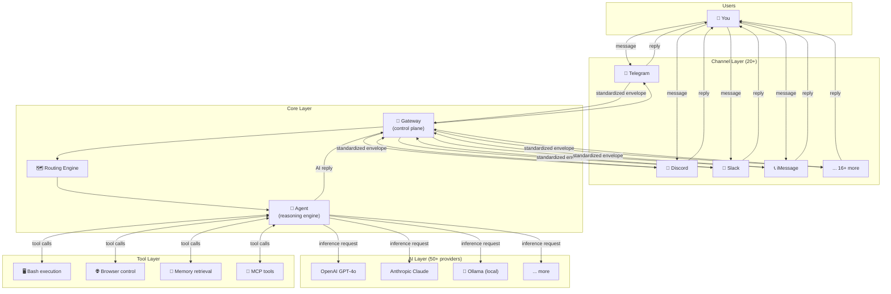

# What Is OpenClaw? 🟢

> OpenClaw is a **self-hosted personal AI assistant** — running on your own devices, connecting all the messaging platforms you already use, powered entirely by your own rules.

## Learning Objectives

After reading this chapter, you'll be able to:
- Explain OpenClaw's core positioning and design philosophy in one sentence
- Contrast OpenClaw with commercial AI assistants (ChatGPT, Claude.ai, etc.)
- Identify and relate the 6 core concepts: Gateway, Channel, Agent, Plugin, Skill, Provider
- Build an intuitive mental model of the system before diving into source code

---

## I. Project Positioning

### What Does "Personal AI Assistant" Actually Mean?

OpenClaw's official tagline is: *"the personal AI assistant you run on your own devices."*

Three key phrases:

1. **Personal**: OpenClaw is single-user by design. It's not a SaaS platform for teams — it's an assistant focused entirely on *your* workflows.
2. **Your own devices**: The process runs on your machine. No third-party relay servers touch your data.
3. **Your own rules**: You decide which LLM to use, which channels to connect, and what tools the AI can execute.

### OpenClaw vs Commercial AI Assistants

| Dimension | ChatGPT / Claude.ai | OpenClaw |
|-----------|---------------------|----------|
| Runs on | OpenAI/Anthropic servers | Your device |
| Data path | Through vendor servers | Direct to LLM API |
| Model choice | Fixed (GPT / Claude) | Any of 50+ providers |
| Access channels | Browser web UI | 20+ messaging platforms |
| Extensibility | Limited (GPT Store etc.) | Full plugin API |
| Customizability | Limited | Fully configurable |

### What Can It Do?

OpenClaw is much more than a chat bot. Core capabilities include:

- **Multi-channel access**: Talk to AI directly in Telegram, Slack, Discord, iMessage — no switching apps
- **Tool execution**: The AI can run shell commands, read/write files, call external APIs, control a browser
- **Voice interaction**: Voice input (STT) and voice replies (TTS) on macOS/iOS/Android
- **Memory system**: Persistent cross-session memory — the AI remembers your preferences and history
- **Scheduled tasks**: AI proactively sends messages on a schedule (e.g., daily morning briefings)
- **Canvas rendering**: Real-time interactive Canvas UI rendering

---

## II. Design Philosophy

`VISION.md` opens with a line that captures the project's spirit:

> **OpenClaw is the AI that actually does things.**

This implies a contrast: many AI products only "chat." OpenClaw's goal is to genuinely *complete tasks*.

### Three Core Design Principles

**1. Local-first, privacy-first**

The process runs on your machine. Aside from the LLM API calls you explicitly configure, no data flows to third-party servers.

**2. Security as a first-class citizen**

> "Security in OpenClaw is a deliberate tradeoff: strong defaults without killing capability."

The balance between security and capability is a central design challenge. Defaults are high-security (shell command execution requires human approval), but users can explicitly unlock higher-power modes.

**3. Lean core, plugin capabilities**

> "Core stays lean; optional capability should usually ship as plugins."

The core only maintains the skeleton: Gateway, basic routing, plugin loader. All channel integrations, LLM provider adapters, memory, and voice capabilities live as plugins. This keeps the core lightweight and stable while allowing unlimited extensibility.

---

## III. System Overview

This diagram shows the complete data flow — from a user sending a message on any platform to an AI reply coming back:



This reveals the "sandwich" architecture:
- **Top layer**: Channel adapters (handle platform protocol differences)
- **Middle layer**: Core control (Gateway + Routing + Agent)
- **Bottom layer**: AI and tools (LLM Providers + execution capabilities)

---

## IV. The 6 Core Concepts

Master these six concepts and you'll be able to read 95% of OpenClaw's source code comments and documentation.

### Gateway
**What it is**: The system's control plane. A persistent process that listens for channel plugin events, coordinates routing/authentication/session management, and pushes AI replies back to channels.

**Key source**: `src/gateway/`

**Analogy**: Like a router — handles traffic routing and policy enforcement without containing business logic.

### Channel
**What it is**: An adapter plugin that connects to a specific messaging platform. Each channel plugin converts platform-native message formats to OpenClaw's internal standard format (`InboundEnvelope`), and converts AI replies back to the platform format.

**Key source**: `src/channels/`, `extensions/telegram/`, `extensions/discord/` etc.

**Analogy**: Like a power adapter — different country plugs (platform protocols) all connect to the same system.

### Agent
**What it is**: The AI reasoning engine. Receives user messages, builds context (system prompt + history + memory + tool list), calls the LLM to reason, handles tool calls, generates replies.

**Key source**: `src/agents/`

**Analogy**: Like an employee — the Gateway is the reception desk (task routing), the Agent is the person actually doing the work.

### Plugin
**What it is**: Code extensions distributed as npm packages. Three types:
- **Channel Plugin**: Add a new messaging platform
- **Provider Plugin**: Add a new LLM vendor
- **Capability Plugin**: Add new capabilities (memory, voice, browser, etc.)

**Key source**: `src/plugins/`, `extensions/`

**Analogy**: Like browser extensions — the core browser stays lean, features are added through plugins.

### Skill
**What it is**: Workflow instructions defined as Markdown documents (with YAML frontmatter). **Skills are not code** — they're structured instruction sets that tell an Agent how to perform specific tasks.

**Key source**: `skills/` directory

**Analogy**: Like a company's SOP (Standard Operating Procedure) documents — employees (Agents) follow SOPs without needing to be "reprogrammed."

This is one of OpenClaw's most distinctive designs: using documents to "program" AI behavior.

### Provider
**What it is**: An LLM vendor adapter that handles model authentication, request format conversion, streaming response parsing, and failover.

**Key source**: `extensions/openai/`, `extensions/anthropic/`, `extensions/ollama/` etc.

**Analogy**: Like a payment gateway — abstracts away API differences across LLM providers.

---

## V. Why TypeScript + Plugin Architecture?

### Why TypeScript?

From `VISION.md`:

> "OpenClaw is primarily an orchestration system: prompts, tools, protocols, and integrations. TypeScript was chosen to keep OpenClaw hackable by default. It is widely known, fast to iterate in, and easy to read, modify, and extend."

OpenClaw is fundamentally an **orchestration system** — its job is to coordinate calls to external services (LLM APIs, messaging platform APIs, local tools), not heavy computation. TypeScript excels here:
- Static types make complex multi-system integration safer (clear interface contracts)
- Async model (async/await + Streams) is ideal for AI streaming responses
- The npm ecosystem is vast — almost every platform has TypeScript SDK support
- Broadest developer base, lowest contribution barrier

### Why Plugin Architecture?

Plugin architecture is the technical expression of OpenClaw's "lean core" philosophy:

```
Core repo (stable)          Plugins (fast-moving)
──────────────────          ─────────────────────
Gateway core                Telegram channel
Routing engine              Discord channel
Plugin loader               OpenAI provider
Session management          Memory plugin
Auth infrastructure         Voice plugin
```

This separation keeps core code stable and secure, while channels and providers (with their rapid API changes and new features) can evolve independently in the plugin layer without affecting the core.

---

## Key Source File Index

| File | Role |
|------|------|
| `README.md` | Project intro, install guide, feature list |
| `VISION.md` | Design philosophy and direction |
| `CLAUDE.md` / `AGENTS.md` | Contribution guidelines and architecture boundary guards |
| `src/entry.ts` | Program main entry point |
| `src/gateway/` | Gateway control plane |
| `src/agents/` | Agent reasoning engine |
| `src/channels/` | Channel abstraction layer |
| `src/plugins/` | Plugin loading and management |
| `src/plugin-sdk/` | Plugin development SDK |
| `extensions/` | 90+ channel/provider plugin implementations |
| `skills/` | 60+ built-in Skills |

---

## Summary

1. **OpenClaw = self-hosted personal AI assistant**: your data, your rules, your device.
2. **Three-layer architecture**: channels (adapters) → core (Gateway + Routing + Agent) → AI (LLM + tools).
3. **6 core concepts**: Gateway (control plane), Channel (platform adapter), Agent (reasoning engine), Plugin (code extension), Skill (instruction doc), Provider (LLM adapter).
4. **Plugin architecture**: core stays lean and stable; channels/providers/capabilities evolve independently.
5. **Skills are the most distinctive design**: structured Markdown documents "program" AI behavior — no coding required.

---

## Further Reading

- [→ Next: Codebase Tour](02-codebase-tour.md)
- [`VISION.md`](../../../../VISION.md) — Design philosophy (original text)
- [`README.md`](../../../../README.md) — Quick start guide
