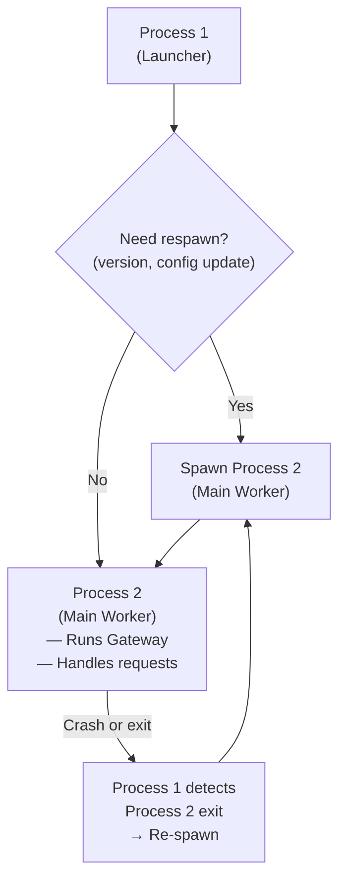
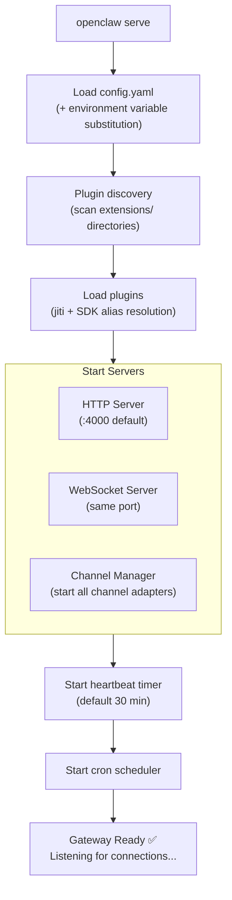

# Running Locally: Startup Flow 🟢

> Understanding how OpenClaw starts up helps you know where things happen and makes debugging much easier. This chapter traces the complete startup chain from `openclaw.mjs` to a running Gateway.

## Learning Objectives

After reading this chapter, you'll be able to:
- Trace the complete startup chain: `openclaw.mjs` → `entry.ts` → `runCli()`
- Understand the respawn mechanism (why there are two Node.js processes)
- Know where the Gateway startup sequence happens
- Read and understand the CLI command tree

---

## I. The Entry Point: `openclaw.mjs`

Everything starts with `openclaw.mjs`, a pure JavaScript wrapper (no TypeScript, runs directly with Node.js):

```javascript
// openclaw.mjs — simplified
import { createRequire } from 'module';
const require = createRequire(import.meta.url);

// Node.js version check
const [major] = process.versions.node.split('.').map(Number);
if (major < 20) {
  console.error('OpenClaw requires Node.js 20+');
  process.exit(1);
}

// Enable V8 compile cache
require('v8-compile-cache');

// Load jiti for TypeScript support, then run entry.ts
const { runCli } = require('./src/entry.ts');
runCli();
```

Why a `.mjs` wrapper? Because `entry.ts` uses TypeScript syntax and requires `jiti` to run directly — but `jiti` itself needs to be loaded first.

---

## II. Respawn Mechanism

OpenClaw uses a **two-process architecture**:



Source: `src/entry.respawn.ts`

The respawn mechanism ensures:
- **Auto-restart on crash**: The main worker is automatically respawned
- **Config hot reload**: After config changes, restarting the worker picks up new configuration
- **Version updates**: After an npm update, the launcher detects version changes and triggers respawn

---

## III. `runCli()` — The Main Entry

`src/entry.ts` exports `runCli()`, the actual startup logic:

```typescript
// src/entry.ts (simplified)
export async function runCli() {
  // 1. Parse command-line arguments
  const args = process.argv.slice(2);
  
  // 2. Handle fast paths (help, version)
  if (args.includes('--help') || args.includes('-h')) {
    printHelp();
    return;
  }
  
  // 3. Load configuration
  const cfg = await loadConfig();
  
  // 4. Route to the correct CLI command
  const command = resolveCommand(args);
  await command.execute(cfg, args);
}
```

---

## IV. CLI Command Tree

OpenClaw provides a rich CLI command set:

```
openclaw
├── serve           ← Start the Gateway server (most important)
├── chat            ← Start a direct chat session (bypasses Gateway)
├── onboard         ← Interactive setup wizard
├── status          ← Show current status
├── config          ← Configuration management
│   ├── get <key>
│   ├── set <key> <value>
│   └── validate
├── secrets         ← Secret management
│   ├── set <key>
│   └── list
├── cron            ← Cron job management
│   ├── list
│   ├── run <job-id>
│   └── status
├── session         ← Session management
│   ├── list
│   └── clear <session-key>
└── plugin          ← Plugin management
    ├── list
    └── install <plugin-id>
```

---

## V. Gateway Startup Sequence

When you run `openclaw serve`, the Gateway starts through these steps:



---

## VI. `isMainModule` Pattern

You'll see this pattern throughout `src/`:

```typescript
// src/entry.ts
if (import.meta.url === `file://${process.argv[1]}`) {
  // Only run when this file is the main entry point
  // Prevents double execution when imported as a module
  runCli();
}
```

This is the ESM equivalent of Node.js's `require.main === module`, preventing the startup function from running when the file is imported as a dependency.

---

## Key Source Files

| File | Size | Role |
|------|------|------|
| `openclaw.mjs` | ~30 lines | CLI wrapper, Node.js version check |
| `src/entry.ts` | 11KB | Main entry, `runCli()` |
| `src/entry.respawn.ts` | 11KB | Respawn mechanism |
| `src/cli/` | - | CLI command implementations |
| `src/gateway/server-http.ts` | 1111 lines | HTTP/WebSocket server |
| `src/gateway/server-channels.ts` | 20KB | Channel lifecycle management |

---

## Summary

1. **Two-process architecture**: Launcher (process 1) watches and respawns the Main Worker (process 2).
2. **`openclaw.mjs` → `entry.ts` → `runCli()`**: The startup chain is straightforward.
3. **Gateway startup is ordered**: config → plugin discovery → plugin loading → servers → heartbeat/cron.
4. **`isMainModule` prevents double execution**: Standard ESM pattern, seen throughout the codebase.

---

*[← Codebase Navigation](02-codebase-tour.md) | [→ System Architecture Layers](../01-architecture/01-system-layers.md)*
