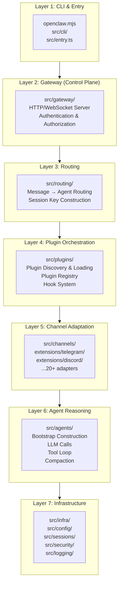

# System Architecture Layers 🟡

> Understanding OpenClaw's layered architecture is the foundation for understanding all other topics. This chapter maps out the 7-layer architecture and the role of each layer.

## Learning Objectives

After reading this chapter, you'll be able to:
- Draw OpenClaw's 7-layer architecture diagram from memory
- Identify which source directory each layer corresponds to
- Understand the "lean core + capability plugins" design principle
- Explain the purpose of `AGENTS.md` boundary guard files

---

## I. The 7-Layer Architecture



---

## II. Layer-by-Layer Breakdown

### Layer 1: CLI & Entry
User-facing command-line interface. Key files:
- `openclaw.mjs` — CLI wrapper, starts the Node.js process
- `src/entry.ts` — `runCli()` main function
- `src/cli/` — individual CLI command implementations

### Layer 2: Gateway (Control Plane)
The central hub of the system. It's a **control plane, not a data plane** — meaning it doesn't process message content, only routes and coordinates.

Key responsibilities:
- HTTP API for Web UI and external tools
- WebSocket real-time communication for CLI
- Authentication (6 methods) and authorization
- Method Scopes permission model

### Layer 3: Routing
Determines which Agent handles each incoming message, and which session context it belongs to.

- `resolveAgentRoute()` — 8-layer priority matching
- Session Key construction — conversation isolation

### Layer 4: Plugin Orchestration
Manages the complete lifecycle of plugins:
- Discovery (scan `extensions/` directories)
- Manifest parsing (`openclaw.plugin.json`)
- Loading (via `jiti` TypeScript runner)
- Registry (runtime capability mapping)
- Hook system (before/after agent reply)

### Layer 5: Channel Adaptation
Platform-specific adapters. Each channel plugin:
- Connects to the platform API (Webhook or Long Polling)
- Converts platform messages to `InboundEnvelope` standard format
- Sends AI replies back to the platform

### Layer 6: Agent Reasoning
The AI "thinking" layer:
- Bootstrap: build System Prompt (core instructions + CLAUDE.md + Skills + Memory)
- LLM Provider calls (streaming)
- Tool call loop (bash, files, MCP tools)
- Compaction: when context window fills up, compress with summaries

### Layer 7: Infrastructure
Foundational support:
- `src/config/` — configuration loading/parsing
- `src/sessions/` — SQLite-based session storage
- `src/infra/` — backoff, retry, heartbeat
- `src/security/` — prompt injection protection, secret handling
- `src/logging/` — structured logging

---

## III. AGENTS.md Boundary Guard Files

Throughout the codebase you'll find `AGENTS.md` files (some say `CLAUDE.md`). These serve a special purpose:

```
src/plugin-sdk/AGENTS.md    ← "DO NOT import from src/ directly"
src/agents/AGENTS.md        ← "Agent layer boundary rules"
```

These files tell AI coding assistants (like Claude Code) the architectural boundaries — which modules can import which. This is OpenClaw using AI to enforce its own architectural integrity.

---

## IV. "Lean Core + Plugin Capabilities" in Practice

The core (`src/`) contains only routing and coordination logic. Examples of what's **not** in core:

| Capability | Location |
|-----------|----------|
| Telegram Bot | `extensions/telegram/` |
| Claude API calls | `extensions/anthropic/` |
| Vector memory | `extensions/memory-core/` |
| MCP tools | `extensions/mcporter/` |
| Browser control | `extensions/browser/` |

If you want to add a new platform, you add a plugin — you don't touch `src/`.

---

## Summary

1. **7-layer architecture**: CLI → Gateway → Routing → Plugin Orchestration → Channel Adaptation → Agent Reasoning → Infrastructure.
2. **Gateway is control plane only**: It orchestrates, not processes content.
3. **Plugin layer is the extension point**: All platform/model/capability support is in plugins.
4. **`AGENTS.md` enforces boundaries**: AI coding assistants read these files to understand what they can and cannot import.

---

*[← Running Locally](../00-intro/03-running-locally.md) | [→ Gateway Core](02-gateway-core.md)*
