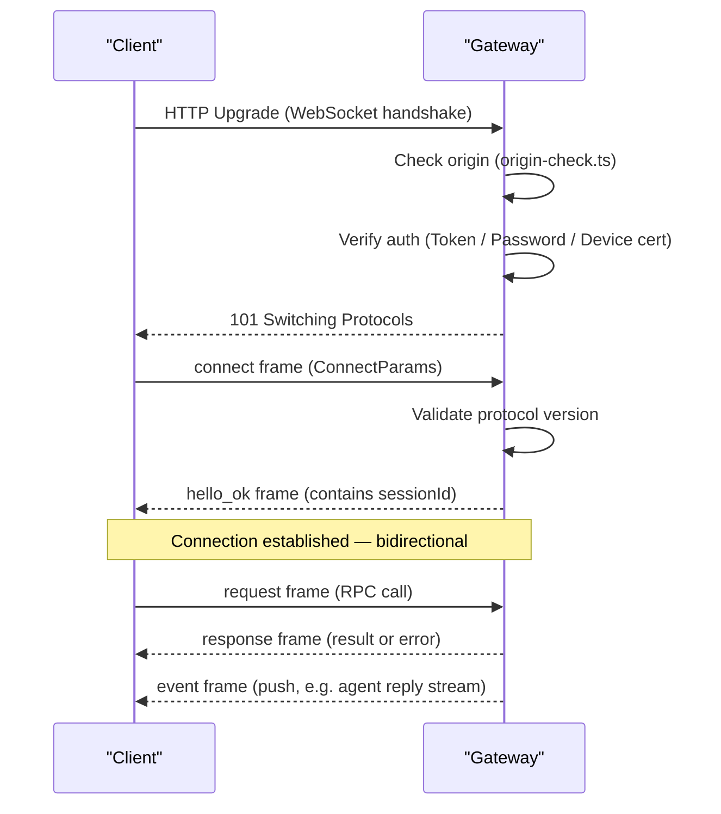
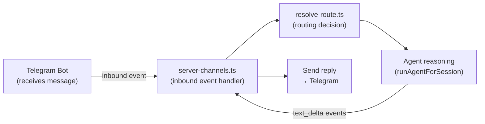

# Gateway Core 🟡

> The Gateway is the "brain" of OpenClaw — but a brain that only routes, coordinates, and authenticates, never reasons. This chapter covers the HTTP routing table, WebSocket protocol, permission model, and how the CLI communicates with the Gateway.

## Learning Objectives

After reading this chapter, you'll be able to:
- Identify all HTTP routes the Gateway exposes and their purposes
- Understand the 3 WebSocket frame types (Request/Response/Event)
- Explain the Method Scopes permission model
- Understand how CLI communicates with the Gateway (`GatewayClient`)

---

## I. Gateway = Control Plane

The official docs describe it precisely:

> "The Gateway is just the control plane — the product is the assistant."

The Gateway is a **control plane, not a data plane**. It knows *what channels exist*, *what agents exist*, and *where messages should go* — but it never runs inference or calls LLMs directly. It orchestrates everything else.

This keeps the Gateway lightweight, stable, and independently testable (you can verify channel connectivity without any LLM configured at all).

```
CLI / Web UI → Gateway → Agent → LLM Provider
                ↑
         Channel Plugins
       (push events via HTTP/WS)
```

---

## II. HTTP API Routes

`src/gateway/server-http.ts` (36KB) registers all HTTP endpoints via `createGatewayHttpServer()`:

| Route | Method | Handler | Purpose |
|-------|--------|---------|---------|
| `/health`, `/healthz` | GET | `handleGatewayProbeRequest` | Liveness probe |
| `/ready`, `/readyz` | GET | `handleGatewayProbeRequest` | Readiness probe |
| `/v1/chat/completions` | POST | `handleOpenAiHttpRequest` | OpenAI-compatible chat API |
| `/v1/responses` | POST | `handleOpenResponsesHttpRequest` | OpenAI Responses API |
| `/v1/embeddings` | POST | `handleOpenAiEmbeddingsHttpRequest` | Embeddings API |
| `/v1/models` | GET | `handleOpenAiModelsHttpRequest` | Model listing (OpenAI format) |
| `/hooks/agent/:id` | POST | `createHooksRequestHandler` | Webhook → trigger Agent |
| `/_ui/**` | GET | `handleControlUiHttpRequest` | Browser management UI |
| *(plugin routes)* | * | `buildPluginRequestStages` | Channel plugin webhooks |

The **OpenAI-compatible API** is a significant feature: any tool that speaks the OpenAI API (Cursor, Continue.dev, etc.) can use OpenClaw as a drop-in backend endpoint.

---

## III. WebSocket Protocol

WebSocket connections are upgraded via `attachGatewayUpgradeHandler()` at `server-http.ts:988`.

### Handshake Flow



### Three Frame Types

`src/gateway/protocol/schema/frames.ts` defines three frame types:

**RequestFrame** — Client → Gateway (RPC call):
```typescript
type RequestFrame = {
  type: 'request';
  id: string;       // Client-generated request ID
  method: string;   // e.g., "chat.send"
  params: unknown;  // Method parameters
};
```

**ResponseFrame** — Gateway → Client (RPC result):
```typescript
type ResponseFrame = {
  type: 'response';
  id: string;       // Matches the request ID
  result?: unknown; // Success result
  error?: { code: string; message: string; details?: unknown };
  final: boolean;   // Whether this is the last frame (for streaming responses)
};
```

**EventFrame** — Gateway → Client (server-push):
```typescript
type EventFrame = {
  type: 'event';
  event: string;    // e.g., "agent.text_delta"
  data: unknown;    // Event payload
};
```

This is a **hybrid RPC + event-push protocol** over WebSocket:
- `request/response` for commands and queries (chat, config, agent management)
- `event` for server-initiated real-time pushes (streaming AI replies, status changes)

### Protocol Versioning

```typescript
// src/gateway/protocol/schema/frames.ts
export const PROTOCOL_VERSION = 9;
```

The client declares its supported protocol version range in the `connect` frame. The Gateway validates compatibility and rejects incompatible clients with a clear upgrade message.

---

## IV. Method Scopes

The Gateway's RPC methods are grouped into permission scopes (`method-scopes.ts`):

```typescript
type OperatorScope =
  | 'read'           // Read config and status
  | 'write'          // Modify config
  | 'chat'           // Send chat messages
  | 'admin'          // Admin operations (restart, update)
  | 'exec_approve'   // Approve AI shell command execution
```

The CLI uses `CLI_DEFAULT_OPERATOR_SCOPES` (nearly all scopes). WebChat clients typically get only `read + chat`. This lets you create read-only monitoring connections, or restricted connections with just chat access.

---

## V. GatewayClient: CLI ↔ Gateway Communication

`src/gateway/client.ts` implements the `GatewayClient` class — used by all CLI commands and the Web UI to talk to the Gateway.

```typescript
// src/gateway/client.ts (simplified)
export class GatewayClient {
  async connect(): Promise<void>                                   // Establish connection + handshake
  async request(method: string, params?: unknown): Promise<unknown>  // RPC request
  async* stream(method: string, params?: unknown): AsyncGenerator<EventFrame>  // Streaming request
  disconnect(): void
}
```

Authentication priority when CLI connects:
```
1. CLI flag --token=<token>
2. OPENCLAW_TOKEN environment variable
3. Token in config file
4. Device certificate (Ed25519 key pair)
5. Password auth --password=<pass>
```

Device certificate auth is the recommended approach: `loadOrCreateDeviceIdentity()` generates an Ed25519 keypair on first connection, allowing subsequent connections via digital signature with no password required.

---

## VI. Channel Management: `server-channels.ts`

Channel plugins register through `server-channels.ts`. When a channel (e.g., Telegram) receives a new message, it fires an inbound event that triggers routing and Agent reasoning:



`server-channels.ts` maintains the state of all active channels (connection status, health checks, errors) for display in the Control UI.

---

## Key Source Files

| File | Size | Role |
|------|------|------|
| `src/gateway/server-http.ts` | 36KB | HTTP server, all route handlers, WS upgrade |
| `src/gateway/server-chat.ts` | 28KB | Message handling, heartbeat, streaming replies |
| `src/gateway/server-channels.ts` | 20KB | Channel event registration, inbound processing |
| `src/gateway/client.ts` | 29KB | `GatewayClient` — WebSocket connection management |
| `src/gateway/call.ts` | 30KB | `callGateway()`, `callGatewayCli()` — CLI entry point |
| `src/gateway/auth.ts` | 18KB | `authorizeHttpGatewayConnect()` — auth (6 methods) |
| `src/gateway/method-scopes.ts` | 6KB | `OperatorScope` types, permission model |
| `src/gateway/protocol/index.ts` | — | Protocol type exports (RequestFrame, ResponseFrame, EventFrame) |

---

## Summary

1. **Gateway = control plane**: routes, authenticates, and coordinates — never runs inference.
2. **Dual protocol**: HTTP (webhooks, OpenAI-compatible API, Control UI) + WebSocket (real-time CLI/WebChat communication).
3. **WebSocket protocol**: three frame types — `request/response` (RPC) + `event` (push); protocol version-negotiated.
4. **`GatewayClient`**: CLI commands talk to the Gateway through `callGateway()` → `GatewayClient`, with multiple auth options.
5. **Method Scopes**: scope-based permission model — different clients get different access levels.

---

*[← System Layers](01-system-layers.md) | [→ Plugin System](03-plugin-system.md)*
