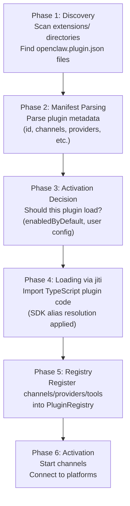

# Plugin System 🟡

> Plugins are how OpenClaw extends its capabilities. This chapter explains the 6-phase plugin lifecycle, the jiti loader mechanism, and the Hook system.

## Learning Objectives

After reading this chapter, you'll be able to:
- Trace the 6 phases of plugin lifecycle (discovery → activation)
- Understand why `jiti` is used (TypeScript runtime loading)
- Explain the SDK Alias mechanism and why it's needed
- Understand the Hook system (before/after agent reply)

---

## I. Three Plugin Types

| Type | Example | Purpose |
|------|---------|---------|
| **Channel Plugin** | `telegram`, `discord`, `slack` | Connect to a messaging platform |
| **Provider Plugin** | `anthropic`, `openai`, `ollama` | Connect to an LLM service |
| **Capability Plugin** | `memory-core`, `mcporter` | Add tools or capabilities |

---

## II. 6-Phase Plugin Lifecycle



### Phase 1: Discovery

`src/plugins/discovery.ts` (924 lines) scans:
- The built-in `extensions/` directory
- `~/.config/openclaw/extensions/` (user plugins)
- Any paths configured in `config.yaml`

### Phase 4: Loading via `jiti`

OpenClaw uses `jiti` to load TypeScript plugin files at runtime without a build step:

```typescript
// src/plugins/loader.ts
import jiti from 'jiti';

const jitiRequire = jiti(import.meta.url, {
  interopDefault: true,
  alias: buildPluginLoaderAliasMap(),  // SDK Alias!
});

const pluginModule = jitiRequire(pluginEntryPath);
```

### The SDK Alias Mechanism

When a plugin imports `'openclaw/plugin-sdk/core'`, `jiti` intercepts it and redirects to the actual `src/plugin-sdk/core.ts` file — ensuring the plugin always uses the same runtime instance as the core.

```typescript
// buildPluginLoaderAliasMap() builds:
{
  'openclaw/plugin-sdk/core': '/path/to/src/plugin-sdk/core.ts',
  'openclaw/plugin-sdk/provider-entry': '/path/to/src/plugin-sdk/provider-entry.ts',
  // ... 20+ entries
}
```

This prevents "duplicate module" bugs where a plugin's copy of a dependency is different from core's copy.

---

## III. PluginRegistry: The Runtime Core

`src/plugins/registry.ts` (1212 lines) maintains runtime maps of all registered capabilities:

```typescript
// PluginRegistry internals (conceptual)
class PluginRegistry {
  channels: Map<string, ChannelPlugin>;
  providers: Map<string, ProviderPlugin>;
  tools: Map<string, ToolFactory>;
  hooks: Map<HookName, HookHandler[]>;
}
```

When a channel plugin registers itself via `api.channel.register(plugin)`, the registry stores it and the channel becomes available for routing.

---

## IV. Hook System

Plugins can register hooks to intercept the agent lifecycle:

| Hook Name | When | Use Case |
|-----------|------|---------|
| `before-agent-reply` | Before AI generates response | Content filtering, adding context |
| `before-tool-call` | Before a tool executes | Security checks, logging |
| `after-agent-reply` | After AI response is sent | Analytics, post-processing |
| `after-tool-call` | After tool execution | Result transformation |

```typescript
// Registering a hook in a Capability plugin
api.hooks.on('before-agent-reply', async (context) => {
  // Inject retrieved memories into the context
  const memories = await memoryStore.search(context.lastMessage);
  context.systemPromptAppend(formatMemories(memories));
});
```

---

## V. Memory Slot Singleton Constraint

An important architectural detail: certain "singleton" plugins (like memory) use a special registry slot that can only have **one implementation active at a time**. If two memory plugins are both enabled, only the first loaded wins.

This is by design — to prevent conflicting memory implementations from interfering with each other.

---

## Key Source Files

| File | Size | Role |
|------|------|------|
| `src/plugins/discovery.ts` | 924 lines | Plugin discovery logic |
| `src/plugins/loader.ts` | 1946 lines | Plugin loading via jiti |
| `src/plugins/registry.ts` | 1212 lines | Runtime plugin registry |
| `src/plugins/types.ts` | 2739 lines | All plugin type definitions |
| `src/plugin-sdk/core.ts` | 21KB | SDK public API entry |

---

## Summary

1. **6-phase lifecycle**: discovery → manifest → activation decision → jiti load → registry → activation.
2. **`jiti` enables TypeScript at runtime**: no build step required for plugins.
3. **SDK Alias** ensures plugins and core share the same module instances — preventing subtle bugs.
4. **`PluginRegistry`** is the runtime map of all capabilities.
5. **Hooks allow plugins to intercept the agent lifecycle** at 4 points.

---

*[← Gateway Core](02-gateway-core.md) | [→ Module Boundaries & SDK Contract](04-module-boundaries.md)*
