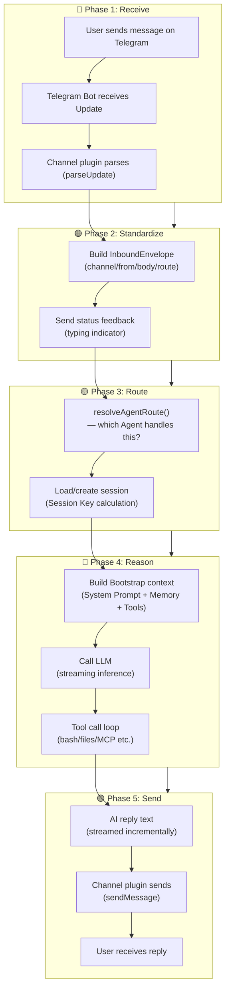
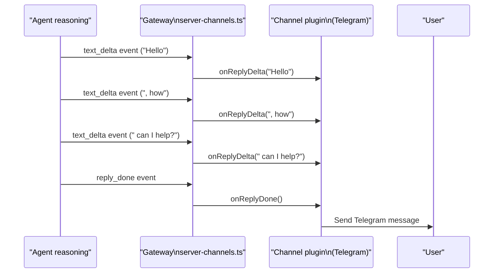
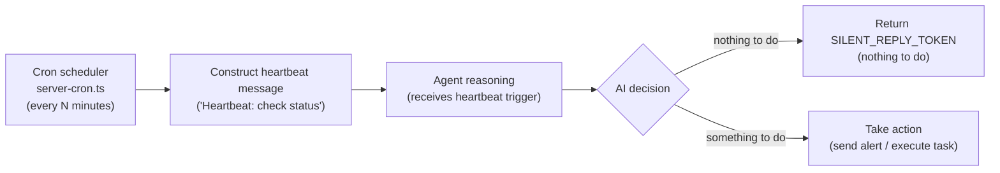

# Message Lifecycle 🟡

> From a user sending a message on Telegram to an AI reply appearing — what happens in between? This chapter traces every step along that path.

## Learning Objectives

After reading this chapter, you'll be able to:
- Draw the complete data flow diagram from inbound to outbound
- Understand the `InboundEnvelope` format and its role in the system
- Explain status feedback (typing indicators, message status) and how it's implemented
- Understand `SILENT_REPLY_TOKEN` and the Heartbeat system

---

## I. The Complete 5-Phase Lifecycle



---

## II. Phase 1: Receiving Messages

Channel plugins receive messages in one of two ways:

**Webhook** (for platforms that support server-push, like Telegram and Discord):
```
User sends message
  → Messaging platform (e.g., Telegram servers)
  → HTTP POST to OpenClaw Gateway (/webhook/telegram/...)
  → Plugin route handler registered in server-http.ts
  → Channel plugin's handleWebhook(req, res)
```

**Long Polling** (for platforms that don't support webhooks):
```
Channel plugin actively polls the platform API
  → Receives message Update
  → Processes it internally
```

The `ChannelManager` in `server-channels.ts` manages the lifecycle (start, stop, restart) of all channels and maintains their runtime state for display in the Control UI.

---

## III. Phase 2: Building the InboundEnvelope

This is the critical interface between the **channel layer** and the **core layer**.

After receiving a raw platform message, the channel plugin builds an **InboundEnvelope** — a standardized "inbound packet" containing everything the core needs, while hiding all platform-specific protocol differences.

```typescript
// src/plugin-sdk/inbound-envelope.ts
type InboundEnvelope = {
  // Source
  channel: string;           // e.g., 'telegram'
  accountId: string;         // Bot account ID
  peer: RoutePeer;           // { kind: 'dm', id: '123456789' }

  // Message content
  text?: string;
  media?: MediaAttachment[]; // Images, files, audio

  // Platform context
  guildId?: string;          // Discord server / equivalent
  teamId?: string;           // Slack workspace / equivalent
  memberRoleIds?: string[];  // Discord role IDs

  // Threading
  threadId?: string;
  parentPeer?: RoutePeer;

  // Metadata
  messageId?: string;
  timestamp?: Date;
};
```

The envelope's `body` field is pre-formatted text containing the timestamp, source channel, and context information, ready to be appended directly into the Agent's conversation history.

### Status Feedback: Typing Indicators

Good UX requires immediate feedback after a user sends a message ("AI is thinking..."). This is implemented through **status reactions**:

```typescript
// Conceptual — src/channels/status-reactions.ts
await channel.status.typing();  // Show typing indicator
// ... AI reasoning runs ...
await channel.status.done();    // Clear indicator
```

- Telegram: `sendChatAction({ action: 'typing' })`
- Discord: `interaction.deferReply()`
- Slack: React with a clock emoji on the message

The interface is unified; implementations differ per platform.

---

## IV. Phase 3: Routing (Overview)

See [Data Flow 02 — Routing Engine](02-routing-engine.md) for the deep dive. Here's the summary:

```typescript
// src/routing/resolve-route.ts
const route = resolveAgentRoute({
  channelId: 'telegram',
  accountId: '@username',
  peer: { kind: 'dm', id: 123456789 },
  cfg,
});
// → { agentId: 'main', sessionKey: 'agent:main:telegram/default/dm/123456789' }
```

The `sessionKey` is the unique identifier for a conversation. All history is stored and retrieved through it.

---

## V. Phase 5: Sending Replies

AI reply text is streamed to channel plugins via `EventFrame` events:



**Streaming vs Batch Sending**:

| Channel | Streaming Strategy |
|---------|-------------------|
| Telegram | No native streaming — send complete reply (typing indicator fills the wait) |
| Discord | Edit message progressively (simulate streaming via edits) |
| Slack | Update Block Kit message incrementally |
| CLI | Direct stdout character-by-character streaming |
| Web UI | Full streaming via WebSocket token-by-token |

Channel plugins implement `ChannelOutboundAdapter` to handle these differences.

---

## VI. SILENT_REPLY_TOKEN

Not every AI response should be sent to the user. `SILENT_REPLY_TOKEN` lets the Agent silently suppress a reply:

```typescript
// src/auto-reply/tokens.ts
export const SILENT_REPLY_TOKEN = '[SKIP_REPLY]';
```

When the AI returns `[SKIP_REPLY]`, the Gateway recognizes it and **sends nothing to the channel**. Used for:
- Passive monitoring mode (AI sees messages but doesn't respond)
- Conditional triggers (AI decides no reply is warranted)
- Heartbeat ACK (internal confirmation only, no user notification needed)

---

## VII. Heartbeat System

Heartbeat is a key OpenClaw feature: even without user messages, the AI periodically "wakes up" to check for tasks and can proactively send messages.



Heartbeat messages are hidden from the user (`shouldHideHeartbeatChatOutput()` filters them), but they trigger full AI reasoning — giving the AI the opportunity to proactively execute tasks (e.g., "send a weather summary every morning at 9am").

---

## VIII. Session Storage

All messages (user + AI turns) are persisted, organized by `sessionKey`:

```
~/.config/openclaw/sessions/
└── <agentId>/
    └── <sessionKey>/
        ├── session.json   ← session metadata (created, last updated)
        └── messages/      ← message history (time-ordered)
            ├── 0001.json
            ├── 0002.json
            └── ...
```

The `src/sessions/` module handles read/write via SQLite (`better-sqlite3`).

---

## Key Source Files

| File | Size | Role |
|------|------|------|
| `src/plugin-sdk/inbound-envelope.ts` | 4.7KB | `createInboundEnvelopeBuilder()` |
| `src/gateway/server-channels.ts` | 20KB | Channel management and inbound scheduling |
| `src/gateway/server-chat.ts` | 27KB | WebSocket chat handling, streaming reply push |
| `src/channels/status-reactions.ts` | — | Status feedback (typing indicators) |
| `src/auto-reply/tokens.ts` | — | `SILENT_REPLY_TOKEN` definition |
| `src/auto-reply/heartbeat.ts` | 172 lines | Heartbeat token processing |
| `src/gateway/server-cron.ts` | 17KB | Cron job scheduling |
| `src/sessions/` | — | Session persistence (SQLite) |

---

## Summary

1. **Five phases**: receive → standardize → route → reason → send; each phase has a single responsibility.
2. **`InboundEnvelope` is the channel-to-core interface**: standardized format that hides all platform protocol differences.
3. **Status feedback is UX, not an afterthought**: typing indicators fire immediately when reasoning starts.
4. **`SILENT_REPLY_TOKEN` enables "silent mode"**: the AI can choose not to respond — for passive listening, conditional triggers, and heartbeat ACKs.
5. **Heartbeat makes AI proactive**: timed triggers let the AI send messages on its own schedule.
6. **Session history persists locally**: all messages organized by `sessionKey` in a local SQLite database.

---

*[← Module Boundaries](../01-architecture/04-module-boundaries.md) | [→ Routing Engine](02-routing-engine.md)*
