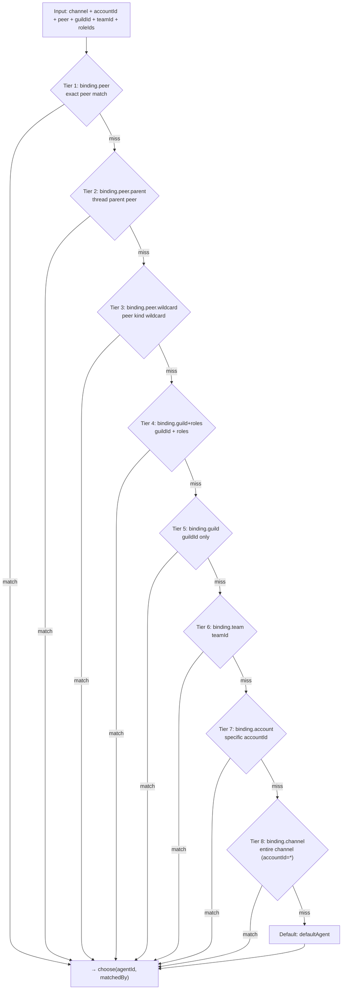

# Routing Engine 🟡

> OpenClaw supports multiple concurrent agents — different messages from different channels, groups, or users can be routed to different agents. The routing engine makes these decisions.

## Learning Objectives

After reading this chapter, you'll be able to:
- Understand binding rules and how to configure them in `config.yaml`
- Trace `resolveAgentRoute()`'s complete decision process (8-tier priority matching)
- Understand Session Key construction and its role in conversation isolation
- Know about the routing cache design (up to 4000 cached route results)

---

## I. The Core Question

When a message arrives, the routing engine must answer two questions:

1. **Which Agent gets this message?** (`agentId`)
2. **Which conversation context does it belong to?** (`sessionKey`)

The answers together form a `ResolvedAgentRoute`:

```typescript
type ResolvedAgentRoute = {
  agentId: string;
  channel: string;
  accountId: string;
  sessionKey: string;       // Used for history isolation
  mainSessionKey: string;   // For direct-chat collapse
  lastRoutePolicy: 'main' | 'session';
  matchedBy: 'binding.peer' | 'binding.guild' | 'default' | ...;
};
```

---

## II. Binding Rules

`config.yaml` `bindings` field defines routing rules — each rule specifies "messages from this source go to this agent":

```yaml
bindings:
  # Telegram DMs → main agent
  - agentId: main
    match:
      channel: telegram
      peer:
        kind: dm
        id: "*"    # any user

  # Discord specific server → coding-agent
  - agentId: coding-agent
    match:
      channel: discord
      guildId: "123456789"

  # Discord server + specific roles → senior-agent
  - agentId: senior-agent
    match:
      channel: discord
      guildId: "123456789"
      roles: ["987654321"]

  # Catch-all: all Telegram → main
  - agentId: main
    match:
      channel: telegram
```

---

## III. 8-Tier Priority Matching

`resolveAgentRoute()` implements 8 tiers of priority:



---

## IV. Session Key: Foundation of Conversation Isolation

Session Key format:
```
agent:<agentId>:<channel>/<accountId>/<peerKind>/<peerId>
```

Examples:
- `agent:main:telegram/default/dm/123456789` — Telegram DM with user 123456789 and main agent
- `agent:coding-agent:discord/default/channel/987654321` — Discord channel 987654321 session

### `dmScope` Configuration

Controls how DMs are grouped into sessions:

| dmScope | Effect | Use Case |
|---------|--------|---------|
| `main` (default) | All DMs share one main session | Personal assistant, cross-channel continuity |
| `per-peer` | Each DM user has independent session | Multi-user service |
| `per-channel-peer` | Each channel+user combination independent | Channel context isolation |

---

## V. Dual-Layer Cache

**Layer 1: Binding Index Cache** (`EvaluatedBindingsCache`)

Pre-processes binding array into multiple indices (`byPeer`, `byGuild`, `byAccount`, etc.), making single route lookups near O(1) instead of O(n).

**Layer 2: Route Result Cache**

```typescript
const MAX_RESOLVED_ROUTE_CACHE_KEYS = 4000;
// Cache invalidated when cfg.bindings, cfg.agents, or cfg.session reference changes
```

When the same user messages on the same channel, routing is near-instant (cache hit).

---

## Key Source Files

| File | Size | Role |
|------|------|------|
| `src/routing/resolve-route.ts` | 832 lines | Core routing function, 8-tier matching, dual-layer cache |
| `src/routing/session-key.ts` | 254 lines | Session Key construction utilities |
| `src/routing/bindings.ts` | 115 lines | Binding reading utilities |

---

## Summary

1. **Binding rules**: configured in `config.yaml` `bindings` field.
2. **8-tier priority**: peer exact → peer parent → peer wildcard → guild+roles → guild → team → account → channel, then default.
3. **Session Key** uniquely identifies conversations: `agent:<id>:<channel>/<accountId>/<kind>/<peerId>`.
4. **`dmScope`** controls DM grouping (default: `main` shares all DMs in one session).
5. **Dual-layer cache**: binding index (O(1) lookup) + route results (max 4000 entries).

---

*[← Message Lifecycle](01-message-lifecycle.md) | [→ Agent Call Loop](03-agent-call-loop.md)*
