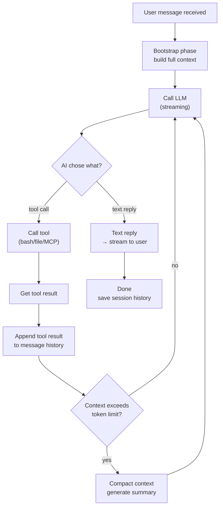
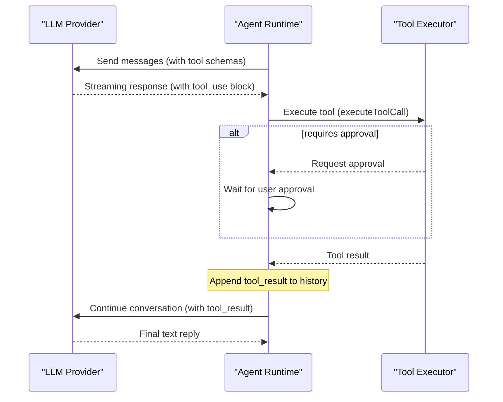

# Agent Call Loop 🔴

> The Agent is where AI "thinking" happens in OpenClaw. From building context, calling LLMs, executing tools, to context compaction — this chapter digs deep into the Agent's reasoning engine.

## Learning Objectives

After reading this chapter, you'll be able to:
- Understand the Bootstrap phase and how it builds the complete Agent context
- Trace the tool call loop (ReAct pattern) end-to-end
- Understand compaction — when it triggers and how it works
- Understand multi-provider failover

---

## I. The ReAct Loop

OpenClaw's Agent reasoning is based on the **ReAct (Reasoning + Acting)** pattern:



---

## II. Bootstrap: Building Context

Bootstrap is the "context preparation" phase before each agent reasoning cycle. It assembles the complete System Prompt:

1. **Core instructions** (Agent definition text) — always included
2. **CLAUDE.md / AGENTS.md** (project spec docs) — loaded hierarchically
3. **Active Skill files** (SKILL.md) — filtered by agent Skill config
4. **Memory injections** (from Memory plugin) — recent relevant memories
5. **Tool list** (JSON Schemas of available tools)

### Bootstrap Budget

Context can't be unlimited — it's bounded by the LLM's context window. `bootstrap-budget.ts` implements a budget allocation system that tracks character counts and truncates when needed.

```typescript
type BootstrapBudgetAnalysis = {
  hasTruncation: boolean;
  totals: {
    rawChars: number;
    injectedChars: number;
    bootstrapMaxChars: number;
    bootstrapTotalMaxChars: number;
  };
};
```

---

## III. Tool Call Loop (ReAct)

When the LLM decides to call a tool:



### Available Tools

| Category | Examples | Source |
|---------|---------|--------|
| File system | `read_file`, `write_file` | Core built-in |
| Shell | `bash` | Core built-in (security-gated) |
| Code | `str_replace_editor` | Core built-in |
| Memory | `memory_create`, `memory_search` | memory-core plugin |
| MCP tools | Any tool from MCP servers | mcporter plugin |

---

## IV. Compaction

When session history grows too large, exceeding the LLM's context window, compaction triggers.

### Trigger Condition

```typescript
export const BASE_CHUNK_RATIO = 0.4;   // Trigger at ~60% of context window
export const SAFETY_MARGIN = 1.2;       // 20% safety buffer
```

### How It Works

Compaction calls the LLM to generate a summary of the conversation history. The summary replaces the detailed history — dramatically reducing token count while preserving key information.

Key instructions to the LLM during compaction:
```
MUST PRESERVE:
- Active tasks and their current status
- Batch operation progress (e.g., '5/17 items completed')
- The last thing the user requested
- Decisions made and their rationale
- TODOs, open questions, and constraints
```

### Identifier Preservation

```typescript
const IDENTIFIER_PRESERVATION_INSTRUCTIONS =
  'Preserve all opaque identifiers exactly as written (no shortening), ' +
  'including UUIDs, hashes, IDs, tokens, API keys, hostnames, IPs, ports, URLs, and file names.';
```

This prevents the LLM from "helpfully" shortening UUIDs or IDs in summaries, which would break subsequent operations.

---

## V. Multi-Provider Failover

When multiple LLM Providers are configured, `model-fallback.ts` implements automatic failover:

```yaml
# config.yaml
agents:
  default:
    model: anthropic/claude-opus-4-5
    modelFallbacks:
      - model: openai/gpt-4o
        triggerOnErrors: ['rate_limit_error', 'overloaded_error']
      - model: ollama/llama3.1
        triggerOnErrors: ['all']  # ultimate fallback
```

---

## Key Source Files

| File | Size | Role |
|------|------|------|
| `src/agents/agent-command.ts` | 29KB | Agent reasoning main scheduler |
| `src/agents/bootstrap-budget.ts` | 12KB | Bootstrap budget allocation |
| `src/agents/compaction.ts` | 16KB | Context compaction (summary generation) |
| `src/agents/bash-tools.exec.ts` | 51KB | Bash tool execution logic |
| `src/agents/acp-spawn.ts` | 33KB | Multi-agent spawning |

---

## Summary

1. **ReAct loop**: LLM → tool calls → tool results → LLM, until LLM gives text reply.
2. **Bootstrap builds full context**: core instructions + CLAUDE.md + Skills + Memory + tool schemas.
3. **Compaction solves long session problem**: when history hits ~60% of context window, LLM summarizes old history.
4. **Bash tool has security gates**: requires approval by default; configurable to allowlist or auto-approve.
5. **Multi-provider failover**: configure backup providers, automatic switching on error types.

---

*[← Routing Engine](02-routing-engine.md) | [→ Plugin SDK Design](../03-mechanisms/01-plugin-sdk-design.md)*
