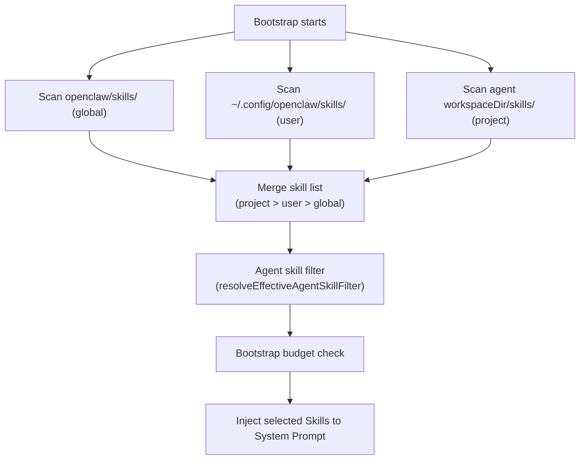

# Skill System 🟡

> Skills are one of OpenClaw's most distinctive features — you can give AI specialized capabilities with just a Markdown file. This chapter explains how Skills work and their design philosophy.

## I. What Is a Skill?

A Skill is a simple **Markdown file** containing instructions for the AI. It tells the AI "what to do in which situations."

When the AI reads Skill files during Bootstrap, these instructions become part of its "temporary knowledge base."

### Example Skill

```markdown
<!-- skills/coding-agent/SKILL.md -->

# Coding Agent Skill

## Code Review Mode
When the user asks to "review" code:
1. Read the relevant files first
2. Identify potential bugs, performance issues, style violations
3. Group findings by severity (critical, warning, suggestion)

## Commit Messages
When creating a git commit:
- Use conventional commits: `type(scope): description`
- Types: feat, fix, docs, chore, refactor, test, perf
```

---

## II. Skill Types

**Workspace Skills**: in the project's `skills/` directory or `~/.config/openclaw/skills/`

**Global Skills**: in OpenClaw's built-in `skills/` directory (~60 Skills):

| Category | Examples | Function |
|---------|---------|---------|
| Productivity | `notion`, `obsidian`, `trello` | Notes and task management |
| Dev tools | `github`, `coding-agent`, `tmux` | Code and terminal |
| Channels | `discord`, `slack` | Messaging platform workflows |
| AI tools | `gemini`, `openai-whisper` | Multi-model capability extension |
| Personal | `1password`, `weather` | Daily assistance |
| System | `sag`, `summarize`, `taskflow` | Advanced Skills |

---

## III. Skill Discovery Flow



---

## IV. Agent-Level Skill Filtering

```yaml
agents:
  list:
    - id: main
      skills:
        enabled:
          - coding-agent
          - github
        disabled:
          - spotify-player  # work agent doesn't need music

    - id: personal
      skills:
        enabled: "*"  # all skills
```

---

## V. Skill-as-Agent (SAG)

The `skills/sag/` directory contains a meta-Skill that guides the AI to create new Skills:

```
User: Create a skill that makes AI always use TypeScript strict mode

AI: [automatically creates skills/ts-strict/SKILL.md]
```

This is OpenClaw's "self-expansion" capability — using AI to create Skills for AI.

---

## Summary

1. **Skill = Markdown file**: plain text instructions, no code needed.
2. **Three scope layers**: global (built-in) < user (`~/.config`) < project (`skills/` dir).
3. **Agent can filter Skills**: `enabled`/`disabled` config controls which Skills each agent uses.
4. **SAG enables self-expansion**: use AI to create new Skills, accumulating capabilities over time.

---

*[← Security Model](../03-mechanisms/05-security-model.md) | [→ Writing High-Quality Skills](02-skill-deep-dive.md)*
