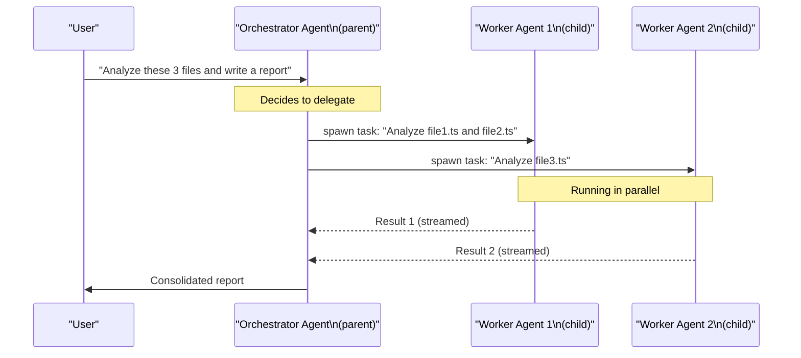
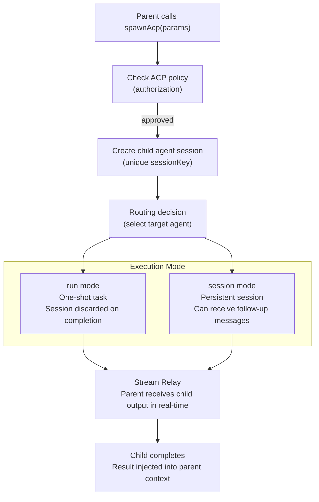

# Multi-Agent Collaboration: ACP Protocol 🔴

> OpenClaw supports multiple AI Agents working together — one Agent (the orchestrator) can dispatch tasks to another (a worker), enabling complex tasks to be parallelized. This chapter digs into ACP (Agent Coordination Protocol).

## Learning Objectives

After reading this chapter, you'll be able to:
- Understand ACP's working model (parent → child spawning)
- Trace the task dispatch flow in `acp-spawn.ts`
- Understand how parent and child agents share results (Stream Relay)
- Know ACP's security policies (preventing unbounded recursion)

---

## I. Why Multi-Agent?

Single agent limitations:
- **Context window**: large tasks exceed a single agent's context window
- **Parallelization**: independent subtasks can run simultaneously
- **Specialization**: different tasks can be routed to purpose-built agents (e.g., `coding-agent` vs `summarizer`)

ACP's solution: **structured protocol for agents to call each other**.

---

## II. ACP Working Model



---

## III. ACP Spawn: `acp-spawn.ts`

`src/agents/acp-spawn.ts` (33KB) implements the child agent dispatch logic.

### Core Types

```typescript
type SpawnAcpParams = {
  task: string;             // Task description for the child agent
  label?: string;           // Display name (for logs/UI)
  agentId?: string;         // Which agent to use (defaults to best match)
  resumeSessionId?: string; // Resume an existing session (continue a prior task)
  cwd?: string;             // Working directory for the child agent
  mode?: SpawnAcpMode;      // 'run' (one-shot) or 'session' (persistent)
  thread?: boolean;         // Run in a channel thread
  sandbox?: SpawnAcpSandboxMode;  // 'inherit' or 'require'
  streamTo?: SpawnAcpStreamTarget; // e.g., 'parent'
};

type SpawnAcpResult = {
  status: 'accepted' | 'forbidden' | 'error';
  childSessionKey?: string; // Child agent's Session Key
  runId?: string;           // This run's ID
  mode?: SpawnAcpMode;
};
```

### Dispatch Flow



### `run` vs `session` Mode

- **`run` mode**: one-shot task, session is discarded after completion
- **`session` mode**: persistent session, can receive follow-up messages — useful for long-running agents with ongoing tasks

---

## IV. Stream Relay: Real-Time Child Output

`acp-spawn-parent-stream.ts` (11.6KB) implements real-time forwarding of child agent output to the parent:

```typescript
// Parent agent starts a Stream Relay to receive child output
const relayHandle = await startAcpSpawnParentStreamRelay({
  childSessionKey,
  onTextDelta: (text) => {
    // Append child's streaming text to parent's context
    appendToParentContext(text);
  },
  onToolUse: (toolName, toolInput) => {
    // Notify parent what tool the child is calling
    notifyParentToolUse(toolName);
  },
});
```

This lets the parent agent see the child's entire "thinking process" in real-time — not just the final result.

---

## V. Thread-Based Collaboration

ACP supports channel thread-based collaboration — the child agent works inside a dedicated thread in the messaging channel (Discord, Slack, Telegram):

```typescript
await spawnAcp({
  task: 'Review the code in PR #123',
  agentId: 'code-review-agent',
  thread: true,  // work in a Discord thread
});
// Users can watch code review progress directly in the thread
```

Advantages of thread mode:
- Users can track child agent progress in real-time
- Child output is directly visible — no waiting for a summary
- Users can interact with the child agent directly in the thread

---

## VI. ACP Security Policy

To prevent abuse (such as unbounded recursive spawning), ACP implements multi-layer security checks:

```typescript
// src/acp/policy.ts
function isAcpEnabledByPolicy(cfg: OpenClawConfig, agentId: string): boolean {
  // 1. Check global ACP toggle
  if (!cfg.agents?.acp?.enabled) return false;

  // 2. Check if this agent is allowed to spawn children
  const agentConfig = resolveAgentConfig(cfg, agentId);
  if (!agentConfig.subagents?.enabled) return false;

  // 3. Check current call depth (prevent recursion)
  if (getCurrentAcpDepth() >= MAX_ACP_DEPTH) return false;  // MAX_ACP_DEPTH = 3

  return true;
}
```

Configuration example:

```yaml
agents:
  acp:
    enabled: true
    maxDepth: 3         # Max nesting depth (prevents infinite recursion)

  list:
    - id: orchestrator
      subagents:
        enabled: true   # Can spawn child agents
        allowedAgents:  # Can only spawn these agents
          - code-reviewer
          - summarizer

    - id: code-reviewer
      subagents:
        enabled: false  # Workers cannot spawn further
```

---

## VII. `/btw`: Side Questions Without Interruption

`btw.ts` (12KB) implements a special "side channel" feature:

While an Agent is running a long task, the user can ask `/btw what framework are you using?` without interrupting the main task.

```typescript
// src/agents/btw.ts
const BTW_SYSTEM_PROMPT = [
  'You are answering an ephemeral /btw side question about the current conversation.',
  'Answer only the side question in the last user message.',
  'Do not continue, resume, or complete any unfinished task from the conversation.',
  'Do not emit tool calls or shell commands unless the side question explicitly asks.',
].join('\n');
```

`/btw` uses the current conversation as background context, runs an **independent ephemeral inference**, answers the question, and returns — without touching the main task's context.

---

## Key Source Files

| File | Size | Role |
|------|------|------|
| `src/agents/acp-spawn.ts` | 33KB | Child agent dispatch core logic |
| `src/agents/acp-spawn-parent-stream.ts` | 11.6KB | Parent-child streaming result relay |
| `src/acp/control-plane/manager.ts` | — | ACP session management |
| `src/acp/control-plane/spawn.ts` | — | ACP dispatch control plane |
| `src/acp/policy.ts` | — | ACP security policy checks |
| `src/agents/btw.ts` | 12KB | `/btw` side question implementation |
| `src/agents/acp-spawn.test.ts` | 48KB | ACP integration tests (best reference) |

---

## Summary

1. **ACP = RPC between AIs**: parent dispatches tasks to child agents for parallelization.
2. **`run` vs `session`**: one-shot (discarded) vs persistent session for ongoing tasks.
3. **Stream Relay shows real-time progress**: parent sees the child's entire thinking process, not just the final answer.
4. **Thread mode**: child works in the channel thread — users can track progress and interact directly.
5. **Multi-layer security**: depth limit (default 3) + agent allowlist + global toggle.
6. **`/btw` side questions**: answer quick questions without touching the main task's context.

---

*[← Writing High-Quality Skills](02-skill-deep-dive.md) | [→ Agent Scope & Context](04-agent-scope-context.md)*
