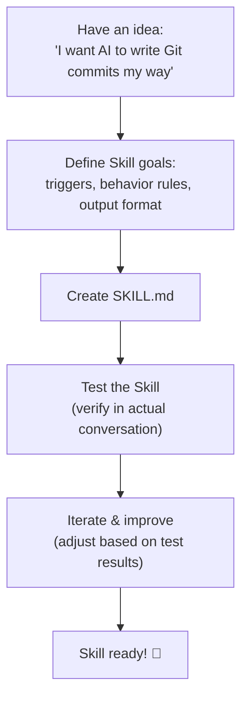

# Creating a Skill: Practical Guide 🟢

> Creating a Skill is the simplest way to extend OpenClaw's capabilities. This chapter walks through a complete real-world example — creating a useful Skill from scratch.

## I. End-to-End Creation Flow



---

## II. Example: "Bilingual Git Assistant" Skill

### Step 1: Define Goals

- **Trigger**: user asks to commit code or write commit message
- **Core behavior**: write commits with both English and Chinese descriptions
- **Output format**: fixed template
- **Scope**: only affects commit message, not code content

### Step 2: Create Skill Directory

```bash
mkdir -p ~/.config/openclaw/skills/git-bilingual
# Or in project directory:
mkdir -p skills/git-bilingual
```

### Step 3: Write `SKILL.md`

```markdown
<!-- skills/git-bilingual/SKILL.md -->

# Bilingual Git Assistant

## When to Activate
Activate when user asks to "commit code", "write commit", "git commit".

## Commit Message Format

Always use this bilingual format:

\`\`\`
<type>(<scope>): <concise English summary>

<Chinese description explaining what changed and why>

- Key change 1
- Key change 2
\`\`\`

## Type Reference

| Type | When to Use |
|------|------------|
| feat | New feature |
| fix  | Bug fix |
| docs | Documentation only |
| refactor | Code restructure (no behavior change) |
| test | Test-related changes |
| chore | Build, deps, config changes |

## Pre-Commit Checklist

Before running git commit:
1. Run \`git diff --staged\` — confirm staged content is correct
2. Run \`git status\` — confirm no missing files

## Prohibited

- Do NOT commit without checking staged content first
- Do NOT combine multiple unrelated changes in one commit
- First line MUST be 72 characters or fewer
```

### Step 4: Enable in Config

```yaml
agents:
  list:
    - id: main
      skills:
        enabled:
          - git-bilingual
          - coding-agent
```

### Step 5: Verify

After starting OpenClaw, send:
```
> Please commit the current changes — it's a new login feature
```

AI should:
1. Run `git diff --staged` first
2. Write bilingual commit message per the format
3. Execute git commit

---

## III. Tips & Tricks

### Tip 1: Support Files for Long Skills

```
skills/git-bilingual/
├── SKILL.md           ← main file (references others)
├── type-guide.md      ← detailed type reference
└── examples.md        ← real examples
```

In `SKILL.md`:
```markdown
## Detailed Type Guide
See: [type-guide.md](type-guide.md)
```

### Tip 2: Using SAG to Auto-Generate Skills

With the `sag` Skill enabled:
```
User: Create a skill that makes AI always suggest TypeScript strict mode and require JSDoc

AI: [automatically creates skills/ts-strict/SKILL.md]
```

---

## IV. Debugging

Enable verbose logging in `config.yaml`:
```yaml
log:
  verbose: true
```

Check that the Skill is injected in Bootstrap logs.

### Common Issues

| Cause | Solution |
|-------|---------|
| Skill directory name doesn't match `enabled` config | Verify exact match |
| Token budget insufficient, Skill truncated | Simplify Skill content |
| `enabled` list configured but Skill not included | Add Skill to `enabled` list |
| Wrong `SKILL.md` filename capitalization | File must be `SKILL.md` (all caps) |

---

## V. Sharing Skills

- **Submit to OpenClaw repo**: create a PR in `skills/` for all users to benefit
- **Git repository**: others clone and use
- **npm publish**: follow OpenClaw's Skill packaging conventions

---

## Key Reference Files

| File | Role |
|------|------|
| `skills/sag/SKILL.md` | SAG — let AI help create Skills |
| `skills/coding-agent/SKILL.md` | Official coding Skill (learning reference) |
| `skills/taskflow/SKILL.md` | Complex Skill example |
| `src/agents/skills.ts` | Skill discovery and loading logic |

---

## Summary

1. **Skill = Markdown**: create `SKILL.md`, put it in `skills/` directory — done.
2. **When-Then structure**: specify clear triggers so AI knows when to apply the Skill.
3. **SAG helps write Skills**: if unsure how to write it, let AI write it for you.
4. **Debug via verbose logs**: confirm Skill is actually injected into Bootstrap.
5. **Token budget is a real constraint**: keep Skills concise — they will be truncated if too long.

---

*[← Integrate LLM Provider](02-integrate-llm-provider.md) | [→ Back to Index](../README.md)*
