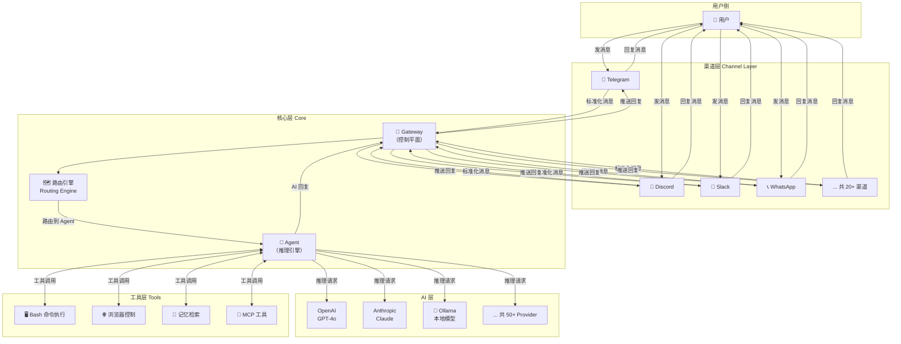

# OpenClaw 是什么 🟢

> 一款运行在你自己设备上的开源个人 AI 助手——连接你已在使用的所有通讯渠道，由你自己的规则驱动。

## 本章目标

读完本章你将能够：
- 理解 OpenClaw 的项目定位和设计哲学
- 区分 OpenClaw 与商业 AI 助手（ChatGPT/Claude.ai 等）的本质差异
- 掌握 Gateway、Channel、Agent、Plugin、Skill、Provider 六个核心概念
- 建立对整个系统的直觉性认知，为深入源码打好基础

---

## 一、项目定位

### "个人 AI 助手"是什么意思？

OpenClaw 的官方定语是：**personal AI assistant you run on your own devices**（运行在你自己设备上的个人 AI 助手）。

这句话有三个关键词：

1. **Personal（个人的）**：OpenClaw 是单用户设计。它不是面向团队或企业的 SaaS 服务，而是专注于单个用户的个人助手体验。
2. **你自己的设备（your own devices）**：程序跑在你的机器上，数据不经过第三方中转服务器。
3. **你自己的规则（your rules）**：你决定 AI 能做什么、不能做什么，包括使用哪个 LLM、连接哪些渠道、开放哪些工具权限。

对比商业 AI 助手：

| 维度 | ChatGPT/Claude.ai | OpenClaw |
|------|-------------------|----------|
| 运行位置 | OpenAI/Anthropic 服务器 | 你的设备 |
| 数据流向 | 经过服务商中转 | 直连 LLM API |
| 模型选择 | 固定（GPT/Claude） | 任意 50+ Provider |
| 消息渠道 | 浏览器 Web UI | 20+ 即时通讯平台 |
| 扩展性 | 有限（GPT Store 等） | 完整插件 API |
| 定制性 | 有限 | 完全可定制 |

### 它能做什么？

OpenClaw 不只是一个聊天机器人。它的核心能力包括：

- **多渠道接入**：在你已经用的 WhatsApp、Telegram、Slack、Discord 等平台上直接对话 AI，不需要切换到新 App
- **工具调用**：AI 可以执行 shell 命令、读写文件、调用外部 API、控制浏览器
- **语音交互**：在 macOS/iOS/Android 上支持语音输入（STT）和语音回复（TTS）
- **记忆系统**：跨对话持久化记忆，AI 能记住你的偏好和历史上下文
- **定时任务**：AI 可以按计划主动发消息（比如每天早晨发天气摘要）
- **Canvas 渲染**：可以渲染实时交互式 Canvas 界面

---

## 二、设计哲学

VISION.md 开篇一句话道尽了项目精神：

> **OpenClaw is the AI that actually does things.**

这句话隐含了一个对比：很多 AI 产品只是"聊天"，而 OpenClaw 的目标是真正"完成任务"。

OpenClaw 的三大设计原则：

### 1. 本地优先，隐私优先

程序运行在你的机器上。除了你主动配置的 LLM API 调用，没有额外的数据流向第三方服务器。Terminal-first 的设计也体现了这一点——用户看得到认证流程和权限配置，没有被隐藏的"便捷包装器"。

### 2. 安全作为一等公民

> "Security in OpenClaw is a deliberate tradeoff: strong defaults without killing capability."

安全与能力之间的平衡是 OpenClaw 的重要设计课题。默认状态下是高安全配置（执行 shell 命令需要人工审批），但允许用户显式解锁高功率模式。

### 3. 核心精简，能力插件化

> "Core stays lean; optional capability should usually ship as plugins."

OpenClaw 的核心只保留骨架（Gateway、基础路由、Plugin 加载器），所有渠道集成、LLM Provider 适配、记忆功能、语音能力都以插件形式存在。这使得核心保持轻量和稳定，同时具有极强的扩展性。

---

## 三、系统鸟瞰图

下图展示了 OpenClaw 的整体数据流——从用户在某个消息平台发出一条消息，到 AI 回复回去的完整路径：



这个图揭示了 OpenClaw 的"三明治"结构：
- **上层**：渠道适配层（负责各平台的协议差异）
- **中层**：核心控制层（Gateway + 路由 + Agent）
- **下层**：AI 和工具层（LLM Provider + 执行能力）

---

## 四、六大核心概念

理解这六个概念，就能读懂 OpenClaw 95% 的源码注释和文档。

### Gateway（网关）

**是什么**：系统的控制平面（control plane）。一个常驻进程，监听来自渠道插件的消息事件，协调路由、认证、会话管理，并将 AI 回复推送回渠道。

**关键源码**：`src/gateway/`

**类比**：就像一个路由器，负责流量分发和策略执行，本身不处理业务逻辑。

---

### Channel（渠道）

**是什么**：连接各个消息平台的适配器插件。每个渠道插件负责将平台原生消息格式转换为 OpenClaw 内部的标准格式（InboundEnvelope），以及将 AI 回复转换回平台格式发出。

**关键源码**：`src/channels/`、`extensions/telegram/`、`extensions/discord/` 等

**类比**：就像电源适配器，不同国家的插头（各平台协议）都能接入同一个系统。

---

### Agent（代理）

**是什么**：AI 推理引擎。Agent 接收用户消息，构建上下文（系统提示 + 历史 + 记忆 + 工具列表），调用 LLM 进行推理，处理工具调用，最终生成回复。

**关键源码**：`src/agents/`

**类比**：就像一个员工，Gateway 是公司接待台（分发任务），Agent 是真正干活的人。

---

### Plugin（插件）

**是什么**：以 npm 包形式分发的代码扩展。分三类：
- **Channel Plugin**：接入新的消息平台
- **Provider Plugin**：接入新的 LLM 服务商
- **Capability Plugin**：添加新的能力（记忆、语音、浏览器控制等）

**关键源码**：`src/plugins/`、`extensions/`

**类比**：就像浏览器扩展插件，核心浏览器保持精简，功能通过插件添加。

---

### Skill（技能）

**是什么**：以 Markdown 文档（带 YAML frontmatter）形式定义的工作流指令。**Skill 不是代码**，而是告诉 Agent 如何执行特定任务的结构化指令集。

**关键源码**：`skills/` 目录

**类比**：就像公司的 SOP（标准操作程序）文档，员工（Agent）按 SOP 行事，不需要重新"编程"。

这是 OpenClaw 最独特的设计之一：用文档来"编程" AI 的行为。

---

### Provider（服务商）

**是什么**：LLM 服务提供商的适配器，负责处理模型认证、请求格式转换、流式响应解析、故障转移。

**关键源码**：`extensions/openai/`、`extensions/anthropic/`、`extensions/ollama/` 等

**类比**：就像支付网关，抹平了不同支付渠道（LLM Provider）的 API 差异。

---

## 五、技术选型：为什么是 TypeScript + 插件架构？

### 为什么选 TypeScript？

VISION.md 给出了官方解释：

> "OpenClaw is primarily an orchestration system: prompts, tools, protocols, and integrations. TypeScript was chosen to keep OpenClaw hackable by default. It is widely known, fast to iterate in, and easy to read, modify, and extend."

OpenClaw 本质上是一个**编排系统**（orchestration system）——它的工作是协调调用各种外部服务（LLM API、消息平台 API、本地工具），而不是处理大量计算。TypeScript 在这个场景下优势明显：

- 静态类型让复杂的多系统集成更安全（接口契约清晰）
- 异步模型（async/await + Stream）非常适合 AI 流式响应
- npm 生态庞大，绝大多数平台 SDK 都有 TS 支持
- 开发者群体最广，降低贡献门槛

### 为什么用插件架构？

插件架构是 OpenClaw "核心精简"哲学的技术体现：

```
核心仓库（稳定）          插件（快速迭代）
---------                --------
Gateway 核心             Telegram 渠道
路由引擎                 Discord 渠道
Plugin 加载器            OpenAI Provider
Session 管理             记忆插件
Auth 基础设施            语音插件
```

这种分离让核心代码保持稳定、安全，而各个渠道和 Provider 的快速变化（API 更新、新功能）可以在插件层独立演进，不影响核心。

---

## 关键源码索引

| 文件 | 作用 |
|------|------|
| `README.md` | 项目介绍、安装指南、功能列表 |
| `VISION.md` | 设计哲学和发展方向 |
| `CLAUDE.md` / `AGENTS.md` | 项目贡献规范和架构边界守卫 |
| `src/entry.ts` | 程序主入口 |
| `src/gateway/` | Gateway 控制平面 |
| `src/agents/` | Agent 推理引擎 |
| `src/channels/` | 渠道抽象层 |
| `src/plugins/` | 插件加载和管理 |
| `src/plugin-sdk/` | 插件开发 SDK |
| `extensions/` | 50+ 渠道/Provider 插件实现 |
| `skills/` | 内置 Skill 集合 |

---

## 小结

1. **OpenClaw 是本地运行的个人 AI 助手**：数据不经过第三方，你控制一切。
2. **三层结构**：渠道层（消息适配）→ 核心层（路由 + Agent）→ AI 层（LLM + 工具）。
3. **六个核心概念**：Gateway（控制平面）、Channel（平台适配）、Agent（推理引擎）、Plugin（代码扩展）、Skill（指令文档）、Provider（LLM 适配）。
4. **插件化设计**：核心精简稳定，渠道/Provider/能力通过插件独立演进。
5. **Skill 是 OpenClaw 最独特的设计**：用结构化 Markdown 文档来定义 AI 的工作流，不需要写代码。

---

## 延伸阅读

- [→ 下一章：代码库导航](02-codebase-tour.md) — 了解代码库结构，找到每个概念对应的文件
- [`VISION.md`](../../../../VISION.md) — 官方设计哲学原文
- [OpenClaw 官方文档](https://docs.openclaw.ai) — 用户文档和配置指南
- [DeepWiki](https://deepwiki.com/openclaw/openclaw) — AI 生成的代码库概览
