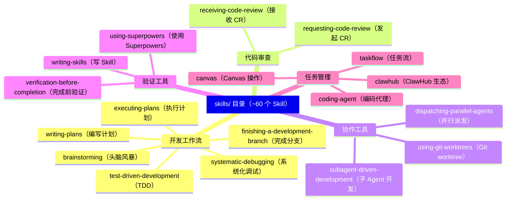

# 代码库导航 🟢

> 打开 OpenClaw 仓库，你会看到数十个目录、数千个文件。本章是你的导航地图——告诉你每块代码在哪里、是干什么的。

## 本章目标

读完本章你将能够：
- 看懂仓库根目录的整体布局
- 知道任意功能对应哪个源码目录
- 理解 `src/`、`extensions/`、`skills/`、`packages/` 四大顶级目录的分工
- 找到关键文件（入口、配置、Plugin SDK 等）的位置

---

## 一、仓库根目录一览

```
openclaw/
├── src/                    ← 核心源码（Gateway、Agent、Plugin 框架等）
├── extensions/             ← 所有插件（90+ 渠道/Provider/能力插件）
├── skills/                 ← 内置 Skill 集合（约 60 个）
├── packages/               ← 独立 npm 包（clawdbot、moltbot 等）
├── apps/                   ← 移动端/桌面端应用（iOS、Android、macOS）
├── docs/                   ← 官方文档（Mintlify 构建）
├── ui/                     ← Web UI 前端
├── test/                   ← 集成/端到端测试
├── test-fixtures/          ← 测试固件数据
├── scripts/                ← 构建、发布脚本
├── assets/                 ← 静态资源（Logo、图标）
├── vendor/                 ← 第三方依赖 patches
│
├── openclaw.mjs            ← CLI 入口包装器（npm bin 指向此文件）
├── src/entry.ts            ← 实际启动逻辑入口
├── src/index.ts            ← 库入口（被其他模块 import）
├── package.json            ← 项目配置（59KB！含大量依赖和脚本）
├── pnpm-workspace.yaml     ← monorepo workspace 配置
├── tsconfig.json           ← TypeScript 编译配置
├── tsdown.config.ts        ← 构建工具（tsdown）配置
├── Dockerfile              ← Docker 部署配置
├── docker-compose.yml      ← Docker Compose 编排
├── CLAUDE.md / AGENTS.md   ← AI 助手的项目规范（架构守卫文档）
├── VISION.md               ← 项目设计哲学和方向
└── CHANGELOG.md            ← 版本更新日志（935KB，历史详尽）
```

---

## 二、`src/` — 核心源码详解

`src/` 是整个项目最重要的目录，包含 OpenClaw 的核心框架代码。子目录按功能模块划分：

### 入口与运行时

| 目录/文件 | 说明 |
|-----------|------|
| `entry.ts` | CLI 程序主入口，处理 respawn、compile cache、环境初始化 |
| `index.ts` | 库入口，供外部 import 使用 |
| `runtime.ts` | 运行时全局状态管理 |
| `globals.ts` | 全局配置常量 |
| `version.ts` | 版本信息读取 |

### Gateway 控制平面

| 目录 | 说明 |
|------|------|
| `gateway/` | Gateway 服务器核心（HTTP + WebSocket + 渠道管理）|
| `routing/` | 消息路由引擎（决定每条消息交给哪个 Agent）|
| `sessions/` | 会话持久化（SQLite 存储会话历史）|
| `daemon/` | 守护进程管理（后台运行 Gateway）|

### Agent 推理层

| 目录 | 说明 |
|------|------|
| `agents/` | Agent 核心逻辑（Bootstrap、调用循环、工具执行、上下文压缩）|
| `acp/` | Agent Communication Protocol（父子 Agent 通信协议）|
| `bootstrap/` | Bootstrap 相关工具函数 |
| `context-engine/` | 上下文引擎（多层级上下文查找）|

### 渠道与消息

| 目录 | 说明 |
|------|------|
| `channels/` | 渠道抽象层（InboundEnvelope、状态回应、线程绑定策略）|
| `chat/` | 聊天消息工具函数 |
| `auto-reply/` | 自动回复和心跳系统 |
| `pairing/` | 设备配对（移动端与 Gateway 连接）|

### 插件框架

| 目录 | 说明 |
|------|------|
| `plugins/` | 插件加载器、注册表、发现机制 |
| `plugin-sdk/` | 插件开发 SDK（公开给插件开发者的 API）|
| `hooks/` | 生命周期钩子（before-agent-reply 等）|

### 能力模块

| 目录 | 说明 |
|------|------|
| `mcp/` | Model Context Protocol 集成 |
| `tts/` | 文字转语音（Text-to-Speech）|
| `media/` | 媒体处理（图片、音频）|
| `media-understanding/` | 媒体理解（图片识别等）|
| `image-generation/` | AI 图片生成 |
| `web-fetch/` | 网页内容获取 |
| `web-search/` | 网页搜索 |
| `terminal/` | 终端控制（TUI 界面）|
| `canvas-host/` | Canvas 渲染宿主 |
| `tui/` | 终端用户界面 |

### 基础设施

| 目录 | 说明 |
|------|------|
| `config/` | 配置文件读取和验证（`openclaw.yaml` 解析）|
| `infra/` | 基础设施工具（环境变量、TLS、设备身份、进程管理）|
| `logging/` | 日志子系统 |
| `secrets/` | Secret 解析（API Key、SecretRef）|
| `security/` | 安全检查（路径遍历防护、输入过滤）|
| `i18n/` | 国际化支持 |

### 开发工具

| 目录 | 说明 |
|------|------|
| `cli/` | CLI 命令解析（参数处理、profile 管理）|
| `commands/` | 具体 CLI 子命令实现 |
| `scripts/` | 构建和维护脚本 |
| `test-helpers/` | 测试辅助工具 |
| `test-utils/` | 测试通用工具 |

---

## 三、`extensions/` — 插件目录（90+ 插件）

`extensions/` 包含 OpenClaw 官方维护的所有插件，按功能可分为四类：

### 渠道插件（Channel Plugins）

| 插件 | 渠道平台 |
|------|---------|
| `telegram/` | Telegram Bot |
| `discord/` | Discord |
| `slack/` | Slack |
| `whatsapp/` | WhatsApp Business API |
| `imessage/` | iMessage（仅 macOS）|
| `bluebubbles/` | BlueBubbles（Android iMessage 替代）|
| `signal/` | Signal |
| `matrix/` | Matrix 协议 |
| `msteams/` | Microsoft Teams |
| `googlechat/` | Google Chat |
| `feishu/` | 飞书 |
| `line/` | LINE |
| `mattermost/` | Mattermost |
| `irc/` | IRC |
| `nostr/` | Nostr |
| `twitch/` | Twitch Chat |
| `discord/` | Discord |
| `zalo/` | Zalo |
| `qqbot/` | QQ Bot |
| `tlon/` | Tlon |

### LLM Provider 插件（Provider Plugins）

| 插件 | Provider |
|------|---------|
| `openai/` | OpenAI（GPT-4o 等）|
| `anthropic/` | Anthropic（Claude）|
| `google/` | Google（Gemini）|
| `mistral/` | Mistral AI |
| `groq/` | Groq（超快推理）|
| `ollama/` | Ollama（本地模型）|
| `openrouter/` | OpenRouter（统一路由）|
| `litellm/` | LiteLLM 代理 |
| `amazon-bedrock/` | AWS Bedrock |
| `deepseek/` | DeepSeek |
| `xai/` | xAI（Grok）|
| `together/` | Together AI |
| `huggingface/` | HuggingFace |
| `vllm/` | vLLM（自托管）|
| `sglang/` | SGLang（高性能推理）|
| `moonshot/` | Moonshot AI（Kimi）|
| `volcengine/` | 火山引擎（字节跳动）|

### 能力插件（Capability Plugins）

| 插件 | 功能 |
|------|------|
| `memory-core/` | 记忆存储抽象层 |
| `memory-lancedb/` | 基于 LanceDB 的向量记忆 |
| `browser/` | 浏览器控制（Playwright）|
| `speech-core/` | 语音能力核心抽象 |
| `deepgram/` | Deepgram STT（语音转文字）|
| `elevenlabs/` | ElevenLabs TTS（文字转语音）|
| `talk-voice/` | 语音通话集成 |
| `voice-call/` | 语音通话核心 |
| `image-generation-core/` | 图片生成核心 |
| `fal/` | Fal.ai（图片生成）|
| `brave/` | Brave Search 搜索 |
| `tavily/` | Tavily 搜索 |
| `exa/` | Exa 搜索 |
| `duckduckgo/` | DuckDuckGo 搜索 |
| `firecrawl/` | Firecrawl 网页抓取 |
| `diffs/` | Diff/Patch 工具 |

### 基础设施插件

| 插件 | 功能 |
|------|------|
| `diagnostics-otel/` | OpenTelemetry 可观测性 |
| `thread-ownership/` | 线程归属管理 |
| `device-pair/` | 设备配对协议 |
| `phone-control/` | 手机控制 |
| `opencode/` | OpenCode 集成 |
| `acpx/` | ACP 协议扩展 |

---

## 四、`skills/` — 内置 Skill 集合

`skills/` 目录包含约 60 个官方 Skill（每个 Skill 是一个子目录，包含 `SKILL.md` 和可选的支持文件）：



每个 Skill 的结构：
```
skills/brainstorming/
├── SKILL.md          ← Skill 主体（frontmatter + 指令内容）
├── references/       ← 参考文档（按需加载）
├── examples/         ← 示例（按需加载）
└── scripts/          ← 辅助脚本（按需加载）
```

---

## 五、`packages/` — 独立 npm 包

`packages/` 下是作为独立 npm 包发布的模块：

| 包 | 说明 |
|----|------|
| `clawdbot/` | Telegram Bot 库（OpenClaw 早期名字的遗留）|
| `moltbot/` | 另一个 Bot 库 |
| `memory-host-sdk/` | 记忆宿主 SDK |
| `plugin-package-contract/` | 插件包契约类型定义 |

---

## 六、关键文件速查

| 文件 | 用途 | 重要程度 |
|------|------|---------|
| `openclaw.mjs` | npm bin 入口 | ⭐⭐⭐ |
| `src/entry.ts` | 程序启动逻辑 | ⭐⭐⭐ |
| `src/index.ts` | 库导出入口 | ⭐⭐⭐ |
| `src/gateway/server-http.ts` | HTTP Gateway 服务器 | ⭐⭐⭐ |
| `src/gateway/server-chat.ts` | WebSocket 聊天处理 | ⭐⭐⭐ |
| `src/routing/resolve-route.ts` | 路由决策核心 | ⭐⭐⭐ |
| `src/plugins/loader.ts` | 插件加载器 | ⭐⭐⭐ |
| `src/plugin-sdk/core.ts` | Plugin SDK 公开 API | ⭐⭐⭐ |
| `src/agents/bootstrap-budget.ts` | Agent 上下文预算 | ⭐⭐⭐ |
| `package.json` | 项目配置（含 exports 字段）| ⭐⭐⭐ |
| `CLAUDE.md` / `AGENTS.md` | 架构规范和边界守卫 | ⭐⭐ |

### `package.json` 的 `exports` 字段

`package.json` 中定义了 OpenClaw 作为库的公开入口点：

```json
{
  "exports": {
    ".": "./dist/index.js",
    "./plugin-sdk": "./dist/plugin-sdk/index.js",
    "./plugin-sdk/core": "./dist/plugin-sdk/core.js",
    "./plugin-sdk/provider-setup": "./dist/plugin-sdk/provider-setup.js",
    "./plugin-sdk/sandbox": "./dist/plugin-sdk/sandbox.js",
    "./plugin-sdk/routing": "./dist/plugin-sdk/routing.js",
    "./plugin-sdk/runtime": "./dist/plugin-sdk/runtime.js",
    "./plugin-sdk/setup": "./dist/plugin-sdk/setup.js"
    // ... 共 20+ 子路径
  }
}
```

这些入口点就是插件开发者可以 `import` 的合法路径。例如 `import { definePlugin } from 'openclaw/plugin-sdk/core'`。

---

## 七、测试文件组织约定

OpenClaw 采用**测试文件与源码文件并列（colocated）**的约定：

```
src/routing/
├── resolve-route.ts          ← 源码
├── resolve-route.test.ts     ← 对应的单元测试（⭐同目录）
├── session-key.ts
├── session-key.test.ts
└── session-key.continuity.test.ts
```

这意味着：
- 看到某个 `.ts` 文件，对应的测试就在同目录的 `.test.ts` 文件里
- 不需要在 `test/` 目录下寻找测试

`test/` 目录（根目录级别）用于跨模块的集成测试和端到端（e2e）测试。

---

## 八、构建工具链

| 工具 | 用途 |
|------|------|
| `pnpm` | 包管理器（monorepo workspace）|
| `tsdown` | TypeScript 构建（基于 Rolldown，输出 `dist/`）|
| `vitest` | 测试框架（多个配置文件对应不同测试套件）|
| `oxlint` | 代码 lint（快速的 Rust 实现）|
| `prettier` | 代码格式化 |

构建产物在 `dist/` 目录（Git 忽略，需要本地构建或 npm 发布时生成）。

---

## 关键源码索引

| 文件 | 作用 |
|------|------|
| `pnpm-workspace.yaml` | Monorepo workspace 定义 |
| `tsconfig.json` | TS 编译配置 |
| `tsdown.config.ts` | 构建配置（入口点、输出格式）|
| `vitest.unit.config.ts` | 单元测试配置 |
| `vitest.e2e.config.ts` | 端到端测试配置 |
| `knip.config.ts` | 未使用代码检测配置 |

---

## 小结

1. **四大顶级目录**：`src/`（核心）、`extensions/`（插件）、`skills/`（Skill）、`packages/`（独立包）。
2. **`src/` 按功能模块分 30+ 子目录**：Gateway、Agent、Channels、Plugins、Plugin SDK 是核心，还有大量基础设施模块。
3. **`extensions/` 有 90+ 插件**：渠道插件、Provider 插件、能力插件三大类，各自独立维护。
4. **测试文件并列放置**：`.test.ts` 与 `.ts` 源文件在同目录。
5. **`package.json` 的 `exports` 字段**：定义了插件开发者可以 `import` 的合法入口点（`openclaw/plugin-sdk/*`）。

---

## 延伸阅读

- [← 上一章：OpenClaw 是什么](01-what-is-openclaw.md)
- [→ 下一章：跑起来——启动流程与入口追踪](03-running-locally.md)
- [`CLAUDE.md`](../../../../CLAUDE.md) — 项目结构规范原文（"Architecture Boundaries" 章节）
