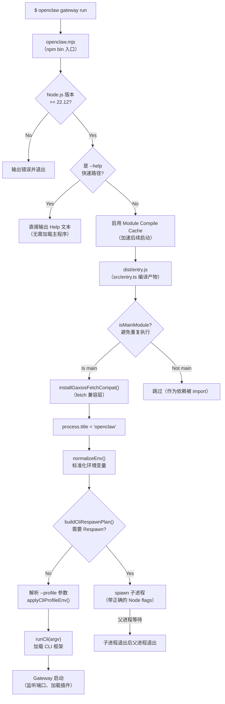
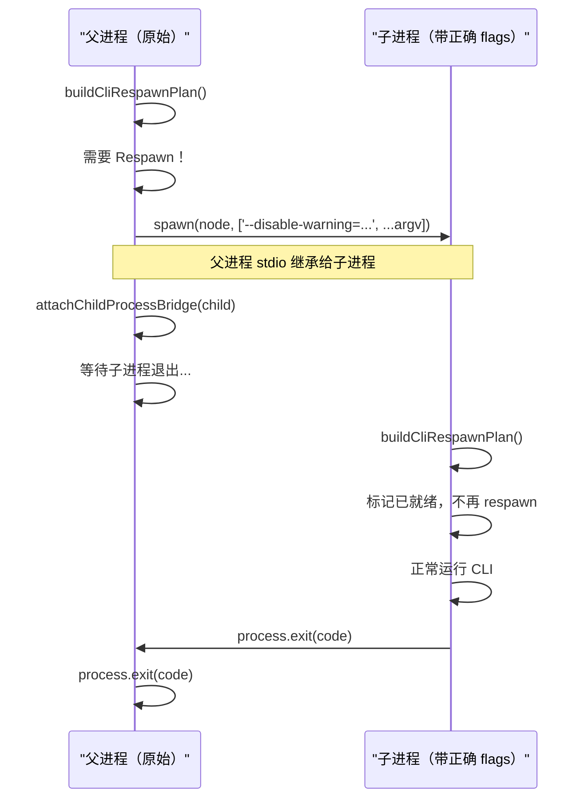
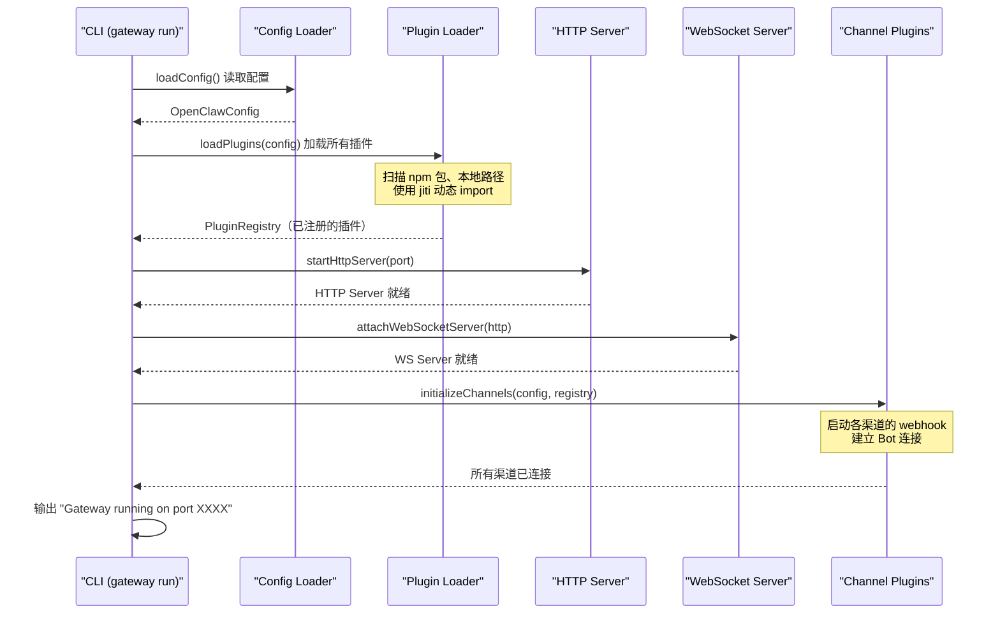

# 跑起来：启动流程与入口追踪 🟡

> 从一行 `openclaw gateway run` 命令开始，追踪程序如何一步步启动，直到 Gateway 开始监听消息。

## 本章目标

读完本章你将能够：
- 理解 `openclaw.mjs` → `entry.ts` → `runCli()` 的完整启动调用链
- 解释 Respawn 机制的作用和触发条件
- 看懂 `entry.ts` 中每个启动步骤的含义
- 了解 CLI 命令树的整体结构

---

## 一、从安装到运行

当你执行 `npm install -g openclaw@latest` 并运行 `openclaw` 命令时，系统实际执行的是什么？

`package.json` 中的 `bin` 字段定义了 CLI 入口：

```json
// package.json
{
  "bin": {
    "openclaw": "openclaw.mjs"
  }
}
```

所以 `openclaw` 命令的起点是仓库根目录的 **`openclaw.mjs`** 文件。

---

## 二、启动全链路



---

## 三、`openclaw.mjs` 详解

`openclaw.mjs` 是纯 JavaScript（不经过 TypeScript 编译），作为 Node.js 可直接运行的轻量级包装器：

### 步骤 1：Node.js 版本检查

```javascript
// openclaw.mjs:8-37
const MIN_NODE_MAJOR = 22;
const MIN_NODE_MINOR = 12;

const ensureSupportedNodeVersion = () => {
  if (isSupportedNodeVersion(parseNodeVersion(process.versions.node))) {
    return;
  }
  process.stderr.write(
    `openclaw: Node.js v${MIN_NODE_VERSION}+ is required (current: v${process.versions.node}).\n`
  );
  process.exit(1);
};

ensureSupportedNodeVersion(); // 最先执行，版本不对立即退出
```

### 步骤 2：Compile Cache 启用（快速路径）

```javascript
// openclaw.mjs:42-48
if (module.enableCompileCache && !process.env.NODE_DISABLE_COMPILE_CACHE) {
  try {
    module.enableCompileCache(); // 缓存 V8 编译产物，加速再次启动
  } catch {
    // Ignore errors — best-effort only
  }
}
```

`module.enableCompileCache()` 是 Node.js 22+ 的新 API，将 JavaScript 的 V8 编译结果缓存到磁盘，能显著减少冷启动时间（OpenClaw 代码量大，这个优化很实际）。

### 步骤 3：Help 快速路径

```javascript
// openclaw.mjs:128-167
const isBareRootHelpInvocation = (argv) =>
  argv.length === 3 && (argv[2] === '--help' || argv[2] === '-h');

if (await tryOutputBareRootHelp()) {
  // 命中：直接输出预计算的 Help 文本，不需要加载整个 CLI 框架
} else {
  // 继续正常启动流程
}
```

`openclaw --help` 有一个特殊的快速路径：直接读取预先生成的 `dist/cli-startup-metadata.json` 中的 Help 文本，**不需要加载 Commander.js 等整个 CLI 框架**，输出极快。

### 步骤 4：加载主程序

```javascript
// openclaw.mjs:172-179
if (await tryImport('./dist/entry.js')) {
  // OK — 正常安装（构建产物）
} else if (await tryImport('./dist/entry.mjs')) {
  // OK — ESM 变体
} else {
  throw new Error(await buildMissingEntryErrorMessage()); // 未构建的源码树
}
```

---

## 四、`src/entry.ts` 详解

这是真正的主入口逻辑。

### isMainModule 守卫

```typescript
// src/entry.ts:37-43
if (
  !isMainModule({
    currentFile: fileURLToPath(import.meta.url),
    wrapperEntryPairs: [...ENTRY_WRAPPER_PAIRS],
  })
) {
  // Imported as a dependency — skip all entry-point side effects.
}
```

这是一个关键的防重复执行守卫。问题背景：

> 当 `dist/index.js`（库入口）被加载时，打包器可能会把 `entry.js` 作为共享依赖 import 进来。如果没有这个守卫，`entry.ts` 的顶层代码会执行两次，导致 Gateway 启动两次，然后因为端口冲突而崩溃。

`isMainModule` 通过检查当前文件是否是 `process.argv[1]` 指向的主模块（或其包装器文件）来判断是否应该执行入口逻辑。

### 正常启动序列

```typescript
// src/entry.ts:44-157（精简版）
else {
  // 1. gaxios fetch 兼容层（让 gaxios 库用原生 fetch）
  const { installGaxiosFetchCompat } = await import('./infra/gaxios-fetch-compat.js');
  await installGaxiosFetchCompat();

  // 2. 设置进程名称（ps 输出中显示为 "openclaw"）
  process.title = 'openclaw';

  // 3. 标记进程为 openclaw 执行环境（防止插件误判运行环境）
  ensureOpenClawExecMarkerOnProcess();

  // 4. 安装 process.on('warning') 过滤器（屏蔽无关的实验性 API 警告）
  installProcessWarningFilter();

  // 5. 标准化环境变量（处理大小写、别名等）
  normalizeEnv();

  // 6. 启用 Compile Cache（TypeScript 编译层面的缓存）
  if (!isTruthyEnvValue(process.env.NODE_DISABLE_COMPILE_CACHE)) {
    try { enableCompileCache(); } catch { /* best-effort */ }
  }

  // 7. Respawn 检测
  if (!ensureCliRespawnReady()) {
    // 8. 解析 --profile 参数
    const parsed = parseCliProfileArgs(parsedContainer.argv);
    if (parsed.profile) {
      applyCliProfileEnv({ profile: parsed.profile });
    }

    // 9. 最终启动 CLI
    runMainOrRootHelp(process.argv);
  }
}
```

---

## 五、Respawn 机制

这是 OpenClaw 启动序列中最特别的设计之一。

### 为什么需要 Respawn？

Node.js 的 `execArgv`（如 `--disable-warning=ExperimentalWarning`）必须在进程启动时传入，不能在运行时修改。同样，`NODE_EXTRA_CA_CERTS`（自定义 CA 证书）必须在进程启动时通过环境变量传入。

**问题**：用户通过 `npm install -g` 安装后直接运行 `openclaw`，启动时没有这些必要的 Node.js flags。

**解决方案**：Respawn——检测到需要额外的 flags 时，**当前进程 spawn 一个带正确 flags 的子进程，然后父进程等待子进程退出**。

```typescript
// src/entry.respawn.ts 核心逻辑（简化版）
export function buildCliRespawnPlan(): { argv: string[]; env: NodeJS.ProcessEnv } | null {
  let needsRespawn = false;
  const childEnv = { ...process.env };
  const childExecArgv = [...process.execArgv];

  // 检查 1：是否需要抑制 ExperimentalWarning？
  if (!hasExperimentalWarningSuppressed() && !env[OPENCLAW_NODE_OPTIONS_READY]) {
    childExecArgv.unshift('--disable-warning=ExperimentalWarning');
    childEnv[OPENCLAW_NODE_OPTIONS_READY] = '1'; // 标记：已处理，防止无限 respawn
    needsRespawn = true;
  }

  // 检查 2：是否需要设置自定义 CA 证书？
  if (autoNodeExtraCaCerts && !env[OPENCLAW_NODE_EXTRA_CA_CERTS_READY]) {
    childEnv.NODE_EXTRA_CA_CERTS = autoNodeExtraCaCerts;
    childEnv[OPENCLAW_NODE_EXTRA_CA_CERTS_READY] = '1'; // 防止无限 respawn
    needsRespawn = true;
  }

  if (!needsRespawn) return null; // 不需要 respawn，返回 null

  return { argv: [...childExecArgv, ...argv.slice(1)], env: childEnv };
}
```

Respawn 流程：



`OPENCLAW_NODE_OPTIONS_READY` 和 `OPENCLAW_NODE_EXTRA_CA_CERTS_READY` 这两个环境变量是防止无限 Respawn 的"已处理"标记。

---

## 六、`runCli()` 与 CLI 命令树

`entry.ts` 最终调用 `runCli(argv)`（在 `src/cli/run-main.ts`），加载基于 Commander.js 构建的 CLI 框架。

OpenClaw 的 CLI 命令树（主要命令）：

```
openclaw
├── gateway
│   ├── run              ← 启动 Gateway（最常用）
│   ├── stop             ← 停止 Gateway
│   ├── status           ← 查看 Gateway 状态
│   ├── logs             ← 查看 Gateway 日志
│   └── restart          ← 重启 Gateway
│
├── onboard              ← 交互式引导安装（推荐新用户使用）
│
├── channels
│   ├── status           ← 查看所有渠道状态
│   ├── add              ← 添加新渠道
│   ├── remove           ← 移除渠道
│   └── test             ← 测试渠道连接
│
├── agents
│   ├── list             ← 列出 Agent 配置
│   └── inspect          ← 检查 Agent 详情
│
├── config
│   ├── get <key>        ← 读取配置
│   └── set <key> <val>  ← 设置配置
│
├── secrets
│   ├── set <key>        ← 设置 Secret（API Key 等）
│   ├── get <key>        ← 获取 Secret
│   ├── list             ← 列出所有 Secret
│   └── audit            ← 审计 Secret（只读模式）
│
├── plugins
│   ├── list             ← 列出已安装插件
│   ├── install <pkg>    ← 安装插件
│   └── remove <pkg>     ← 移除插件
│
├── login [provider]     ← OAuth 登录（OpenAI/Anthropic 等）
├── logout [provider]    ← 登出
│
└── --version / -V       ← 显示版本（快速路径，不加载 CLI 框架）
```

---

## 七、Gateway 启动序列

当执行 `openclaw gateway run` 时，Gateway 服务器的启动序列如下：



---

## 八、配置文件

OpenClaw 的主配置文件格式（简化示例）：

```yaml
# ~/.config/openclaw/config.yaml（或通过 OPENCLAW_CONFIG 环境变量指定路径）
gateway:
  port: 4242
  auth:
    password: "${env:OPENCLAW_PASSWORD}"  # SecretRef 语法

agents:
  default:
    provider: anthropic
    model: claude-opus-4-5

channels:
  telegram:
    enabled: true
    token: "${env:TELEGRAM_BOT_TOKEN}"
  discord:
    enabled: true
    token: "${env:DISCORD_BOT_TOKEN}"
```

配置文件的解析由 `src/config/` 模块负责，支持 `${env:VAR}`、`${file:/path}` 等 SecretRef 语法（在[机制篇 02](../03-mechanisms/02-auth-system.md) 详细讲解）。

---

## 关键源码索引

| 文件 | 作用 |
|------|------|
| `openclaw.mjs` | npm bin 入口，版本检查、Help 快速路径 |
| `src/entry.ts` | 主入口逻辑，Respawn 检测、环境初始化 |
| `src/entry.respawn.ts` | Respawn 计划构建逻辑 |
| `src/cli/run-main.ts` | CLI 框架加载，`runCli()` 函数 |
| `src/cli/argv.ts` | 命令行参数解析工具 |
| `src/cli/profile.ts` | `--profile` 参数处理 |
| `src/infra/is-main.ts` | `isMainModule()` 守卫 |
| `src/infra/env.ts` | 环境变量标准化 |
| `src/config/config.ts` | 配置文件加载和解析 |
| `src/gateway/server-http.ts` | Gateway HTTP 服务器启动 |

---

## 小结

1. **两级入口**：`openclaw.mjs`（纯 JS，最小化依赖）→ `src/entry.ts`（TypeScript 主逻辑）。
2. **Help 快速路径**：`openclaw --help` 不加载 CLI 框架，直接读预计算文本，极速响应。
3. **Respawn 机制**：检测到需要特定 Node.js flags 时，自动 spawn 带正确参数的子进程，父进程等待并代理退出码。
4. **isMainModule 守卫**：防止 `entry.ts` 作为依赖被 import 时重复执行启动逻辑。
5. **Compile Cache**：两个层面（`openclaw.mjs` 的 Node.js 原生缓存 + `entry.ts` 的 `enableCompileCache`）都有启用，加速冷启动。

---

## 延伸阅读

- [← 上一章：代码库导航](02-codebase-tour.md)
- [→ 下一章：系统分层架构](../01-architecture/01-system-layers.md)
- [`src/entry.ts`](../../../../src/entry.ts) — 主入口源码
- [`src/entry.respawn.ts`](../../../../src/entry.respawn.ts) — Respawn 逻辑
- [`openclaw.mjs`](../../../../openclaw.mjs) — CLI 包装器
