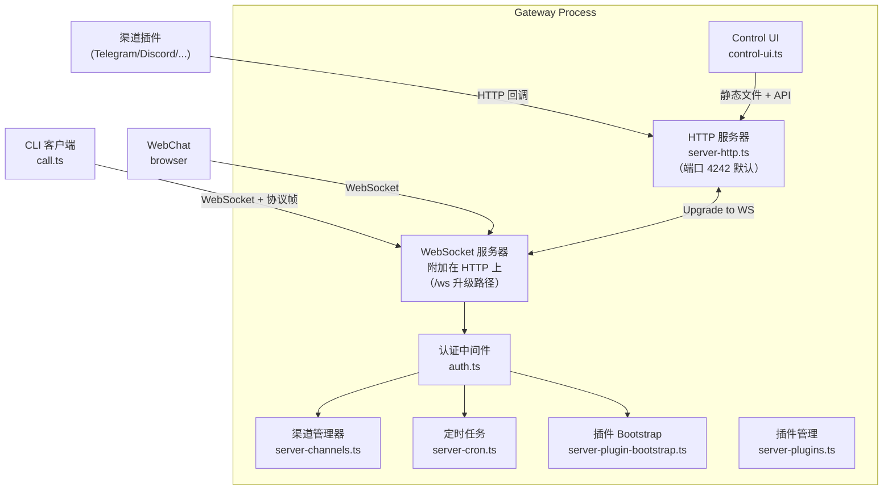
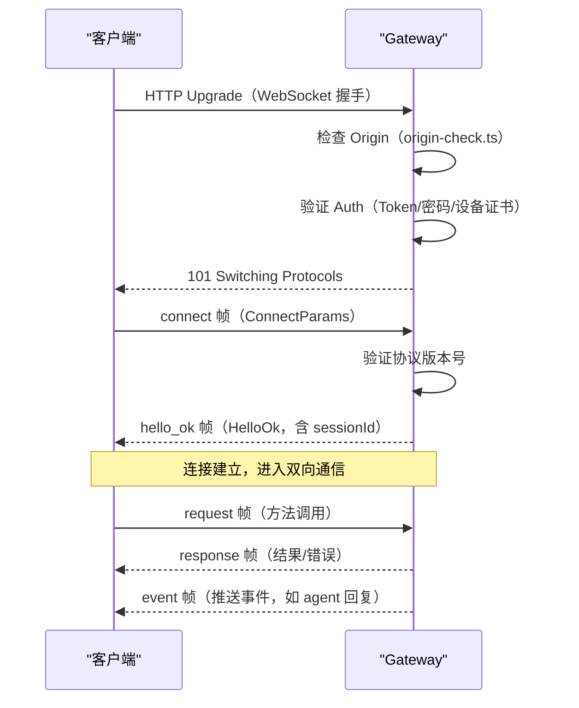
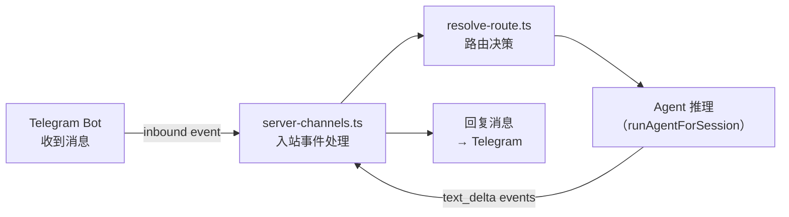

# Gateway 核心 🟡

> Gateway 是 OpenClaw 的"神经中枢"——它不做 AI 推理，只负责将正确的消息分发到正确的地方，并把 AI 的回复准确地推送回去。

## 本章目标

读完本章你将能够：
- 理解 Gateway 控制平面与数据平面分离的设计
- 追踪一个 WebSocket 连接从建立到消息收发的完整过程
- 理解 Gateway 的 HTTP 路由表和各端点的作用
- 理解 CLI → Gateway 通信协议（`call.ts`）的工作方式

---

## 一、Gateway 的核心定位

官方文档有一句话精准描述了 Gateway 的地位：

> "The Gateway is just the control plane — the product is the assistant."

Gateway 是**控制平面（control plane）**，不是数据平面。这意味着：
- Gateway 知道"有哪些渠道"、"有哪些 Agent"、"消息该去哪里"
- Gateway **不直接推理**，也不直接调用 LLM
- Gateway 通过协调各组件（路由、会话、插件、Agent）完成请求处理

这个设计让 Gateway 保持轻量、稳定，便于独立测试和独立运行（甚至可以在无 LLM 的情况下验证渠道连接）。

---

## 二、Gateway 的组件结构



---

## 三、HTTP 路由表

`server-http.ts` 中的 `createGatewayHttpServer()` 函数注册了所有 HTTP 路由。主要路由包括：

| 路径 | 方法 | 处理器 | 说明 |
|------|------|--------|------|
| `/health`、`/healthz` | GET | `handleGatewayProbeRequest` | 健康检查（liveness probe）|
| `/ready`、`/readyz` | GET | `handleGatewayProbeRequest` | 就绪检查（readiness probe）|
| `/v1/chat/completions` | POST | `handleOpenAiHttpRequest` | OpenAI 兼容 API 入口 |
| `/v1/responses` | POST | `handleOpenResponsesHttpRequest` | OpenAI Responses API |
| `/v1/embeddings` | POST | `handleOpenAiEmbeddingsHttpRequest` | Embeddings API |
| `/v1/models` | GET | `handleOpenAiModelsHttpRequest` | 模型列表（OpenAI 格式）|
| `/hooks/agent/:id` | POST | `createHooksRequestHandler` | Webhook 触发 Agent |
| `/_ui/**` | GET | `handleControlUiHttpRequest` | 浏览器管理界面 |
| `/_ui/avatar/**` | GET | `handleControlUiAvatarRequest` | Agent 头像 |
| `plugin routes` | * | `buildPluginRequestStages` | 渠道插件注册的 webhook 路由 |

OpenAI 兼容 API 是 Gateway 的一个重要特性——它让 OpenClaw 可以作为一个标准 OpenAI 接口端点，供其他工具（如 Cursor、Continue.dev 等）直接使用。

---

## 四、WebSocket 协议

WebSocket 连接的升级由 `attachGatewayUpgradeHandler()` 处理（`server-http.ts:988`）。

### 握手流程



### 协议帧类型

`src/gateway/protocol/schema/frames.ts` 定义了三种帧：

```typescript
// RequestFrame: 客户端 → Gateway（RPC 调用）
type RequestFrame = {
  type: 'request';
  id: string;       // 请求 ID（客户端生成）
  method: string;   // 方法名，如 "chat.send"
  params: unknown;  // 方法参数
};

// ResponseFrame: Gateway → 客户端（RPC 返回）
type ResponseFrame = {
  type: 'response';
  id: string;       // 对应的请求 ID
  result?: unknown; // 成功结果
  error?: { code: string; message: string; details?: unknown }; // 错误
  final: boolean;   // 是否是最后一帧（流式响应）
};

// EventFrame: Gateway → 客户端（主动推送）
type EventFrame = {
  type: 'event';
  event: string;    // 事件类型，如 "agent.text_delta"
  data: unknown;    // 事件数据
};
```

这是一个基于 WebSocket 的**RPC + 事件推送混合协议**：
- `request/response` 用于命令/查询（chat、config、agents 管理等）
- `event` 用于服务器向客户端推送实时状态（Agent 流式回复、状态变化等）

### 协议版本

```typescript
// src/gateway/protocol/schema/frames.ts
export const PROTOCOL_VERSION = 9; // 当前协议版本
```

客户端在 `connect` 帧中声明支持的协议版本范围，Gateway 验证兼容性，不兼容则拒绝连接并告知升级方式。

---

## 五、CLI → Gateway 通信：`call.ts`

`call.ts`（`src/gateway/call.ts`，30KB）是 CLI 命令访问 Gateway 的核心模块。几乎所有 CLI 命令最终都通过 `callGateway()` 函数与 Gateway 通信。

### GatewayClient

`client.ts` 中的 `GatewayClient` 类封装了 WebSocket 连接管理：

```typescript
// src/gateway/client.ts（简化版）
export class GatewayClient {
  // 建立 WebSocket 连接，完成握手
  async connect(): Promise<void>

  // 发送 RPC 请求，等待响应
  async request(method: string, params?: unknown): Promise<unknown>

  // 发送流式请求，逐步接收 EventFrame
  async* stream(method: string, params?: unknown): AsyncGenerator<EventFrame>

  // 断开连接
  disconnect(): void
}
```

### 认证优先级

CLI 连接 Gateway 时支持多种认证方式，按优先级：

```
1. CLI 参数 --token=<token>
2. 环境变量 OPENCLAW_TOKEN
3. 配置文件中的 token
4. 本地设备证书（device identity + TLS）
5. 密码认证（--password=<pass>）
```

设备证书认证是推荐方式：`loadOrCreateDeviceIdentity()` 会在首次连接时生成 Ed25519 密钥对，后续连接通过数字签名认证，不需要每次输入密码。

---

## 六、渠道管理：`server-channels.ts`

渠道插件通过 `server-channels.ts` 注册和管理。当一个渠道插件（如 Telegram）有新消息时，它调用 `server-channels.ts` 中的入站处理函数，触发路由和 Agent 推理。



`server-channels.ts` 中维护了所有已激活渠道的状态（连接状态、健康检查、错误信息），以便在 Control UI 中展示渠道状态。

---

## 七、Control UI：`control-ui.ts`

Control UI 是一个内置于 Gateway 的轻量级 Web 界面，提供：
- 渠道状态监控
- Agent 配置管理
- 会话历史查看
- 模型配置

访问方式：启动 Gateway 后打开 `http://localhost:4000/_ui/`（默认端口，可在配置中修改）。

`control-ui.ts`（13KB）负责：
- 注册 `/_ui/**` 下的所有路由
- CSP（Content Security Policy）头部设置
- 与 Web UI 前端（`ui/` 目录）的集成

---

## 八、Method Scopes 权限模型

Gateway 的 RPC 方法被分成不同的权限组（`method-scopes.ts`），控制不同客户端的访问权限：

```typescript
// src/gateway/method-scopes.ts（简化）
type OperatorScope =
  | 'read'           // 读取配置、状态
  | 'write'          // 修改配置
  | 'chat'           // 发送聊天消息
  | 'admin'          // 管理操作（重启、更新等）
  | 'exec_approve'   // 批准 AI 执行 shell 命令
```

CLI 默认使用 `CLI_DEFAULT_OPERATOR_SCOPES`（几乎全部权限）。WebChat 客户端通常只有 `read + chat` 权限。这允许通过 Gateway token 创建只读监控连接，或只有聊天权限的受限连接。

---

## 关键源码索引

| 文件 | 大小 | 关键函数 |
|------|------|---------|
| `src/gateway/server-http.ts` | 36KB | `createGatewayHttpServer()`, `createHooksRequestHandler()`, `attachGatewayUpgradeHandler()` |
| `src/gateway/server-chat.ts` | 28KB | 消息处理、心跳、流式回复 |
| `src/gateway/server-channels.ts` | 20KB | 渠道事件注册、入站消息处理 |
| `src/gateway/client.ts` | 29KB | `GatewayClient` 类，WebSocket 连接管理 |
| `src/gateway/call.ts` | 30KB | `callGateway()`, `callGatewayCli()` |
| `src/gateway/auth.ts` | 18KB | `authorizeHttpGatewayConnect()` |
| `src/gateway/control-ui.ts` | 14KB | `handleControlUiHttpRequest()` |
| `src/gateway/method-scopes.ts` | 6KB | `OperatorScope` 类型，权限模型 |
| `src/gateway/protocol/index.ts` | - | 协议类型导出（`RequestFrame`, `ResponseFrame`, `EventFrame`）|
| `src/gateway/server-cron.ts` | 17KB | 定时任务调度 |

---

## 小结

1. **Gateway 是控制平面**：协调路由、会话、插件、认证，不做 AI 推理。
2. **双协议设计**：HTTP（webhook、OpenAI 兼容 API、Control UI）+ WebSocket（CLI 和 WebChat 的实时通信）。
3. **WebSocket 协议**：三种帧类型——`request/response`（RPC）+ `event`（推送），协议版本化管理。
4. **GatewayClient**：CLI 命令通过 `callGateway()` → `GatewayClient` 与 Gateway 通信，支持多种认证方式。
5. **Method Scopes**：基于 scope 的权限模型，不同客户端有不同访问权限。

---

## 延伸阅读

- [← 上一章：系统分层架构](01-system-layers.md)
- [→ 下一章：插件体系](03-plugin-system.md)
- [`src/gateway/server-http.ts`](../../../../src/gateway/server-http.ts) — HTTP 服务器（36KB）
- [`src/gateway/client.ts`](../../../../src/gateway/client.ts) — Gateway 客户端（29KB）
- [`src/gateway/protocol/`](../../../../src/gateway/protocol/) — 协议类型定义
