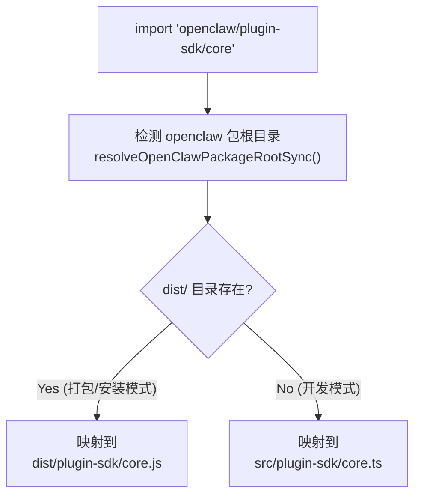

# 插件体系 🟡

> OpenClaw 的扩展性几乎全部来自其插件体系——90+ 个官方插件，通过统一的生命周期管理，让系统核心保持精简的同时具备无限扩展性。

## 本章目标

读完本章你将能够：
- 区分三种插件类型及其注册方式
- 追踪一个插件从"文件系统上的 npm 包"到"在系统中激活运行"的完整过程
- 理解 `openclaw.plugin.json` manifest 的字段含义
- 理解 jiti 和 SDK alias 在插件加载中的关键作用

---

## 一、三种插件类型

OpenClaw 的插件分为三大类，服务于不同的扩展需求：

```mermaid
classDiagram
    class ChannelPlugin {
        +id: string
        +channels: string[]
        注册消息渠道
        处理入站/出站消息
    }
    class ProviderPlugin {
        +id: string
        +providers: string[]
        注册 LLM Provider
        处理推理请求
    }
    class CapabilityPlugin {
        +id: string
        +kind: string
        注册能力扩展
        (memory/speech/search/image)
    }

    ChannelPlugin --|> BasePlugin : 继承
    ProviderPlugin --|> BasePlugin : 继承
    CapabilityPlugin --|> BasePlugin : 继承

    class BasePlugin {
        +openclaw.plugin.json
        +index.ts 入口
        激活/停用生命周期
    }
```

| 插件类型 | 功能 | 典型示例 |
|---------|------|---------|
| **Channel Plugin** | 接入消息平台，处理入站/出站消息 | `extensions/telegram/`, `extensions/discord/` |
| **Provider Plugin** | 接入 LLM 服务商，处理推理请求 | `extensions/openai/`, `extensions/anthropic/` |
| **Capability Plugin** | 添加能力扩展（记忆/语音/搜索等）| `extensions/memory-lancedb/`, `extensions/browser/` |

---

## 二、插件生命周期

```mermaid
flowchart LR
    FS["文件系统\n（npm 包/本地路径）"]
    DISCOVER["发现\ndiscovery.ts"]
    MANIFEST["解析 manifest\nmanifest.ts"]
    VALIDATE["验证配置\nconfig-state.ts"]
    LOAD["加载模块\nloader.ts via jiti"]
    REGISTER["注册到 Registry\nregistry.ts"]
    ACTIVATE["激活\n初始化连接/服务"]

    FS --> DISCOVER
    DISCOVER -->|"PluginCandidate[]"| MANIFEST
    MANIFEST -->|"PluginManifest"| VALIDATE
    VALIDATE -->|"ActivationState"| LOAD
    LOAD -->|"OpenClawPluginModule"| REGISTER
    REGISTER -->|"PluginRecord"| ACTIVATE
```



### 阶段 1：发现（`discovery.ts`）

`discoverOpenClawPlugins()` 函数扫描以下来源，收集所有候选插件：

1. **Bundled workspace plugins**：`extensions/` 目录下的 workspace 包
2. **用户安装的 npm 包**：`node_modules/` 中带有 `openclaw.plugin.json` 的包
3. **本地路径**：配置文件中 `plugins.extraPaths` 指定的本地目录

```typescript
// discovery.ts 返回的 PluginCandidate
type PluginCandidate = {
  idHint: string;        // 插件 ID 候选
  source: string;        // 入口文件路径
  rootDir: string;       // 插件根目录
  origin: PluginOrigin;  // "workspace" | "npm" | "local"
  packageName?: string;  // npm 包名
  packageVersion?: string;
  bundledManifest?: PluginManifest; // 解析后的 manifest
};
```

发现结果有**短时缓存**（默认 1 秒），防止启动时的批量重载引起性能问题。

### 阶段 2：解析 manifest（`manifest.ts`）

每个插件目录下有 `openclaw.plugin.json`（manifest 文件），定义插件的元数据：

**Channel Plugin manifest 示例（`extensions/telegram/openclaw.plugin.json`）**：
```json
{
  "id": "telegram",
  "channels": ["telegram"],
  "configSchema": {
    "type": "object",
    "additionalProperties": false,
    "properties": {}
  }
}
```

**Provider Plugin manifest 示例（`extensions/openai/openclaw.plugin.json`）**：
```json
{
  "id": "openai",
  "enabledByDefault": true,
  "providers": ["openai", "openai-codex"],
  "providerAuthEnvVars": {
    "openai": ["OPENAI_API_KEY"]
  },
  "providerAuthChoices": [
    {
      "provider": "openai-codex",
      "method": "oauth",
      "choiceLabel": "OpenAI Codex (ChatGPT OAuth)"
    },
    {
      "provider": "openai",
      "method": "api-key",
      "choiceLabel": "OpenAI API key"
    }
  ],
  "contracts": {
    "speechProviders": ["openai"],
    "imageGenerationProviders": ["openai"]
  }
}
```

`manifest.ts` 中的 `loadPluginManifest()` 函数读取并验证这个 JSON 文件。

### 阶段 3：激活状态决策（`config-state.ts`）

并非所有发现的插件都会被激活。`resolveEffectivePluginActivationState()` 函数根据配置决定每个插件的状态：

```typescript
type PluginActivationState = 
  | 'active'           // 已激活，正常运行
  | 'inactive'         // 配置为禁用
  | 'missing-config'   // 缺少必要配置（如 API Key 未设置）
  | 'error'            // 加载失败
```

决策逻辑优先级：
1. 用户在 `config.yaml` 中显式 enable/disable
2. 插件 manifest 的 `enabledByDefault` 字段
3. 相关环境变量（如 `OPENAI_API_KEY`）是否存在

### 阶段 4：动态加载（`loader.ts` + jiti）

这是最技术性的阶段。`loader.ts` 使用 **jiti**（一个能直接运行 TypeScript 的 Node.js loader）动态导入插件模块：

```typescript
// loader.ts（简化版）
const jiti = createJiti(rootDir, buildPluginLoaderJitiOptions({
  aliasMap: buildPluginLoaderAliasMap({ packageRoot })
}));

const pluginModule = await jiti.import(pluginEntryPath);
```

jiti 的 `aliasMap` 是关键——它将 `import 'openclaw/plugin-sdk/core'` 这样的路径在运行时解析到正确的文件（可以是 `dist/plugin-sdk/core.js`，也可以是开发时的 `src/plugin-sdk/core.ts`）。

---

## 三、SDK Alias 解析机制

这是 OpenClaw 插件系统最精妙的设计之一，解决了"如何让插件代码在开发时和打包后都能正确找到 SDK"的问题。

### 问题背景

插件代码中写：
```typescript
import { definePlugin } from 'openclaw/plugin-sdk/core';
```

这条 import 在不同场景下应该解析到不同文件：
- **开发时**（源码树）：`src/plugin-sdk/core.ts`
- **打包后**（npm 发布）：`dist/plugin-sdk/core.js`
- **全局安装**（`npm install -g`）：`/usr/local/lib/node_modules/openclaw/dist/plugin-sdk/core.js`

### 解决方案：动态 Alias Map

`sdk-alias.ts` 中的 `buildPluginLoaderAliasMap()` 函数在运行时构建一个路径映射表：



这个机制让插件开发者无需关心运行环境差异，始终用相同的 `import 'openclaw/plugin-sdk/*'` 路径导入 SDK。

---

## 四、插件注册表（`registry.ts`）

所有成功加载的插件记录在 `PluginRegistry` 中：

```typescript
// registry.ts（简化版）
type PluginRecord = {
  id: string;
  pluginModule: OpenClawPluginModule;
  runtime: PluginRuntime;
  activationSource: PluginActivationSource;
  // ... 渠道注册、Provider 注册、工具注册等
};

type PluginRegistry = {
  plugins: Map<string, PluginRecord>;

  // 查询接口
  getChannelPlugins(): ChannelPlugin[];
  getProviderPlugins(): ProviderPlugin[];
  getToolFactories(): PluginToolRegistration[];
  getHookHandlers(hookName: string): HookHandler[];
  // ...
};
```

Gateway 通过 `PluginRegistry` 查询"现在有哪些渠道可用"、"Agent 推理时可以调用哪些工具"、"哪个 Provider 处理某个模型的请求"等。

---

## 五、插件隔离原则

OpenClaw 的插件隔离通过两种机制实现：

### 1. Import 路径限制

`CLAUDE.md` 明确规定：

> **Rule**: extensions must cross into core only through `openclaw/plugin-sdk/*`, manifest metadata, and documented runtime helpers. Do not import `src/**` from extension production code.

这不是运行时的沙箱，而是约定层面的隔离。配合 lint 规则（`knip.config.ts` + `oxlintrc.json`）在 CI 中自动检查。

### 2. Memory Slot 单例限制

记忆插件是一个特殊的 slot——`config-state.ts` 中的 `resolveMemorySlotDecision()` 确保同时只能激活一个 memory 插件：

```typescript
// config-state.ts
function resolveMemorySlotDecision(candidates: PluginCandidate[]): {
  winner: PluginCandidate | null;
  conflicts: PluginCandidate[];
}
// 如果有多个 memory 插件都符合激活条件，只激活优先级最高的一个
```

---

## 六、钩子系统（Hooks）

插件可以注册生命周期钩子，在 Agent 工作流的关键节点介入：

```typescript
// 在 Plugin 的 setup() 函数中注册 hook
openclaw.hooks.on('before-agent-reply', async (ctx) => {
  // 在 AI 生成回复前执行（可以修改 prompt）
});

openclaw.hooks.on('before-tool-call', async (ctx) => {
  // 在 AI 调用工具前执行（可以阻止危险操作）
});

openclaw.hooks.on('after-agent-reply', async (ctx) => {
  // 在 AI 发出回复后执行（可以做日志记录）
});
```

`src/hooks/` 目录管理钩子的注册和调用，`gateway/hooks.ts` 处理 HTTP Webhook 形式的钩子触发。

---

## 关键源码索引

| 文件 | 大小 | 关键函数 |
|------|------|---------|
| `src/plugins/discovery.ts` | 924行 | `discoverOpenClawPlugins()` |
| `src/plugins/loader.ts` | 1946行 | `loadPlugins()` |
| `src/plugins/registry.ts` | 1212行 | `createPluginRegistry()`, `PluginRegistry` 类型 |
| `src/plugins/manifest.ts` | - | `loadPluginManifest()` |
| `src/plugins/config-state.ts` | - | `resolveEffectivePluginActivationState()`, `resolveMemorySlotDecision()` |
| `src/plugins/sdk-alias.ts` | 439行 | `buildPluginLoaderAliasMap()`, `buildPluginLoaderJitiOptions()` |
| `src/plugins/types.ts` | 2739行 | 所有插件相关类型定义 |
| `extensions/telegram/openclaw.plugin.json` | - | Channel Plugin manifest 示例 |
| `extensions/openai/openclaw.plugin.json` | - | Provider Plugin manifest 示例 |

---

## 小结

1. **三种插件类型**：Channel（渠道接入）、Provider（LLM 接入）、Capability（能力扩展），统一通过 `openclaw.plugin.json` manifest 声明。
2. **六阶段生命周期**：发现 → 解析 manifest → 激活决策 → 加载（jiti）→ 注册表 → 激活运行。
3. **SDK Alias 是关键技术**：让 `import 'openclaw/plugin-sdk/*'` 在开发时和打包后都能正确解析，插件开发者无感知。
4. **PluginRegistry 是运行时核心**：所有组件（Gateway、Agent、Tools）通过 Registry 查询插件能力，不直接依赖具体插件实现。
5. **隔离通过约定实现**：Import 路径限制 + lint 规则，不是运行时沙箱，但足够有效。

---

## 延伸阅读

- [← 上一章：Gateway 核心](02-gateway-core.md)
- [→ 下一章：模块边界与 SDK 契约](04-module-boundaries.md)
- [`src/plugins/loader.ts`](../../../../src/plugins/loader.ts) — 插件加载器全文（1946行）
- [`src/plugins/discovery.ts`](../../../../src/plugins/discovery.ts) — 插件发现全文（924行）
- [官方插件开发文档](https://docs.openclaw.ai/plugins/building-plugins) — 插件 SDK 用法指南
