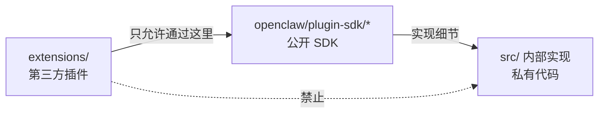
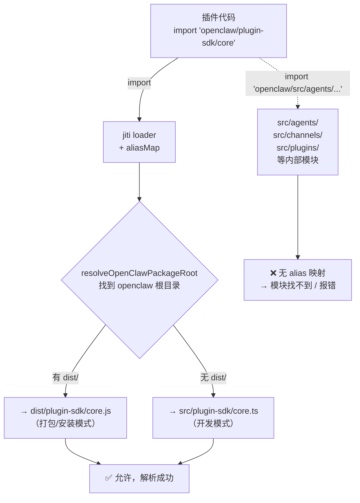

# 模块边界与 SDK 契约 🔴

> OpenClaw 最重要的架构守则是：第三方插件只能通过 `openclaw/plugin-sdk/*` 访问核心功能，绝对不能 `import src/**`。本章深入解析这个契约的实现原理和工程保障。

## 本章目标

读完本章你将能够：
- 理解 SDK 契约（公开面）与内部实现（私有面）的区分标准
- 列出 Plugin SDK 的所有公开入口点及其用途
- 理解 API Baseline 机制如何防止意外的契约破坏
- 解释 `provider-entry.ts` 中 `SingleProviderPlugin` 模式的设计思路

---

## 一、模块边界是什么，为什么重要

在 OpenClaw 代码库中，"模块边界"（module boundary）指的是**哪些代码是对外承诺稳定的 API，哪些是内部实现细节**。

这对 OpenClaw 格外重要，因为：

1. **有第三方插件存在**：社区开发的渠道插件、Provider 插件依赖 SDK API，破坏 API = 破坏生态
2. **Bundled 插件数量庞大（90+）**：核心代码的任何改动都可能影响大量插件
3. **核心需要独立演进**：核心团队需要重构内部实现，而不影响插件开发者



AGENTS.md 中的一句话总结了这个原则：

> "This directory is the public contract between plugins and core. Changes here can affect bundled plugins and third-party plugins."

---

## 二、Plugin SDK 入口点全景

`src/plugin-sdk/entrypoints.ts` 中定义了所有公开的 SDK 入口点列表（`pluginSdkEntrypoints`），`package.json` 的 `exports` 字段基于这个列表自动生成。

主要入口点及其用途：

| 入口点 | import 路径 | 用途 |
|--------|------------|------|
| `core` | `openclaw/plugin-sdk/core` | **最核心的入口**：插件定义、工具注册、Hook 注册 |
| `plugin-entry` | `openclaw/plugin-sdk/plugin-entry` | 定义通用插件的基础 API |
| `provider-entry` | `openclaw/plugin-sdk/provider-entry` | 定义 LLM Provider 插件 |
| `channel-contract` | `openclaw/plugin-sdk/channel-contract` | 渠道插件接口类型 |
| `channel-setup` | `openclaw/plugin-sdk/channel-setup` | 渠道插件的 Setup 入口 |
| `runtime` | `openclaw/plugin-sdk/runtime` | 运行时 API（获取配置、发消息等）|
| `runtime-env` | `openclaw/plugin-sdk/runtime-env` | 运行时环境访问 |
| `routing` | `openclaw/plugin-sdk/routing` | 路由相关工具 |
| `setup` | `openclaw/plugin-sdk/setup` | Setup 流程 API |
| `sandbox` | `openclaw/plugin-sdk/sandbox` | 工具沙箱（Bash 执行安全）|
| `approval-runtime` | `openclaw/plugin-sdk/approval-runtime` | 执行审批运行时 |
| `config-runtime` | `openclaw/plugin-sdk/config-runtime` | 配置运行时访问 |
| `reply-runtime` | `openclaw/plugin-sdk/reply-runtime` | 消息回复运行时 |

### `core.ts` — SDK 最核心的入口

`src/plugin-sdk/core.ts`（21KB）是最常用的 SDK 入口，它的作用是**从内部模块精选并重新导出**插件开发者需要的类型和工具：

```typescript
// core.ts 的作用（简化版）
// 它不包含实现代码，只是一个精心设计的 re-export 文件

// 从 plugin-entry 重新导出（通用插件 API）
export type {
  AnyAgentTool,
  OpenClawPluginApi,
  OpenClawPluginCommandDefinition,
  OpenClawPluginDefinition,
  OpenClawPluginService,
  PluginCommandContext,
  ProviderPlugin,
  // ... 80+ 类型
} from './plugin-entry.js';

// 渠道插件专用类型
export type {
  ChannelPlugin,
  ChannelMessagingAdapter,
  ChannelOutboundAdapter,
  // ... 30+ 渠道类型
} from './channel-contract.js';

// 常用工具函数
export {
  definePlugin,
  defineChannelPlugin,
  defineProviderPlugin,
} from './define-plugin.js';
```

---

## 三、插件入口点模式

### `definePlugin()` — 通用插件定义

插件的主入口文件通常导出一个使用 `definePlugin()` 创建的对象：

```typescript
// extensions/example-channel/src/index.ts
import { definePlugin } from 'openclaw/plugin-sdk/core';

export default definePlugin({
  name: 'example-channel',
  description: 'Example messaging channel',

  setup(api) {
    // api 是 OpenClawPluginApi 类型
    // 通过 api 注册所有能力

    // 注册渠道
    api.channel.register({
      id: 'example',
      // ...
    });

    // 注册工具
    api.tools.register({
      name: 'example_tool',
      description: '...',
      factory: async (ctx) => {
        // 工具实现
      }
    });

    // 注册 Hook
    api.hooks.on('before-agent-reply', async (ctx) => {
      // 前置钩子
    });
  }
});
```

### `provider-entry.ts` — SingleProviderPlugin 模式

`provider-entry.ts` 暴露了一个高度封装的模式，让简单的 API Key 认证 Provider 只需几行代码：

```typescript
// extensions/deepseek/src/index.ts（实际代码）
import { defineSingleProviderPlugin } from 'openclaw/plugin-sdk/provider-entry';

export default defineSingleProviderPlugin({
  id: 'deepseek',
  name: 'DeepSeek',
  description: 'DeepSeek AI models',
  provider: {
    id: 'deepseek',
    label: 'DeepSeek',
    docsPath: '/providers/deepseek',
    auth: [{
      methodId: 'api-key',
      label: 'DeepSeek API Key',
      envVar: 'DEEPSEEK_API_KEY',
      hint: 'Get your key from platform.deepseek.com',
    }],
    catalog: {
      buildProvider: ({ apiKey }) => {
        return new DeepSeekProvider({ apiKey });
      }
    }
  }
});
```

`defineSingleProviderPlugin()` 内部自动处理：
- API Key 认证流程
- Wizard Setup（新用户引导）
- 模型目录（catalog）注册
- 错误处理和 Doctor 提示

这让 Provider 插件的开发者不需要关心 OpenClaw 内部的认证基础设施细节。

---

## 四、API Baseline — 契约破坏检测

这是 OpenClaw 最有工程价值的机制之一。

### 问题

Plugin SDK 有 20+ 个入口点，每个导出数十个类型和函数。如何保证任何人的 PR 不会意外删除或重命名一个已有的公开 API？

### 解决方案：Snapshot + Diff

`src/plugin-sdk/api-baseline.ts` 中定义了一套机制：

```
脚本：scripts/generate-plugin-sdk-api-baseline.ts
        ↓ 执行
docs/.generated/plugin-sdk-api-baseline.json
        ↓ 提交到 Git
```

这个 JSON 文件包含当前所有 Plugin SDK 入口点的完整 API 快照：

```jsonc
// docs/.generated/plugin-sdk-api-baseline.json（节选）
{
  "generatedBy": "scripts/generate-plugin-sdk-api-baseline.ts",
  "modules": [
    {
      "category": "core",
      "entrypoint": "core",
      "importSpecifier": "openclaw/plugin-sdk/core",
      "exports": [
        {
          "exportName": "OpenClawPluginApi",
          "kind": "type",
          "declaration": "export type OpenClawPluginApi = { ... }"
        },
        {
          "exportName": "definePlugin",
          "kind": "function",
          "declaration": "export function definePlugin(def: OpenClawPluginDefinition): ..."
        }
        // ...
      ]
    }
  ]
}
```

CI 中会运行验证脚本：**如果实际的 SDK 导出与 baseline.json 不一致（有新增或删除/改名），CI 报错，要求开发者显式更新 baseline.json 并说明理由**。

这不仅防止意外破坏，也让每个 SDK 变更都有清晰的 Git 记录。

---

## 五、各层边界规则汇总

根据 `CLAUDE.md` 的 "Architecture Boundaries" 章节，各层边界规则总结如下：

### Plugin 边界

```
✅ 允许：
  extensions/**  →  openclaw/plugin-sdk/*（任意子路径）
  extensions/**  →  manifest metadata
  extensions/**  →  documented runtime helpers

❌ 禁止：
  extensions/**  →  src/**（任意核心内部模块）
  extensions/A  →   extensions/B/src/**（跨插件私有依赖）

核心 →  extensions/**（私有模块）
```

### Channel 边界

```
✅ 允许：
  Plugin authors  →  openclaw/plugin-sdk/channel-contract（渠道接口类型）
  Plugin authors  →  openclaw/plugin-sdk/channel-setup（Setup API）

❌ 禁止：
  Plugin authors  →  src/channels/**（渠道内部实现）
```

### Provider 边界

```
✅ 允许：
  Provider plugins  →  openclaw/plugin-sdk/provider-entry
  Provider plugins  →  openclaw/plugin-sdk/core

❌ 禁止：
  Core  →  plugins.entries.<id>.config（直接读取特定插件配置）
  Core  →  provider-specific internals（Provider 实现细节）
```

### Gateway Protocol 边界

```
✅ 允许：
  任何客户端  →  src/gateway/protocol/**（协议类型可公开使用）

规则：
  协议变更 = 契约变更 = 需要版本化 + 向后兼容
  不兼容变更 = 递增 PROTOCOL_VERSION
```

---

## 六、sdk-alias 是契约实现的技术基础

模块边界在运行时通过 jiti + sdk-alias 机制强制执行：



`src/` 下的内部模块不会被添加到 alias 映射表中，因此插件尝试直接 `import 'src/**'` 时，jiti 找不到对应的别名，会报模块解析错误。这是**运行时层面**的边界强制。

---

## 关键源码索引

| 文件 | 大小 | 作用 |
|------|------|------|
| `src/plugin-sdk/core.ts` | 21KB | SDK 最核心入口，精选导出 |
| `src/plugin-sdk/plugin-entry.ts` | - | 通用插件 API 类型定义 |
| `src/plugin-sdk/provider-entry.ts` | - | Provider 插件 API，`defineSingleProviderPlugin()` |
| `src/plugin-sdk/channel-contract.ts` | - | 渠道插件接口类型 |
| `src/plugin-sdk/entrypoints.ts` | 1.4KB | SDK 入口点列表（`pluginSdkEntrypoints`）|
| `src/plugin-sdk/api-baseline.ts` | 14KB | API Baseline 类型和生成逻辑 |
| `src/plugin-sdk/AGENTS.md` | 1.9KB | SDK 边界规则说明（给 AI 助手看）|
| `scripts/lib/plugin-sdk-entrypoints.json` | - | 入口点列表 JSON（机器可读）|
| `docs/.generated/plugin-sdk-api-baseline.json` | - | 当前 SDK API 快照（CI 验证基准）|
| `CLAUDE.md`（Architecture Boundaries 章节）| - | 官方架构边界规范 |

---

## 小结

1. **模块边界的核心规则**：插件只能通过 `openclaw/plugin-sdk/*` 访问核心功能，不能直接 `import src/**`。
2. **SDK 入口点是精心策划的**：每个 `openclaw/plugin-sdk/<name>` 都是有意图的"公开门户"，内部的 `src/plugin-sdk/*.ts` 文件数量是入口点数量的 10 倍以上，大部分是不对外的。
3. **API Baseline 防止意外破坏**：snapshot 快照 + CI diff 检查，让每个 SDK API 变更都显式可见。
4. **边界在运行时通过 jiti alias 强制**：没有 alias 映射的路径在运行时找不到，形成技术层面的屏障。
5. **`defineSingleProviderPlugin()` 是高层封装**：简单 Provider 只需声明认证方式和 catalog，无需关心底层框架细节。

---

## 延伸阅读

- [← 上一章：插件体系](03-plugin-system.md)
- [→ 下一章：消息生命周期](../02-flow/01-message-lifecycle.md)
- [`src/plugin-sdk/AGENTS.md`](../../../../src/plugin-sdk/AGENTS.md) — SDK 边界规则文档
- [`src/plugin-sdk/core.ts`](../../../../src/plugin-sdk/core.ts) — SDK 核心入口（21KB）
- [官方插件架构文档](https://docs.openclaw.ai/plugins/architecture) — 架构概览
- [官方 SDK 入口点文档](https://docs.openclaw.ai/plugins/sdk-entrypoints) — 完整入口点说明
