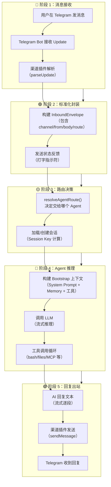
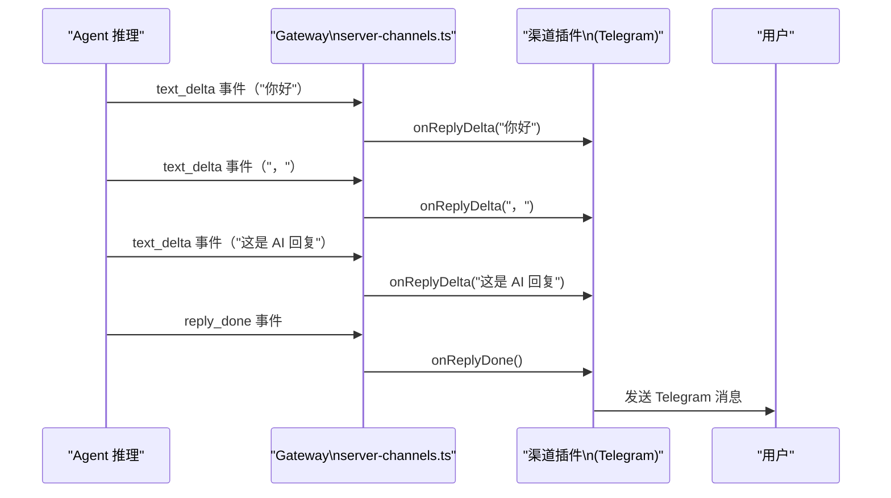
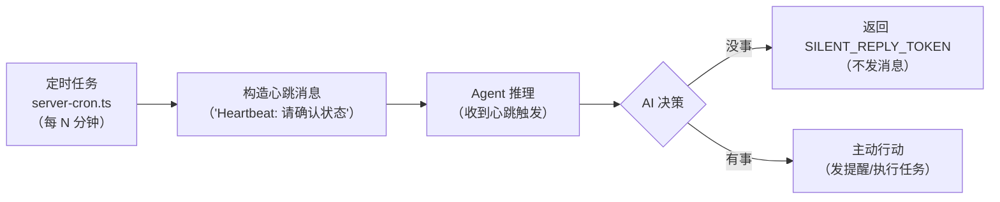

# 消息生命周期 🟡

> 从用户在 Telegram 发出一条消息，到 AI 回复出现，这中间经历了哪些环节？本章完整追踪这条路径上的每一步。

## 本章目标

读完本章你将能够：
- 画出消息从入站到出站的完整数据流图
- 理解 `InboundEnvelope` 格式和它在系统中的作用
- 解释状态反馈（打字指示符、消息等待等）的实现机制
- 理解 `SILENT_REPLY_TOKEN` 和心跳（Heartbeat）系统

---

## 一、完整生命周期概览

一条消息的完整生命周期可以分为五个阶段：



---

## 二、阶段 1：消息接收

### 渠道插件如何接收消息

每个渠道插件有两种方式接收消息：

**方式 A：Webhook**（适合 Telegram、Discord 等服务端推送）

```
用户发消息
  → 消息平台（如 Telegram 服务器）
  → HTTP POST 到 OpenClaw Gateway（/webhook/telegram/...）
  → server-http.ts 中注册的 plugin route 处理器
  → 渠道插件的 handleWebhook(req, res)
```

**方式 B：Long Polling**（适合某些不支持 Webhook 的平台）

```
渠道插件主动轮询平台 API（长轮询）
  → 收到消息 Update
  → 自行处理
```

Gateway 通过 `server-channels.ts` 中的 `ChannelManager` 管理所有渠道的生命周期（启动、停止、重启），并维护每个渠道的运行时状态。

---

## 三、阶段 2：构建 InboundEnvelope

这是渠道层 → 核心层的关键界面。

渠道插件收到原生消息后，需要构建一个 **InboundEnvelope**——这是一个标准化的"入站信封"，包含核心层需要的所有信息，同时屏蔽了各平台的协议差异。

InboundEnvelope 由 `createInboundEnvelopeBuilder()` 创建：

```typescript
// src/plugin-sdk/inbound-envelope.ts

// 渠道插件调用这个 builder 构建信封
const buildEnvelope = createInboundEnvelopeBuilder({
  cfg,
  route,        // { agentId, sessionKey }
  resolveStorePath: ...,
  readSessionUpdatedAt: ...,
  resolveEnvelopeFormatOptions: ...,
  formatAgentEnvelope: ...,
});

// 每条消息调用 buildEnvelope
const { storePath, body } = buildEnvelope({
  channel: 'telegram',
  from: '@username',
  body: '用户消息文本',
  timestamp: Date.now(),
});
```

信封的 `body` 字段是**已格式化**的文本，包含了时间戳、来源渠道、上下文等信息，直接拼入 Agent 的历史对话中。

### 状态反馈：打字指示符

用户发出消息后，优秀的 UX 要求立即给反馈（"AI 正在思考中..."）。这通过 **status reactions** 实现：

```typescript
// src/channels/status-reactions.ts（概念）
// 渠道插件在 "开始思考" 时调用
await channel.status.typing();   // 显示打字指示符

// 推理完成，消除打字指示符
await channel.status.done();
```

Telegram 使用 `sendChatAction({ action: 'typing' })`，Discord 使用 "deferReply()"，各平台实现不同，但接口统一。

---

## 四、阶段 3：路由决策

在[数据流篇 02 - 路由引擎](02-routing-engine.md) 中会详细讲解，这里只做概述。

路由决策的核心问题：**这条消息应该交给哪个 Agent？**

```typescript
// src/routing/resolve-route.ts
const route = resolveAgentRoute({
  channelId: 'telegram',
  accountId: '@username',
  peer: { kind: 'dm', id: 123456789 }, // 来自哪个群组/私聊
  cfg,
});
// → { agentId: 'my-agent', sessionKey: 'telegram/dm/123456789' }
```

`sessionKey` 是会话的唯一标识符，所有历史消息都通过 sessionKey 存储和检索。

---

## 五、阶段 4：Agent 推理（概述）

在[数据流篇 03 - Agent 调用循环](03-agent-call-loop.md) 中详细讲解。

简要流程：
1. **Bootstrap**：加载系统提示（CLAUDE.md 等文件）、记忆、工具列表，构建完整上下文
2. **LLM 调用**：将上下文发送给配置的 LLM Provider，获取流式响应
3. **工具调用循环**：如果 AI 在回复中调用了工具（bash、file read 等），执行工具并将结果追加回上下文，继续推理
4. **最终回复**：当 AI 给出文本回复（不再调用工具时），进入阶段 5

---

## 六、阶段 5：回复出站

AI 的回复文本通过事件（`EventFrame`）流式推送给渠道插件：



**流式 vs 批量发送**：

不同渠道对流式回复有不同策略：
- Telegram：**不支持**原生流式，只能等 Agent 回复完整后一次发送（但打字指示符给了等待体验）
- Discord：支持通过编辑消息实现类流式效果（逐步追加内容）
- WebChat：**完全流式**，通过 WebSocket 实时推送每个 token

渠道插件通过实现 `ChannelOutboundAdapter` 接口处理这些差异。

---

## 七、特殊消息：SILENT_REPLY_TOKEN

OpenClaw 支持 AI 在某些情况下不发送任何回复。这通过特殊的占位符 `SILENT_REPLY_TOKEN` 实现：

```typescript
// src/auto-reply/tokens.ts
export const SILENT_REPLY_TOKEN = '[SKIP_REPLY]';
```

当 AI 的回复是 `[SKIP_REPLY]` 时，Gateway 识别这个 token，**不向渠道发送任何消息**。这用于：
- 被动监听模式（AI 看到消息但不回复）
- 条件触发（AI 判断当前不需要回复）
- Heartbeat ACK（自动心跳只需内部确认，不需要发给用户）

---

## 八、心跳系统（Heartbeat）

心跳（Heartbeat）是 OpenClaw 的一项关键特性：即使用户没有发消息，AI 也能定期"心跳"确认自己还在运行，并在需要时主动发送消息。



心跳消息不会显示给用户（`shouldHideHeartbeatChatOutput()` 过滤），但会触发 AI 推理，让 AI 有机会主动执行任务（如"每天早上 9 点发天气摘要"）。

心跳相关代码：
- `src/auto-reply/heartbeat.ts` — 心跳 token 处理
- `src/infra/heartbeat-visibility.ts` — 心跳可见性策略
- `src/gateway/server-cron.ts` — 定时触发

---

## 九、消息存储与会话

所有消息（用户消息 + AI 回复）都持久化存储，通过 `sessionKey` 组织：

```
~/.config/openclaw/sessions/
└── <agentId>/
    └── <sessionKey>/
        ├── session.json     ← 会话元数据（创建时间、最后更新时间）
        └── messages/        ← 消息历史（按时间序列）
            ├── 0001.json
            ├── 0002.json
            └── ...
```

`src/sessions/` 模块负责读写会话数据，基于 SQLite（`better-sqlite3`）提供持久化。

---

## 关键源码索引

| 文件 | 大小 | 作用 |
|------|------|------|
| `src/plugin-sdk/inbound-envelope.ts` | 4.7KB | `createInboundEnvelopeBuilder()` |
| `src/gateway/server-channels.ts` | 20KB | 渠道管理和入站消息调度 |
| `src/gateway/server-chat.ts` | 27KB | WebSocket 聊天处理，流式回复推送 |
| `src/channels/status-reactions.ts` | - | 状态反馈（打字指示符）|
| `src/auto-reply/tokens.ts` | - | `SILENT_REPLY_TOKEN` 定义 |
| `src/auto-reply/heartbeat.ts` | - | 心跳 token 解析 |
| `src/gateway/server-cron.ts` | 17KB | 定时任务调度 |
| `src/sessions/` | - | 会话持久化（SQLite）|

---

## 小结

1. **五个阶段**：接收 → 标准化 → 路由 → 推理 → 出站，每个阶段职责单一。
2. **InboundEnvelope 是渠道层 → 核心层的核心接口**：标准化格式屏蔽了各平台的协议差异。
3. **状态反馈是 UX 的一部分**：打字指示符在推理开始时立即触发，让用户知道 AI 正在工作。
4. **SILENT_REPLY_TOKEN 实现了"沉默回复"**：AI 可以主动选择不发消息，用于被动监听、条件触发等场景。
5. **心跳系统让 AI 具备主动性**：定时触发 AI 推理，让 AI 可以主动发送消息（天气提醒、任务通知等）。
6. **会话历史持久化**：所有消息通过 sessionKey 组织，存储在本地 SQLite 数据库。

---

## 延伸阅读

- [← 上一章：模块边界与 SDK 契约](../01-architecture/04-module-boundaries.md)
- [→ 下一章：路由引擎](02-routing-engine.md)
- [`src/gateway/server-channels.ts`](../../../../src/gateway/server-channels.ts) — 渠道管理（20KB）
- [`src/plugin-sdk/inbound-envelope.ts`](../../../../src/plugin-sdk/inbound-envelope.ts) — 入站信封 Builder
