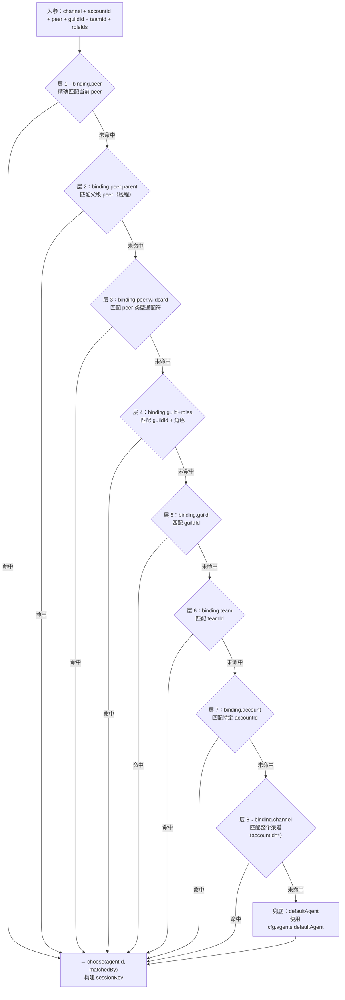

# 路由引擎 🟡

> OpenClaw 支持多个 Agent 并发运行，不同渠道、不同群组、不同用户的消息可以路由到不同的 Agent。路由引擎负责这个决策过程。

## 本章目标

读完本章你将能够：
- 理解 Binding 规则是什么，以及如何在 `config.yaml` 中配置
- 追踪 `resolveAgentRoute()` 的完整决策过程（8 层优先级匹配）
- 理解 Session Key 的构成规则和它对会话隔离的意义
- 了解路由缓存的设计（最多缓存 4000 条路由结果）

---

## 一、路由引擎的核心问题

当一条消息到达时，路由引擎需要回答两个问题：

1. **该消息交给哪个 Agent？**（`agentId`）
2. **这条消息属于哪个会话上下文？**（`sessionKey`）

这两个问题的答案合在一起，就是 `ResolvedAgentRoute`：

```typescript
// src/routing/resolve-route.ts
type ResolvedAgentRoute = {
  agentId: string;        // 目标 Agent ID
  channel: string;        // 来源渠道
  accountId: string;      // Bot 账号 ID
  sessionKey: string;     // 会话唯一键（用于历史记录隔离）
  mainSessionKey: string; // 主会话键（直接对话的合并键）
  lastRoutePolicy: 'main' | 'session';  // 最后路由记录策略
  matchedBy: 'binding.peer' | 'binding.guild' | 'default' | ...;  // 调试用：匹配方式
};
```

---

## 二、Binding 规则：路由配置

`config.yaml` 中的 `bindings` 字段定义路由规则。每条规则指定：**"来自某个渠道/群组/用户的消息，交给哪个 Agent"**。

### Binding 配置示例

```yaml
# config.yaml
bindings:
  # 来自 Telegram 私聊的消息 → 默认 Agent
  - agentId: main
    match:
      channel: telegram
      peer:
        kind: dm         # 私聊（direct message）
        id: "*"          # 任意用户

  # Discord 特定服务器的消息 → coding-agent
  - agentId: coding-agent
    match:
      channel: discord
      guildId: "123456789"    # Discord 服务器 ID

  # Discord 某服务器 + 特定角色 → senior-agent
  - agentId: senior-agent
    match:
      channel: discord
      guildId: "123456789"
      roles: ["987654321"]    # 有此角色的用户

  # Slack 特定工作区 → work-agent
  - agentId: work-agent
    match:
      channel: slack
      teamId: "T01234567"     # Slack 工作区 ID

  # 兜底：所有 Telegram 消息 → main agent
  - agentId: main
    match:
      channel: telegram
```

### Binding 匹配字段

| 字段 | 说明 |
|------|------|
| `channel` | 渠道 ID（`telegram`/`discord`/`slack` 等）|
| `accountId` | Bot 账号 ID（多 Bot 账号时区分）|
| `peer.kind` | 消息类型（`dm`/`group`/`channel`/`thread` 等）|
| `peer.id` | 消息来源 ID（用户 ID 或群组 ID）|
| `guildId` | Discord 服务器 ID 或等效的公会/组织 ID |
| `teamId` | Slack 工作区 ID 或等效的团队 ID |
| `roles` | 成员角色 ID 列表（用于基于角色的路由）|

---

## 三、`resolveAgentRoute()` 的决策流程

`resolve-route.ts` 中的 `resolveAgentRoute()` 函数实现了一个**8 层优先级匹配**：



源码中，这 8 层被定义为 `tiers` 数组：

```typescript
// src/routing/resolve-route.ts:743-808（核心逻辑）
const tiers = [
  { matchedBy: 'binding.peer',         enabled: Boolean(peer),          ... },
  { matchedBy: 'binding.peer.parent',  enabled: Boolean(parentPeer),    ... },
  { matchedBy: 'binding.peer.wildcard',enabled: Boolean(peer),          ... },
  { matchedBy: 'binding.guild+roles',  enabled: Boolean(guildId && memberRoleIds.length > 0), ... },
  { matchedBy: 'binding.guild',        enabled: Boolean(guildId),        ... },
  { matchedBy: 'binding.team',         enabled: Boolean(teamId),         ... },
  { matchedBy: 'binding.account',      enabled: true,                    ... },
  { matchedBy: 'binding.channel',      enabled: true,                    ... },
];

for (const tier of tiers) {
  if (!tier.enabled) continue;
  const matched = tier.candidates.find(
    (candidate) => tier.predicate(candidate) && matchesBindingScope(candidate.match, scope)
  );
  if (matched) {
    return choose(matched.binding.agentId, tier.matchedBy);
  }
}

// 所有层都未命中 → 使用默认 Agent
return choose(resolveDefaultAgentId(input.cfg), 'default');
```

---

## 四、Session Key：会话隔离的基础

Session Key 是会话的唯一标识符，决定了"这条消息属于哪个对话历史"。

### Session Key 的构成

```
agent:<agentId>:<channel>/<accountId>/<peerKind>/<peerId>
```

示例：
- `agent:main:telegram/default/dm/123456789` — Telegram 私聊用户 123456789 与 main agent 的会话
- `agent:coding-agent:discord/default/channel/987654321` — Discord 频道 987654321 的会话（routing 给 coding-agent）
- `agent:main:main` — 主会话（无具体 peer，用于 CLI 直接对话）

### `dmScope` 配置

不同的 `dmScope` 配置决定私聊如何被分组到会话：

```yaml
# config.yaml
session:
  dmScope: main   # 所有 DM 合并为一个会话（默认）
  # dmScope: per-peer  # 每个 DM 对话独立会话
  # dmScope: per-channel-peer  # 每个渠道+DM 独立会话
```

| dmScope | 效果 | 使用场景 |
|---------|------|---------|
| `main`（默认）| 所有渠道的 DM 共享一个主会话 | 个人助手，跨渠道上下文连续 |
| `per-peer` | 每个 DM 用户独立会话 | 多用户服务场景 |
| `per-channel-peer` | 每个渠道+用户组合独立会话 | 渠道语境隔离 |

### Special Session Keys

```typescript
// src/sessions/session-key-utils.ts
// ACP 子 Agent 的 session key 格式
'acp:<parentSessionKey>:<subAgentId>:<uuid>'

// 定时任务的 session key 格式
'cron:<jobId>:<timestamp>'

// 子 Agent 的格式
'agent:<agentId>:sub:<uuid>'
```

---

## 五、路由缓存

路由引擎有两层缓存机制：

### 层 1：Binding 索引缓存

`EvaluatedBindingsCache`（基于 `WeakMap<OpenClawConfig, ...>`）：

```typescript
// 当配置不变时（bindings/agents 引用未变），复用上次构建的索引
const evaluatedBindingsCacheByCfg = new WeakMap<OpenClawConfig, EvaluatedBindingsCache>();
```

这个缓存将 bindings 数组预处理成多个索引（`byPeer`、`byGuild`、`byAccount` 等），使得单条路由查询时间接近 O(1) 而不是 O(n)。

### 层 2：路由结果缓存

`resolvedRouteCacheByCfg`：最多缓存 4000 条路由结果：

```typescript
const MAX_RESOLVED_ROUTE_CACHE_KEYS = 4000;

// 缓存键格式
// channel\taccountId\tpeerKind:peerId\tguildId\tteamId\troleIds\tdmScope
'telegram\tdefault\tdm:123456789\t-\t-\t-\tmain'
```

当同一个用户在同一渠道发消息时，路由决策几乎是瞬时的（直接从缓存取）。

**缓存失效**：当 `cfg.bindings`、`cfg.agents` 或 `cfg.session` 引用发生变化时（配置更新），旧缓存被废弃，新缓存重建。

---

## 六、多账号路由

当 OpenClaw 配置了多个 Bot 账号时（如同时管理多个 Telegram Bot），`accountId` 字段用于区分：

```yaml
# 配置两个 Telegram Bot
channels:
  telegram:
    accounts:
      bot1:
        token: "${env:TELEGRAM_BOT_1_TOKEN}"
      bot2:
        token: "${env:TELEGRAM_BOT_2_TOKEN}"

bindings:
  - agentId: personal-assistant
    match:
      channel: telegram
      accountId: bot1     # bot1 → 个人助手 Agent

  - agentId: work-assistant
    match:
      channel: telegram
      accountId: bot2     # bot2 → 工作助手 Agent
```

`accountId` 在 `resolveAgentRoute()` 的输入中，由渠道插件从消息上下文中提取并传入。

---

## 七、路由 Debug 模式

开启 verbose 日志后，路由引擎会输出每次路由决策的详细信息：

```
[routing] resolveAgentRoute: channel=telegram accountId=default peer=dm:123456789 guildId=none teamId=none bindings=3
[routing] binding: agentId=main accountPattern=default peer=dm:123456789 guildId=none teamId=none roles=0
[routing] binding: agentId=main accountPattern=* peer=none guildId=none teamId=none roles=0
[routing] match: matchedBy=binding.peer agentId=main
```

这对调试复杂的多 Agent 路由配置非常有用。

---

## 关键源码索引

| 文件 | 大小 | 作用 |
|------|------|------|
| `src/routing/resolve-route.ts` | 832行 | 核心路由函数 `resolveAgentRoute()`，8 层优先级匹配，双层缓存 |
| `src/routing/session-key.ts` | 254行 | Session Key 构建工具（`buildAgentSessionKey`、`buildAgentPeerSessionKey`）|
| `src/routing/bindings.ts` | 115行 | Binding 读取工具（`listBindings()`）|
| `src/routing/account-id.ts` | - | 账号 ID 标准化（`normalizeAccountId()`）|
| `src/sessions/session-key-utils.ts` | - | Session Key 解析工具（`parseAgentSessionKey()`）|
| `src/config/bindings.ts` | - | 从配置读取 Binding 规则（`listRouteBindings()`）|

---

## 小结

1. **Binding 规则**：在 `config.yaml` 的 `bindings` 字段配置，每条规则说明"什么来源的消息交给哪个 Agent"。
2. **8 层优先级匹配**：peer 精确 → peer 父级 → peer 通配 → guild+roles → guild → team → account → channel，最后才是默认 Agent。
3. **Session Key 唯一标识会话**：`agent:<agentId>:<channel>/<accountId>/<peerKind>/<peerId>` 格式，决定历史记录的隔离范围。
4. **`dmScope` 控制私聊分组**：默认 `main`（所有 DM 共享主会话），可配置为 `per-peer`（每个 DM 独立会话）。
5. **双层缓存**：Binding 索引缓存（O(1) 查询）+ 路由结果缓存（最多 4000 条），让高频路由接近零开销。

---

## 延伸阅读

- [← 上一章：消息生命周期](01-message-lifecycle.md)
- [→ 下一章：Agent 调用循环](03-agent-call-loop.md)
- [`src/routing/resolve-route.ts`](../../../../src/routing/resolve-route.ts) — 路由引擎全文（832行）
- [`src/routing/session-key.ts`](../../../../src/routing/session-key.ts) — Session Key 工具
