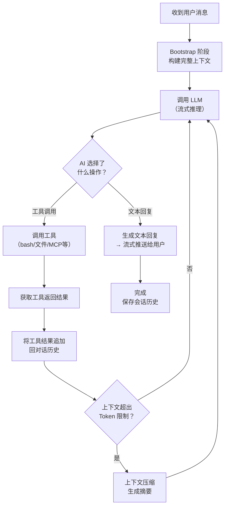
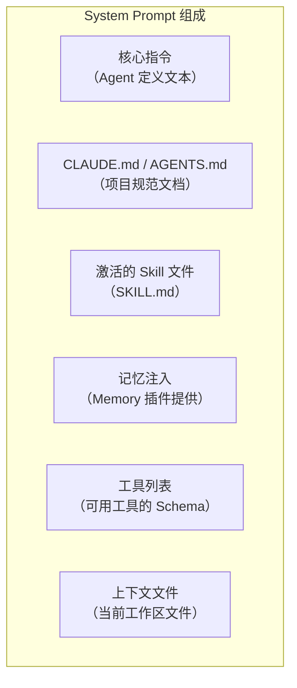
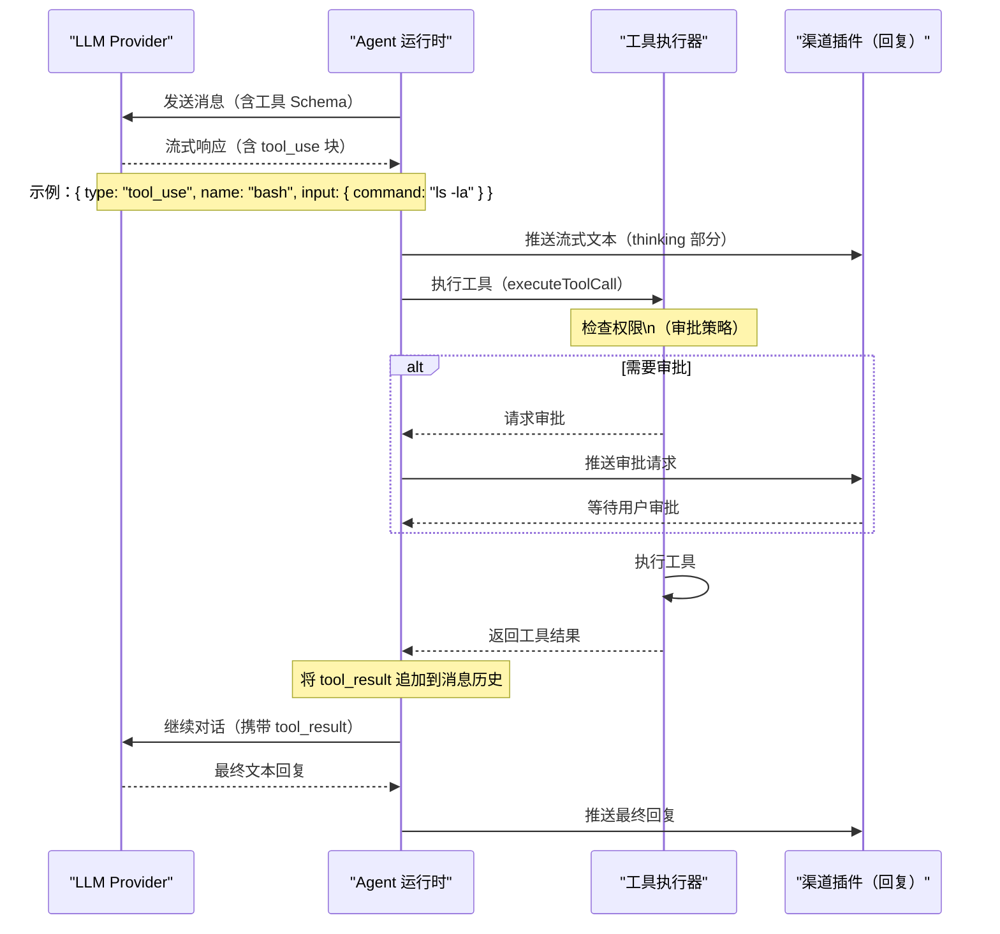
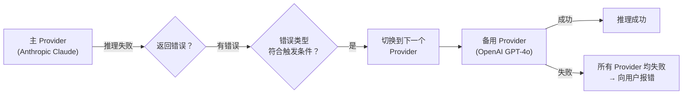

# Agent 调用循环 🔴

> Agent 是 OpenClaw 中 AI"思考"发生的地方。从构建上下文、调用 LLM、执行工具，到上下文压缩，本章深入 Agent 的推理引擎。

## 本章目标

读完本章你将能够：
- 理解 Bootstrap 阶段如何构建完整的 Agent 上下文
- 追踪工具调用循环（ReAct 模式）的完整执行过程
- 理解上下文压缩（Compaction）的触发条件和工作原理
- 理解多 Provider 故障转移机制

---

## 一、Agent 调用循环概览

OpenClaw 的 Agent 推理基于 **ReAct（Reasoning + Acting）** 模式，是现代 AI Agent 的标准范式：



---

## 二、Bootstrap 阶段：构建上下文

Bootstrap 是 Agent 每次推理前的"上下文准备"阶段，负责组装完整的 System Prompt。

### Bootstrap 的组成

System Prompt 由多个层次的内容组成，按优先级从高到低：



### Bootstrap 预算（`bootstrap-budget.ts`）

上下文不能无限大，受限于 LLM 的 context window（通常 128K-200K tokens）。`bootstrap-budget.ts` 实现了一个"预算分配"机制：

```typescript
// bootstrap-budget.ts 核心概念
type BootstrapBudgetAnalysis = {
  files: BootstrapAnalyzedFile[];
  hasTruncation: boolean;     // 是否有文件被截断
  totals: {
    rawChars: number;         // 原始字符数
    injectedChars: number;    // 实际注入字符数（截断后）
    bootstrapMaxChars: number;// 单文件最大字符数
    bootstrapTotalMaxChars: number; // 所有文件总最大字符数
  };
};
```

文件的注入遵循规则：
1. 核心指令：始终完整注入
2. CLAUDE.md：尽量完整，超出则截断并发出警告
3. Skill 文件：按优先级注入，超出预算时跳过低优先级 Skill
4. 记忆：最后注入，预算不足时截断较旧的记忆

### Bootstrap 文件加载（`bootstrap-files.ts`）

```typescript
// bootstrap-files.ts 加载的文件类型
type WorkspaceBootstrapFile = {
  name: string;        // 文件名（如 "CLAUDE.md"）
  path: string;        // 文件路径
  rawChars: number;    // 原始字符数
  injectedChars: number; // 实际注入字符数（可能被截断）
  missing: boolean;    // 文件是否存在
  truncated: boolean;  // 是否被截断
};
```

OpenClaw 会自动扫描 Agent 工作目录和上级目录中的 `CLAUDE.md`（或 `AGENTS.md`、`.clawconfig.md`）文件，并以"上下文感知"的方式注入。

---

## 三、工具调用循环（ReAct）

当 LLM 决定调用工具时，OpenClaw 的执行流程如下：



### 可用工具集

Agent 可以调用的工具列表由多个来源组成：

| 工具类别 | 代表性工具 | 来源 |
|---------|-----------|------|
| 文件系统 | `read_file`, `write_file`, `list_files` | 核心内置 |
| Shell 执行 | `bash`, `run_command` | 核心内置（受安全策略保护）|
| 代码操作 | `str_replace_editor`, `apply_patch` | 核心内置 |
| 网络 | `web_fetch`, `web_search` | 核心内置（需对应插件）|
| 浏览器 | `browser_action` | browser 插件 |
| 记忆 | `memory_create`, `memory_search` | memory-core 插件 |
| 渠道 | `message`, `telegram_send` | 渠道插件 |
| MCP 工具 | 任意 MCP Server 提供的工具 | mcporter 插件 |
| 自定义 | 插件注册的任意工具 | Capability 插件 |

### Bash 工具的安全策略

`bash` 工具是最强大也最危险的工具。OpenClaw 有三种安全级别：

```yaml
# config.yaml
agents:
  default:
    allowedTools:
      - bash         # 允许 bash（默认需要审批）
    settings:
      bashApprovalPolicy: "approve-all"  # 每次执行都需要批准
      # OR
      bashApprovalPolicy: "auto-approve" # 自动批准（高风险模式）
      # OR
      bashApprovalPolicy: "allowlist"    # 只批准白名单中的命令
```

---

## 四、上下文压缩（Compaction）

当会话历史消息积累过多，超过 LLM 的 context window 时，需要压缩历史。

### 触发条件

```typescript
// compaction.ts
export const BASE_CHUNK_RATIO = 0.4;
export const MIN_CHUNK_RATIO = 0.15;
export const SAFETY_MARGIN = 1.2;  // 20% 安全余量

// 当估计的 token 数 > context_window * (1 - 0.4) * 1.2 时，触发压缩
```

当会话历史达到 context window 的约 60% 时，触发压缩。

### 压缩策略

压缩通过另一次 LLM 调用实现——用 LLM 生成当前对话历史的摘要：

```typescript
// compaction.ts：摘要生成指令（保留最重要的信息）
const MERGE_SUMMARIES_INSTRUCTIONS = [
  'Merge these partial summaries into a single cohesive summary.',
  '',
  'MUST PRESERVE:',
  '- Active tasks and their current status (in-progress, blocked, pending)',
  '- Batch operation progress (e.g., "5/17 items completed")',
  '- The last thing the user requested and what was being done about it',
  '- Decisions made and their rationale',
  '- TODOs, open questions, and constraints',
  '- Any commitments or follow-ups promised',
  '',
  'PRIORITIZE recent context over older history.',
].join('\n');
```

压缩后，历史消息被替换为摘要文本，保留了关键信息但大幅减少了 token 占用。

### 标识符保留策略

压缩时有一个重要细节：摘要必须精确保留 UUID、哈希值、API Key 等"不透明标识符"：

```typescript
const IDENTIFIER_PRESERVATION_INSTRUCTIONS =
  'Preserve all opaque identifiers exactly as written (no shortening or reconstruction), '
  + 'including UUIDs, hashes, IDs, tokens, API keys, hostnames, IPs, ports, URLs, and file names.';
```

这防止 LLM 在摘要中"自作主张"缩短标识符（如把 UUID 写成 "some-uuid"），导致后续执行时找不到对应资源。

---

## 五、多 Provider 故障转移

当配置了多个 LLM Provider 时，`model-fallback.ts` 实现了自动故障转移：

```typescript
// 配置示例：带故障转移的 Provider 配置
// config.yaml
agents:
  default:
    model: anthropic/claude-opus-4-5
    modelFallbacks:
      - model: openai/gpt-4o
        triggerOnErrors: ['rate_limit_error', 'overloaded_error']
      - model: ollama/llama3.1
        triggerOnErrors: ['all']  # 最终兜底
```

故障转移策略（`failover-error.ts`）：



---

## 六、`agent-command.ts`：核心调度文件

`src/agents/agent-command.ts`（29KB）是 Agent 推理的最高层调度，整合了上述所有机制。主要函数：

```typescript
// agent-command.ts 主要导出
export async function runAgentCommand(params: AgentCommandOpts): Promise<AgentCommandResult>
```

这个函数：
1. 解析 `sessionKey` → 确认 `agentId`
2. 加载 Agent 配置（模型、工具白名单、Skill 等）
3. 加载会话历史（来自 SQLite）
4. 触发 Bootstrap（构建 System Prompt）
5. 执行 LLM 调用 + 工具循环
6. 处理结果回调（流式推送）
7. 保存更新后的会话历史

---

## 七、Agent 事件系统

Agent 在推理过程中会发出多种内部事件，供监听者（Gateway、WebChat）消费：

| 事件名 | 含义 |
|--------|------|
| `agent.text_delta` | AI 生成了一段文字（流式）|
| `agent.tool_use_start` | AI 开始调用工具 |
| `agent.tool_use_end` | 工具执行完成 |
| `agent.thinking_delta` | AI 的"思考"流（extended thinking 模式）|
| `agent.reply_done` | AI 完成本轮回复 |
| `agent.run_start` | Agent 开始处理新消息 |
| `agent.run_end` | Agent 完成处理（含所有工具调用）|
| `agent.compaction_start` | 上下文压缩开始 |
| `agent.compaction_done` | 压缩完成 |

这些事件通过 `emitAgentEvent()` 发出，通过 `src/infra/agent-events.ts` 的事件总线传播。

---

## 关键源码索引

| 文件 | 大小 | 作用 |
|------|------|------|
| `src/agents/agent-command.ts` | 29KB | Agent 推理主调度 |
| `src/agents/command/attempt-execution.ts` | - | 单次推理尝试 |
| `src/agents/bootstrap-budget.ts` | 12KB | Bootstrap 预算分配 |
| `src/agents/bootstrap-files.ts` | 3.8KB | Bootstrap 文件加载 |
| `src/agents/compaction.ts` | 16KB | 上下文压缩（摘要生成）|
| `src/agents/bash-tools.exec.ts` | 51KB | Bash 工具执行逻辑 |
| `src/agents/failover-error.ts` | 7.7KB | Provider 故障转移 |
| `src/agents/model-fallback.ts` | - | 多 Provider 调用循环 |
| `src/agents/acp-spawn.ts` | 33KB | 多 Agent 协作（子 Agent 派发）|
| `src/infra/agent-events.ts` | - | Agent 事件系统 |

---

## 小结

1. **ReAct 循环**：LLM → 工具调用 → 工具结果 → LLM，直到 LLM 给出文本回复为止。这是现代 AI Agent 的标准范式。
2. **Bootstrap 构建完整上下文**：System Prompt = 核心指令 + CLAUDE.md + Skill + Memory + 工具列表，受 Token 预算控制。
3. **Compaction 解决长会话问题**：当历史超过 context window 的约 60% 时，用 LLM 自身生成摘要替换旧历史。
4. **Bash 工具有安全门控**：默认需要审批，可配置为白名单或自动审批（高风险）。
5. **多 Provider 故障转移**：支持配置多个备用 Provider，按错误类型自动切换。

---

## 延伸阅读

- [← 上一章：路由引擎](02-routing-engine.md)
- [→ 下一章：Plugin SDK 设计](../03-mechanisms/01-plugin-sdk-design.md)
- [`src/agents/agent-command.ts`](../../../../src/agents/agent-command.ts) — Agent 推理主调度（29KB）
- [`src/agents/compaction.ts`](../../../../src/agents/compaction.ts) — 上下文压缩（16KB）
- [`src/agents/acp-spawn.ts`](../../../../src/agents/acp-spawn.ts) — 多 Agent 协作（33KB）
