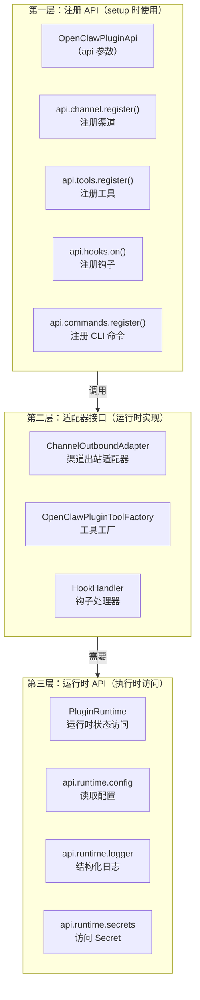
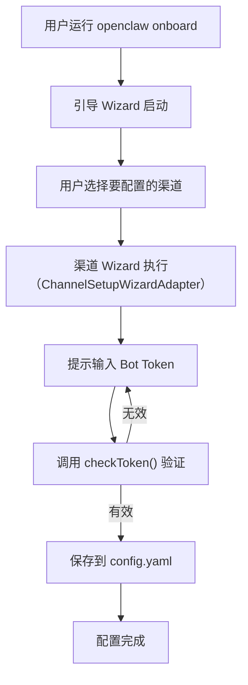

# Plugin SDK 设计 🔴

> Plugin SDK 不仅仅是一组接口，它是 OpenClaw 的"对外承诺"——插件开发者依赖它，任何破坏性变更都会影响整个生态。本章深入 SDK 的设计思路。

## 本章目标

读完本章你将能够：
- 理解 Plugin API 的三层设计（`OpenClawPluginApi`、适配器、运行时）
- 解释为什么 SDK 使用大量 `type` 导出而不是 `class`
- 理解 `PluginRuntime` 的设计意图
- 了解 Wizard 流程在插件中的作用

---

## 一、Plugin SDK 的核心目标

Plugin SDK 需要同时满足三个看似矛盾的目标：

1. **对插件开发者友好**：简单、易于上手，不需要了解核心内部实现
2. **对核心演进友好**：核心可以重构内部实现，不影响已有插件
3. **安全和稳定**：防止插件越权访问核心敏感数据

这三个目标的解决方案是：**将公开 API 与内部实现彻底分离**。

---

## 二、Plugin API 三层模型



### 第一层：`OpenClawPluginApi`

这是插件 `setup(api)` 函数收到的 API 对象，提供注册能力：

```typescript
// 类型定义（plugins/types.ts 节选）
type OpenClawPluginApi = {
  // 注册渠道
  channel: {
    register: (channel: ChannelPlugin) => void;
  };
  // 注册工具
  tools: {
    register: (tool: OpenClawPluginToolFactory) => void;
  };
  // 注册钩子
  hooks: {
    on: <T extends PluginHookName>(name: T, handler: PluginHookHandlerMap[T]) => void;
  };
  // 注册 CLI 命令
  commands: {
    register: (cmd: OpenClawPluginCommandDefinition) => void;
  };
  // 注册 Provider
  provider: {
    register: (provider: ProviderPlugin) => void;
  };
  // 访问运行时
  runtime: PluginRuntime;
};
```

### 第二层：适配器接口

渠道插件通过实现**适配器接口**提供能力。这些接口都是 TypeScript `type` 而不是 `class`，原因：

- **可测试性**：`type` 方便 mock 测试，不依赖构造函数继承
- **灵活性**：插件可以用任何方式实现接口（函数对象、类实例、工厂函数）
- **版本兼容**：接口可以渐进式扩展，不需要插件修改基类

渠道插件的适配器层次：

```typescript
// types.adapters.ts（节选）
type ChannelOutboundAdapter = {
  // 发送消息到平台
  send(params: OutboundSendParams): Promise<OutboundDeliveryResult>;
};

type ChannelLifecycleAdapter = {
  // 启动渠道（建立连接/注册 webhook）
  start(params: ChannelStartParams): Promise<void>;
  // 停止渠道
  stop(): Promise<void>;
};

type ChannelAuthAdapter = {
  // 检查 Bot Token 是否有效
  checkToken(params: TokenCheckParams): Promise<TokenCheckResult>;
};
```

渠道插件将这些适配器组合到 `ChannelPlugin` 对象中：

```typescript
// ChannelPlugin 完整接口（types.plugin.ts）
type ChannelPlugin = {
  id: ChannelId;               // 渠道唯一 ID
  name?: string;               // 显示名称
  messaging: ChannelMessagingAdapter;   // 核心消息能力（必须）
  outbound?: ChannelOutboundAdapter;    // 出站发送（可选）
  lifecycle?: ChannelLifecycleAdapter;  // 生命周期（可选）
  auth?: ChannelAuthAdapter;            // 认证（可选）
  setup?: ChannelSetupAdapter;          // Setup 流程（可选）
  status?: ChannelStatusAdapter;        // 状态上报（可选）
  // ... 15+ 个可选适配器
};
```

### 第三层：`PluginRuntime`

`PluginRuntime` 是插件在运行时访问系统能力的接口：

```typescript
// plugin-sdk/runtime/types.ts（节选）
type PluginRuntime = {
  config: OpenClawConfig;      // 当前配置（只读）
  logger: PluginLogger;        // 结构化日志
  secrets: SecretResolver;     // Secret 解析
  gateway: GatewayRuntime;     // Gateway 运行时 API
  // ...
};
```

---

## 三、Wizard 流程设计

每个插件（特别是渠道插件和 Provider 插件）都有一个**引导安装（Wizard）**流程，在用户首次配置时执行。



Wizard 流程由 `ChannelSetupWizardAdapter` 接口定义，插件实现这个接口来提供自定义的引导步骤。

---

## 四、Provider 插件的 `defineSingleProviderPlugin` 工厂

对于使用 API Key 认证的标准 Provider 插件，`provider-entry.ts` 提供了一个高层工厂函数，大大简化了 Provider 插件的编写：

```typescript
// extensions/mistral/src/index.ts（真实代码简化版）
import { defineSingleProviderPlugin } from 'openclaw/plugin-sdk/provider-entry';
import { MistralProvider } from './provider.js';

export default defineSingleProviderPlugin({
  id: 'mistral',
  name: 'Mistral AI',
  description: 'Mistral AI language models',
  provider: {
    id: 'mistral',
    label: 'Mistral AI',
    docsPath: '/providers/mistral',
    auth: [{
      methodId: 'api-key',
      label: 'Mistral API Key',
      envVar: 'MISTRAL_API_KEY',
      hint: 'Get your key from console.mistral.ai',
    }],
    catalog: {
      buildProvider: ({ apiKey }) => new MistralProvider({ apiKey })
    }
  }
});
```

`defineSingleProviderPlugin()` 内部自动处理：认证流程、Wizard 引导、模型目录注册、健康检查、错误提示（Doctor）。

---

## 关键源码索引

| 文件 | 大小 | 作用 |
|------|------|------|
| `src/plugins/types.ts` | 2739行 | 所有插件类型定义（`OpenClawPluginApi`等）|
| `src/channels/plugins/types.plugin.ts` | 125行 | `ChannelPlugin` 接口定义 |
| `src/channels/plugins/types.adapters.ts` | - | 渠道适配器接口定义 |
| `src/channels/plugins/types.core.ts` | 652行 | 渠道核心类型定义 |
| `src/plugin-sdk/provider-entry.ts` | - | `defineSingleProviderPlugin()` 工厂 |
| `src/plugin-sdk/plugin-entry.ts` | 174行 | 通用插件定义 API |
| `src/plugin-sdk/runtime/types.ts` | - | `PluginRuntime` 类型定义 |

---

## 小结

1. **三层模型**：注册 API（setup 时）→ 适配器接口（运行时实现）→ 运行时访问（执行时）。
2. **`type` 优先于 `class`**：所有适配器接口是 TypeScript `type`，提高可测试性和灵活性。
3. **Wizard 流程标准化**：所有插件共享统一的引导安装机制。
4. **`defineSingleProviderPlugin` 是最常用的高层封装**：大多数 Provider 插件只需 10 行代码。

---

*[← Agent 调用循环](../02-flow/03-agent-call-loop.md) | [→ 认证系统](02-auth-system.md)*
