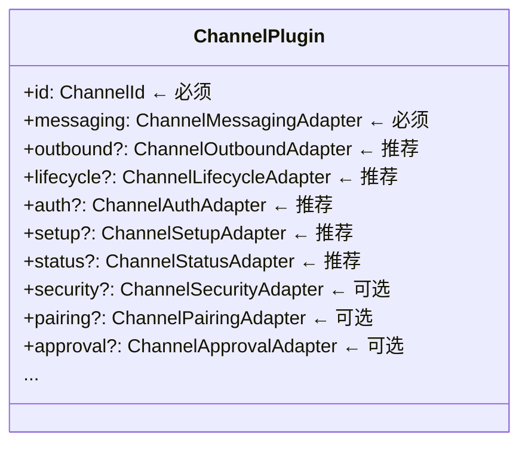

# 渠道集成模式 🟡

> OpenClaw 支持 20+ 个消息平台，每个平台的 API 都不同，但它们都遵循相同的集成模式。本章通过 Telegram 渠道插件为例，展示渠道集成的标准做法。

## 本章目标

读完本章你将能够：
- 理解渠道插件的完整生命周期（启动 → 收消息 → 发消息 → 停止）
- 掌握 Webhook vs Long Polling 两种接入方式的选择
- 理解多账号支持（Multi-Account）的设计
- 了解渠道健康检查（Health Monitor）的工作原理

---

## 一、渠道插件的核心结构

渠道插件通过实现 `ChannelPlugin` 接口定义自身能力，分为**必须实现**和**可选实现**两类适配器：



### 最小可行渠道插件

```typescript
// 最简单的渠道插件示例
import { defineChannelPlugin } from 'openclaw/plugin-sdk/core';

export default defineChannelPlugin({
  id: 'my-channel',
  messaging: {
    // 将平台消息格式化为 Agent 可读的文本
    formatMessage(params: { text: string; from: string }): string {
      return `[${params.from}] ${params.text}`;
    },
    // 将 AI 回复发送给用户
    async send(params: OutboundSendParams): Promise<void> {
      await myPlatformApi.sendMessage(params.targetId, params.text);
    },
  },
});
```

---

## 二、入站消息处理：Webhook vs Long Polling

### Webhook 模式（推荐）

Telegram、Discord、Slack 等平台支持 Webhook——平台主动推送消息到 OpenClaw。

```
用户发消息
  → 消息平台 → HTTP POST → OpenClaw Gateway
  → 渠道插件的 handleWebhook(req) 处理
  → 构建 InboundEnvelope
  → 路由 → Agent 推理 → 回复
```

渠道插件通过 `api.channel.registerHttpRoute()` 注册 Webhook 路由：

```typescript
// 在 setup() 中注册 webhook 路由
api.gateway.registerHttpRoute({
  path: '/webhook/telegram',
  auth: 'none',   // 渠道自己验证 webhook secret
  handler: async (req, res) => {
    const update = await parseWebhookPayload(req);
    await handleTelegramUpdate(update);
  }
});
```

### Long Polling 模式

不支持 Webhook 的平台（如某些自托管 Matrix 服务器）使用 Long Polling：

```typescript
// lifecycle 适配器的 start() 中启动轮询循环
async start() {
  this.pollLoop = async () => {
    while (!this.stopped) {
      const updates = await api.getUpdates({ timeout: 30 });
      for (const update of updates) {
        await this.handleUpdate(update);
      }
    }
  };
  this.pollLoop().catch(/* ... */);
}
```

Gateway 的 `server-channels.ts` 中的 `ChannelManager` 管理两种模式渠道的生命周期，并在渠道崩溃时自动重启（指数退避策略）：

```typescript
// server-channels.ts
const CHANNEL_RESTART_POLICY = {
  initialMs: 5_000,      // 5 秒后重试
  maxMs: 5 * 60_000,     // 最长等待 5 分钟
  factor: 2,             // 指数退避
  jitter: 0.1,           // 加入随机抖动
};
const MAX_RESTART_ATTEMPTS = 10;
```

---

## 三、出站消息发送

AI 生成回复后，Gateway 调用 `ChannelOutboundAdapter.send()` 将回复发送给用户。

### 渠道能力差异

不同渠道对消息格式的支持不同，`ChannelMessagingAdapter` 需要处理这些差异：

| 能力 | Telegram | Discord | Slack | iMessage |
|------|---------|---------|-------|---------|
| Markdown | ✅ | ✅ | ✅ | ❌ |
| 图片 | ✅ | ✅ | ✅ | ✅ |
| 流式更新消息 | ❌ | ✅（编辑）| ✅（块编辑）| ❌ |
| 按钮/交互式组件 | ✅ | ✅ | ✅ | ❌ |
| 最大消息长度 | 4096 | 2000 | 4000 | 无明确限制 |

渠道插件通过 `capabilities` 字段声明支持的能力：

```typescript
// ChannelCapabilities（types.core.ts）
type ChannelCapabilities = {
  streaming?: boolean;    // 支持流式消息更新
  images?: boolean;       // 支持发送图片
  markdown?: boolean;     // 支持 Markdown
  voiceMessages?: boolean; // 支持语音消息
};
```

---

## 四、多账号支持

一个渠道插件可以管理多个 Bot 账号。例如，同时运行两个 Telegram Bot：

```yaml
# config.yaml
channels:
  telegram:
    accounts:
      main-bot:
        token: "${env:TELEGRAM_BOT_1_TOKEN}"
      work-bot:
        token: "${env:TELEGRAM_BOT_2_TOKEN}"
```

渠道插件通过 `accountId` 区分：

```typescript
// 每个账号独立的 ChannelAccountSnapshot
type ChannelAccountSnapshot = {
  accountId: string;    // 'main-bot' | 'work-bot'
  configured: boolean;
  mode?: string;        // 运行模式（'webhook' | 'polling'）
  error?: string;       // 错误信息（如 Token 失效）
};
```

---

## 五、渠道健康检查

`channel-health-monitor.ts`（6.6KB）实现了定期健康检查：

```
每隔 N 秒
  → 调用 ChannelAuthAdapter.checkToken()
  → 验证 Bot Token 是否仍然有效
  → 更新 ChannelAccountSnapshot.status
  → 如果失效，发出告警（通过配置的告警渠道）
```

这让用户在 Token 过期或被撤销时及时收到通知，而不是等到用户发消息时才发现 Bot 无响应。

---

## 关键源码索引

| 文件 | 大小 | 作用 |
|------|------|------|
| `src/channels/plugins/types.plugin.ts` | 125行 | `ChannelPlugin` 接口 |
| `src/channels/plugins/types.core.ts` | 652行 | 渠道核心类型（`ChannelMessagingAdapter` 等）|
| `src/channels/plugins/types.adapters.ts` | - | 渠道适配器接口定义 |
| `src/gateway/server-channels.ts` | 20KB | 渠道生命周期管理，`ChannelManager` |
| `src/gateway/channel-health-monitor.ts` | 6.6KB | 健康检查实现 |
| `extensions/telegram/src/index.ts` | - | Telegram 渠道插件（官方参考实现）|

---

## 小结

1. **渠道插件通过适配器接口组合能力**：`messaging`（必须）+ 15 个可选适配器。
2. **两种接入模式**：Webhook（平台推送）和 Long Polling（主动轮询），插件自行选择。
3. **自动重启**：`ChannelManager` 在渠道崩溃时自动指数退避重启。
4. **多账号支持**：通过 `accountId` 区分，同一渠道可同时运行多个 Bot 账号。
5. **健康检查**：定期验证 Token 有效性，及时发现配置问题。

---

*[← 认证系统](02-auth-system.md) | [→ 记忆与 MCP](04-memory-mcp.md)*
