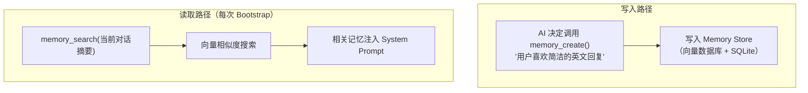
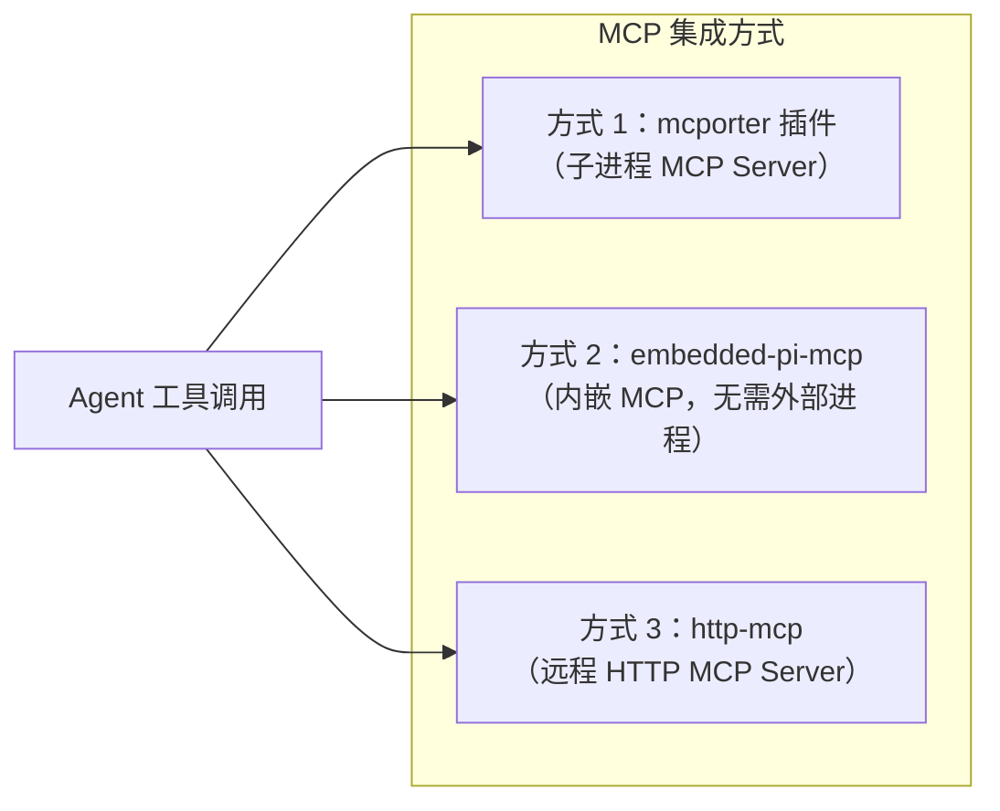

# 记忆与 MCP 🟡

> 记忆（Memory）让 AI 拥有跨会话的长期记忆。MCP（Model Context Protocol）让 AI 接入外部系统。本章讲解这两个强大机制的实现原理。

## 本章目标

读完本章你将能够：
- 理解 Memory 插件的工作原理（存储、检索、遗忘）
- 了解 OpenClaw 中 MCP 的三种集成方式（mcporter/embedded-pi/http）
- 理解 MCP 工具如何被注册为 Agent 可调用的工具

---

## 一、Memory 系统

### Memory 是什么？

Memory（记忆）是一种 **Capability 插件**，为 Agent 提供两个工具：
- `memory_create(content)` — 将信息写入长期记忆
- `memory_search(query)` — 从长期记忆中检索相关信息

每次 Bootstrap 时，Memory 插件自动检索与当前对话相关的记忆，注入到 System Prompt 中。

### Memory 流程



### Memory 存储实现

Memory 的存储层有两种实现：

**1. 本地向量存储（memory-core 插件）**

```typescript
// 使用 SQLite + 向量扩展
// 每条记忆存储为：
type MemoryEntry = {
  id: string;           // UUID
  content: string;      // 记忆内容
  embedding: Float32Array; // 向量嵌入（通过 LLM API 生成）
  tags: string[];       // 标签（agentId、sessionKey 等）
  createdAt: Date;
  accessedAt: Date;
};
```

**2. 外部记忆服务（memory-mcp 插件）**

通过 MCP 协议连接外部记忆服务（如 mem0、自定义记忆服务器）：

```yaml
# config.yaml
plugins:
  - id: memory-mcp
    mcp:
      command: npx
      args: ['-y', '@mem0/mcp-server']
```

---

## 二、MCP 集成

MCP（Model Context Protocol，模型上下文协议）是 Anthropic 发布的开放协议，允许 AI 模型通过标准化接口访问外部工具和数据源。

### MCP 三种集成方式

OpenClaw 支持三种方式集成 MCP Server：



**方式 1：mcporter 插件（最常用）**

通过 `mcporter` 插件启动子进程型 MCP Server：

```yaml
# config.yaml
plugins:
  - id: mcporter
    mcpServers:
      filesystem:
        command: npx
        args: ['-y', '@modelcontextprotocol/server-filesystem', '/workspace']
        
      github:
        command: npx
        args: ['-y', '@modelcontextprotocol/server-github']
        env:
          GITHUB_TOKEN: "${env:GITHUB_TOKEN}"
          
      postgres:
        command: npx
        args: ['-y', '@modelcontextprotocol/server-postgres', 'postgresql://localhost/mydb']
```

**方式 2：内嵌 MCP（embedded-pi-mcp.ts）**

某些工具直接嵌入 OpenClaw 进程中，无需启动外部进程。例如 pi-lsp（LSP 语言服务器集成）：

```typescript
// agents/embedded-pi-mcp.ts
// 直接在同一进程中运行的 MCP Server
export function createEmbeddedMcpServer() {
  const server = new McpServer({ /* ... */ });
  // 注册内嵌工具
  server.tool('list_definitions', listDefinitionsHandler);
  return server;
}
```

**方式 3：HTTP MCP（mcp-http.ts）**

连接远程 HTTP MCP Server：

```yaml
# config.yaml
plugins:
  - id: http-mcp
    servers:
      - name: my-api
        url: 'https://mcp.example.com/api'
        headers:
          Authorization: "Bearer ${env:MCP_TOKEN}"
```

### MCP 工具注册

MCP Server 启动后，mcporter 插件：
1. 调用 `tools/list` 获取 MCP Server 的工具列表
2. 将每个 MCP 工具包装为 OpenClaw 工具格式（含 JSON Schema）
3. 通过 `api.tools.register()` 注册到工具系统
4. Agent 即可像调用普通工具一样调用 MCP 工具

---

## 三、MCP Bundle 模式

`cli-runner.bundle-mcp.e2e.test.ts` 揭示了一个特殊的 Bundle MCP 模式：

在 OpenClaw 中，整个 CLI Runner（Claude Code）本身可以作为一个 MCP Server 暴露给外部系统。这意味着可以用另一个 AI 应用（如自定义 Claude Desktop 配置）通过 MCP 协议调用 OpenClaw 的 Agent 能力。

---

## 关键源码索引

| 文件 | 大小 | 作用 |
|------|------|------|
| `extensions/memory-core/` | - | 本地向量记忆插件 |
| `src/agents/embedded-pi-mcp.ts` | 0.95KB | 内嵌 MCP Server |
| `src/agents/embedded-pi-lsp.ts` | 0.77KB | 内嵌 LSP Server |
| `src/agents/mcp-http.ts` | 2.0KB | HTTP MCP 连接 |
| `src/agents/mcp-config-shared.ts` | 1.1KB | MCP 配置共享类型 |
| `src/agents/bundle-mcp.test-harness.ts` | 4.25KB | Bundle MCP 测试框架 |
| `extensions/mcporter/` | - | mcporter 插件（子进程 MCP）|

---

## 小结

1. **Memory 插件提供跨会话记忆**：`memory_create` 写入，`memory_search` 检索，Bootstrap 时自动注入相关记忆。
2. **MCP 三种集成方式**：子进程（mcporter）、内嵌（embedded-pi-mcp）、远程 HTTP，覆盖不同场景需求。
3. **MCP 工具透明整合**：MCP Server 的工具自动注册为 Agent 可调用工具，使用体验与内置工具一致。
4. **Bundle MCP**：OpenClaw 自身也可以作为 MCP Server 暴露，支持多层 AI 系统嵌套。

---

*[← 渠道集成模式](03-channel-integration.md) | [→ 安全模型](05-security-model.md)*
