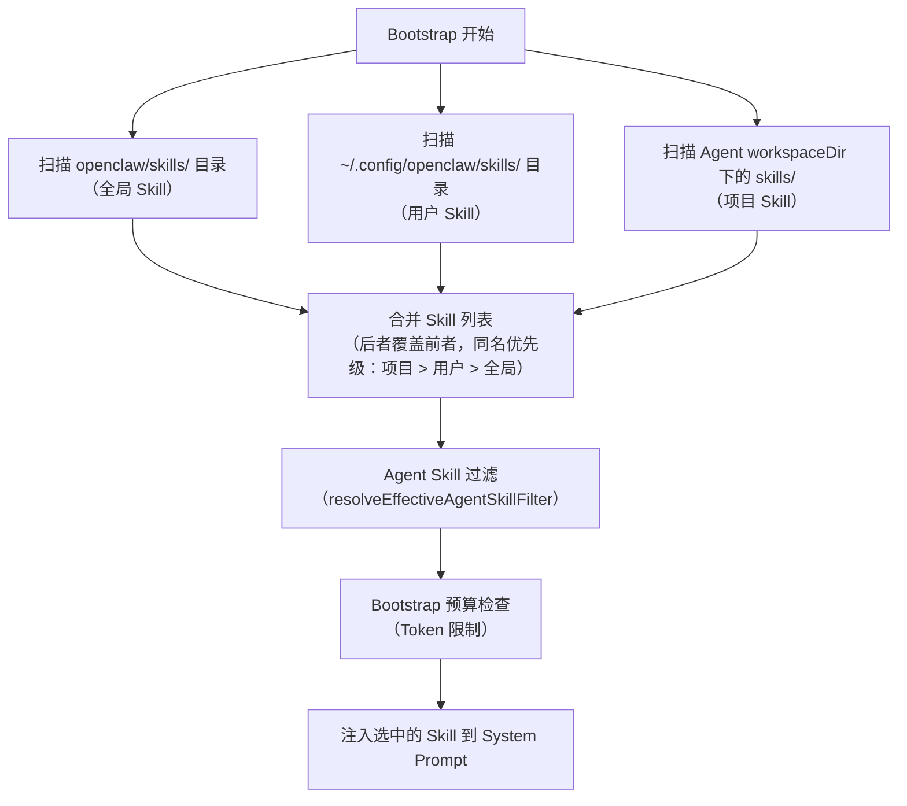

# Skill 系统 🟡

> Skill 是 OpenClaw 最独特的设计之一——用 Markdown 文件就能给 AI 添加专业能力。本章深入讲解 Skill 的工作原理和设计哲学。

## 本章目标

读完本章你将能够：
- 理解 Skill 的本质和工作原理（它只是一个 Markdown 文件）
- 区分 Workspace Skill 和 Global Skill 的区别
- 掌握 Skill 过滤机制（Agent 只看到自己被授权的 Skill）
- 理解 Skill 发现流程

---

## 一、Skill 是什么？

Skill（技能）是一个简单的 **Markdown 文件**，包含给 AI 的指令说明。它告诉 AI"在什么场景下应该怎么做"。

当 AI 在 Bootstrap 阶段读取 Skill 文件时，这些指令成为其"临时知识库"的一部分。

### 一个真实的 Skill 示例

```markdown
<!-- skills/coding-agent/SKILL.md -->

# Coding Agent Skill

You are a coding assistant. When helping with code:

## Code Review Mode
When the user asks to "review" code:
1. Read the relevant files first
2. Identify potential bugs, performance issues, and style violations
3. Group findings by severity (critical, warning, suggestion)
4. Present findings in a structured format

## Commit Message Format
When creating commits, always use conventional commits format:
- feat: new feature
- fix: bug fix
- docs: documentation only
- chore: maintenance

## Testing Requirements
Before saying "done", always:
1. Run existing tests: `npm test`
2. If tests fail, fix them before claiming completion
```

这就是一个 Skill 的全部内容——纯 Markdown，无需任何代码。

---

## 二、Skill 类型

### Workspace Skill

存放在项目的 `skills/` 目录（或 `~/.config/openclaw/skills/`）中，适用于整个 Workspace：

```
my-project/
├── skills/
│   ├── my-project-conventions/
│   │   └── SKILL.md    ← 项目级 Skill
│   └── code-review/
│       └── SKILL.md
└── src/
```

### Global Skill

`openclaw` 安装目录中的 `skills/`（即仓库的 `skills/` 目录），包含 50+ 个通用 Skill，涵盖：

| 类别 | 代表 Skill | 功能 |
|------|-----------|------|
| 生产力工具 | `notion`、`obsidian`、`trello` | 笔记和任务管理 |
| 开发工具 | `github`、`coding-agent`、`tmux` | 代码和终端操作 |
| 渠道 | `discord`、`slack`、`wacli` | 消息平台集成 |
| AI 工具 | `gemini`、`openai-whisper` | 多模型能力扩展 |
| 媒体 | `spotify-player`、`songsee`、`video-frames` | 媒体操作 |
| 个人助手 | `1password`、`apple-reminders`、`weather` | 日常辅助 |
| 系统 | `sag`（Skill-as-Agent）、`summarize`、`taskflow` | 高级 Skill |

---

## 三、Skill 发现流程

`src/agents/skills.ts` 实现了 Skill 的发现和过滤逻辑：



---

## 四、Agent 级 Skill 过滤

每个 Agent 可以配置只使用特定的 Skill（`resolveEffectiveAgentSkillFilter`）：

```yaml
# config.yaml — Agent Skill 配置
agents:
  list:
    - id: main
      skills:
        # 只启用这些 Skill
        enabled:
          - coding-agent
          - github
          - tmux
        # 禁用某些全局 Skill
        disabled:
          - spotify-player  # 工作 Agent 不需要

    - id: personal
      skills:
        # 启用所有 Skill（默认行为）
        enabled: "*"
```

过滤器实现（`skills/agent-filter.ts`）：

```typescript
// resolveEffectiveAgentSkillFilter 返回过滤函数
function resolveEffectiveAgentSkillFilter(
  agentConfig: ResolvedAgentConfig,
): (skillId: string) => boolean {
  const { enabled, disabled } = agentConfig.skills ?? {};
  if (enabled === "*") return () => true;
  const enabledSet = new Set(enabled ?? []);
  const disabledSet = new Set(disabled ?? []);
  return (skillId) => {
    if (disabledSet.has(skillId)) return false;
    if (enabledSet.size === 0) return true; // 没有 enable 列表则全部启用
    return enabledSet.has(skillId);
  };
}
```

---

## 五、Skill 的高级功能：支持文件

除了 `SKILL.md` 主文件，Skill 还可以包含支持文件（support files）：

```
skills/github/
├── SKILL.md           ← 主 Skill 指令
├── pr-template.md     ← PR 模板（在 SKILL.md 中引用）
├── commit-guide.md    ← 提交指南
└── examples/
    └── api-usage.md   ← API 使用示例
```

`SKILL.md` 可以包含对支持文件的引用：

```markdown
<!-- SKILL.md -->
# GitHub Skill

When creating a PR, use the template in pr-template.md.

[pr-template.md](pr-template.md)

When writing commit messages, follow the guide in commit-guide.md.
```

Bootstrap 时，OpenClaw 会递归加载引用的文件，并根据 Token 预算决定是否注入。

---

## 六、Skill-as-Agent（SAG）模式

`skills/sag/` 目录包含一个特殊的元 Skill——**SAG（Skill-as-Agent）**，它指导 AI 如何创建新的 Skill：

```markdown
<!-- skills/sag/SKILL.md（简化）-->
# Skill-as-Agent

When the user asks you to "create a skill" or "add a skill for X":

1. Understand what the skill should do
2. Identify the relevant tools and workflows
3. Create SKILL.md with clear instructions
4. Test the skill by acting as if you're following it
```

这是 OpenClaw 的"自我扩展"能力——用 AI 来创建 AI 使用的 Skill。

---

## 关键源码索引

| 文件 | 大小 | 作用 |
|------|------|------|
| `src/agents/skills.ts` | - | Skill 发现和加载主逻辑 |
| `src/agents/skills/agent-filter.ts` | - | Agent 级 Skill 过滤 |
| `skills/` | 50+ 目录 | 内置 Skill 集合 |
| `skills/sag/SKILL.md` | - | Skill 创建助手（SAG）|
| `skills/coding-agent/SKILL.md` | - | 编程 Agent Skill |

---

## 小结

1. **Skill 就是 Markdown 文件**：纯文本指令，无需代码，任何人都可以创建。
2. **三层 Skill 作用域**：全局（openclaw 内置）< 用户（`~/.config/openclaw/skills/`）< 项目（`skills/` 目录）。
3. **Agent 可过滤 Skill**：`enabled`/`disabled` 配置精确控制每个 Agent 使用哪些 Skill。
4. **Skill 支持引用文件**：主 SKILL.md 可引用其他 Markdown 文件，按 Token 预算加载。
5. **SAG 模式实现自我扩展**：用 AI 创建新 Skill，让能力不断积累。

---

*[← 安全模型](../03-mechanisms/05-security-model.md) | [→ Skill 深度解析](02-skill-deep-dive.md)*
