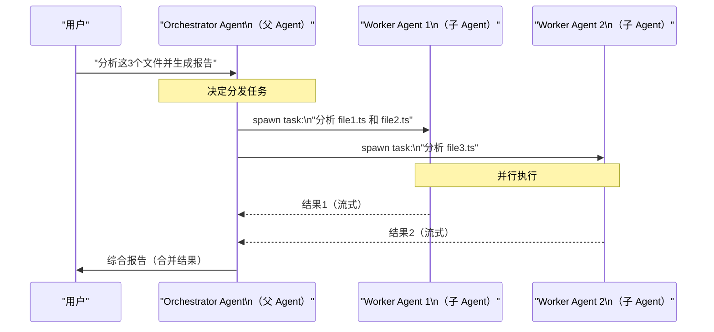
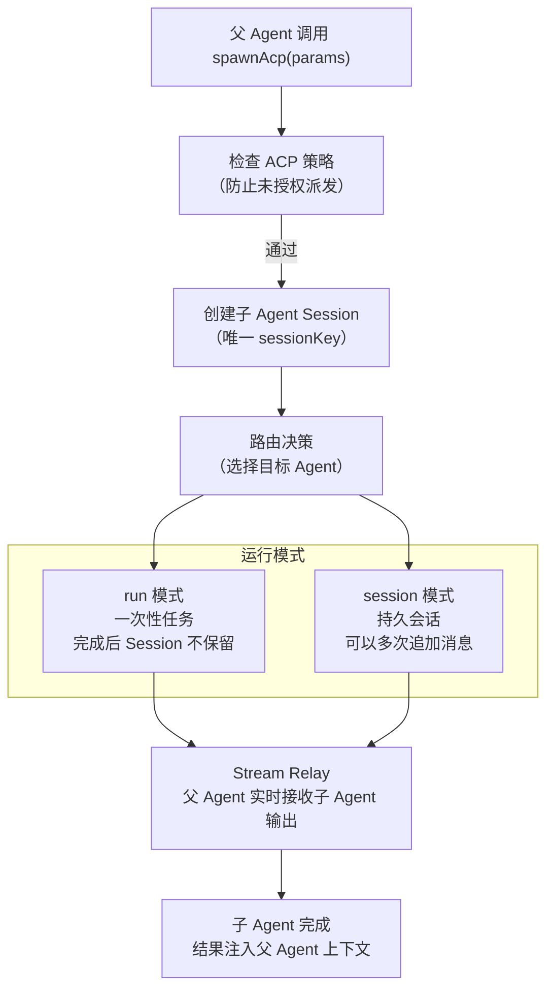

# 多 Agent 协作：ACP 协议 🔴

> OpenClaw 支持多个 AI Agent 协同工作——一个 Agent（orchestrator）可以派发任务给另一个 Agent（worker），让复杂任务并行化处理。本章深入 ACP（Agent Coordination Protocol）的设计。

## 本章目标

读完本章你将能够：
- 理解 ACP 协议的工作模型（parent → child spawning）
- 理解 `acp-spawn.ts` 的任务派发流程
- 理解父子 Agent 之间如何传递结果（Stream Relay）
- 了解 ACP 的安全策略（防止无限递归等）

---

## 一、为什么需要多 Agent 协作？

单个 Agent 的局限：
- **Context Window 限制**：大型任务需要处理的信息超过单次 context window
- **并行化**：多个独立子任务可以同时执行，缩短总时间
- **专业化**：不同任务可以路由给专门的 Agent（如 coding-agent vs summarize-agent）

ACP 的解决方案：**Agent 之间通过结构化协议相互调用**。

---

## 二、ACP 工作模型



---

## 三、ACP 派发：`acp-spawn.ts`

`src/agents/acp-spawn.ts`（33KB）实现了子 Agent 的派发逻辑。

### 核心类型

```typescript
// acp-spawn.ts
type SpawnAcpParams = {
  task: string;           // 子 Agent 要完成的任务描述
  label?: string;         // 显示名称（用于日志）
  agentId?: string;       // 指定使用哪个 Agent（默认使用最佳匹配）
  resumeSessionId?: string; // 恢复已有会话（续接上次任务）
  cwd?: string;           // 子 Agent 的工作目录
  mode?: SpawnAcpMode;    // 'run'（单次执行）或 'session'（持久会话）
  thread?: boolean;       // 是否在新线程中运行
  sandbox?: SpawnAcpSandboxMode; // 'inherit'（继承父级沙箱）或 'require'（必须沙箱）
  streamTo?: SpawnAcpStreamTarget; // 结果流向哪里（'parent'）
};

type SpawnAcpResult = {
  status: 'accepted' | 'forbidden' | 'error';
  childSessionKey?: string;  // 子 Agent 的 Session Key
  runId?: string;            // 本次运行 ID
  mode?: SpawnAcpMode;
};
```

### 派发流程



---

## 四、Stream Relay：实时传递子 Agent 输出

`acp-spawn-parent-stream.ts` 实现了子 Agent 输出到父 Agent 的实时转发：

```typescript
// 父 Agent 启动 Stream Relay，实时接收子 Agent 的流式输出
const relayHandle = await startAcpSpawnParentStreamRelay({
  childSessionKey,
  onTextDelta: (text) => {
    // 将子 Agent 的文字流式输出追加到父 Agent 的上下文
    appendToParentContext(text);
  },
  onToolUse: (toolName, toolInput) => {
    // 通知父 Agent 子 Agent 正在调用什么工具
    notifyParentToolUse(toolName);
  },
});
```

这使得父 Agent 可以看到子 Agent 的"思考过程"，而不仅仅是最终结果。

---

## 五、Thread-Based 协作

ACP 还支持基于渠道线程（Thread）的协作——子 Agent 在消息渠道（如 Discord、Slack）的一个独立线程中工作：

```typescript
// spawn with thread: true
await spawnAcp({
  task: 'Review the code in PR #123',
  agentId: 'code-review-agent',
  thread: true,  // 在 Discord 线程中工作
});
// 用户可以在渠道的线程中看到代码审查进度
```

Thread 模式的优势：
- 用户可以实时跟踪子 Agent 进度
- 子 Agent 的输出直接可见，无需等待汇总
- 支持在线程中与子 Agent 直接交互

---

## 六、ACP 安全策略

为防止滥用（如无限递归派发），ACP 实现了多层安全检查：

```typescript
// policy.ts
function isAcpEnabledByPolicy(cfg: OpenClawConfig, agentId: string): boolean {
  // 1. 检查全局 ACP 开关
  if (!cfg.agents?.acp?.enabled) return false;
  
  // 2. 检查 Agent 是否允许派发子 Agent
  const agentConfig = resolveAgentConfig(cfg, agentId);
  if (!agentConfig.subagents?.enabled) return false;
  
  // 3. 检查当前调用深度（防止递归）
  if (getCurrentAcpDepth() >= MAX_ACP_DEPTH) return false;  // MAX_ACP_DEPTH = 3
  
  return true;
}
```

配置示例：

```yaml
# config.yaml
agents:
  # 全局 ACP 配置
  acp:
    enabled: true
    maxDepth: 3          # 最大嵌套深度（防止无限递归）

  list:
    - id: orchestrator
      subagents:
        enabled: true    # 允许派发子 Agent
        allowedAgents:   # 只能派发这些 Agent
          - code-reviewer
          - summarizer

    - id: code-reviewer
      subagents:
        enabled: false   # Worker 不能再派发子 Agent
```

---

## 七、`/btw` 命令：旁路问答

`btw.ts`（12KB）实现了一个特殊的"旁路"功能：

在 Agent 执行长任务过程中，用户可以用 `/btw 你用的什么框架？` 在不打断主任务的情况下询问问题。

```typescript
// btw.ts
const BTW_SYSTEM_PROMPT = [
  'You are answering an ephemeral /btw side question about the current conversation.',
  'Answer only the side question in the last user message.',
  'Do not continue, resume, or complete any unfinished task from the conversation.',
  'Do not emit tool calls or shell commands unless the side question explicitly asks.',
].join('\n');
```

`/btw` 使用当前对话作为背景上下文，启动一个**独立的 ephemeral（临时）推理**，回答后不影响主任务的上下文。

---

## 关键源码索引

| 文件 | 大小 | 作用 |
|------|------|------|
| `src/agents/acp-spawn.ts` | 33KB | 子 Agent 派发核心逻辑 |
| `src/agents/acp-spawn-parent-stream.ts` | 11.6KB | 父子 Agent 流式结果传递 |
| `src/acp/control-plane/manager.ts` | - | ACP Session 管理 |
| `src/acp/control-plane/spawn.ts` | - | ACP 派发控制平面 |
| `src/acp/policy.ts` | - | ACP 安全策略检查 |
| `src/agents/btw.ts` | 12KB | `/btw` 旁路问答实现 |
| `src/agents/acp-spawn.test.ts` | 48KB | ACP 集成测试（最全参考）|

---

## 小结

1. **ACP = AI 之间的 RPC 调用**：父 Agent 可以派发任务给子 Agent，实现并行化。
2. **`run` vs `session` 两种模式**：`run` 用于一次性任务，`session` 用于持续交互。
3. **Stream Relay 实时可见**：父 Agent 可以实时接收子 Agent 的思考过程，而不仅是结果。
4. **Thread 模式**：子 Agent 在渠道线程中工作，用户可以直接在渠道跟踪进度。
5. **多层安全防护**：深度限制（默认 3 层）+ Agent 白名单 + 全局开关，防止滥用。
6. **`/btw` 旁路问答**：不打断主任务，在旁路回答用户的临时问题。

---

*[← Skill 深度解析](02-skill-deep-dive.md) | [→ Agent 作用域与上下文](04-agent-scope-context.md)*
