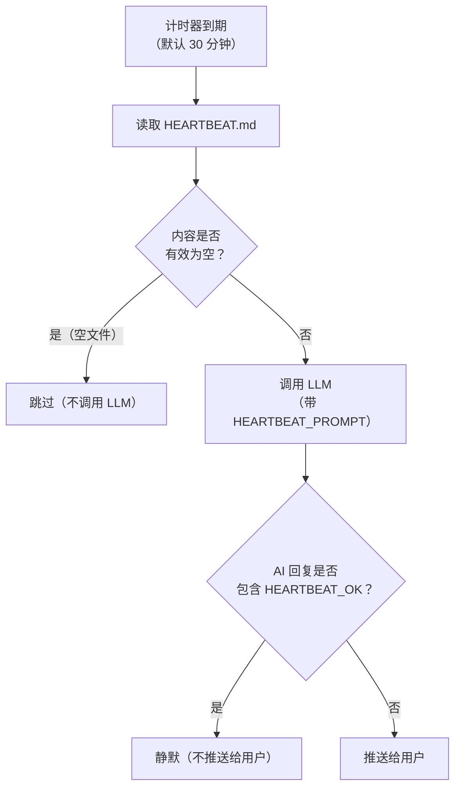
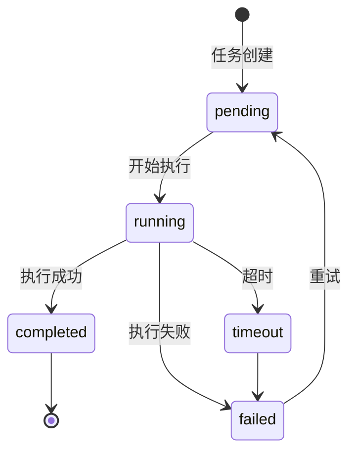

# 自动化与定时任务：Heartbeat 与 Cron 🟡

> OpenClaw 不只是一个被动的"问答机器人"，它还可以**主动执行任务**。本章讲解两种自动化机制：Heartbeat（心跳）和 Cron（定时任务）。

## 本章目标

读完本章你将能够：
- 理解 Heartbeat 的工作原理（HEARTBEAT.md 驱动的主动触发）
- 掌握 Cron 任务的三种调度方式（at / every / cron）
- 理解定时任务的 Payload 类型和 Delivery 策略
- 实现常见自动化场景（每日报告、定时提醒等）

---

## 一、Heartbeat：主动触发的 AI

### Heartbeat 是什么？

Heartbeat 是一种让 AI **定期自主检查任务并采取行动**的机制，默认每 **30 分钟**触发一次。

每次心跳，AI 会：
1. 读取 `HEARTBEAT.md` 文件（如果存在）
2. 按文件中的指令执行操作
3. 如果没有需要处理的事项，回复 `HEARTBEAT_OK` 并静默（不推送给用户）

### HEARTBEAT.md 示例

```markdown
<!-- HEARTBEAT.md -->

# AI 助手任务清单

## 持续监控
- [ ] 检查 /logs/app.log 是否有新的 ERROR 级别日志
  - 如有：汇总并推送给用户
- [ ] 检查 ~/Downloads 目录是否有新文件
  - 如有：整理分类到对应目录

## 早上任务（每天 9:00 后首次心跳）
- [ ] 拉取 git 仓库最新状态
- [ ] 生成昨日工作摘要

## 待处理
- [ ] 审核 PR #42 的代码
```

### Heartbeat 触发流程



### Heartbeat 配置

```yaml
# config.yaml
agents:
  list:
    - id: main
      heartbeat:
        enabled: true
        every: "30m"        # 触发间隔
        prompt: |           # 自定义提示（覆盖默认 HEARTBEAT_PROMPT）
          Check HEARTBEAT.md and complete pending tasks.
          Be concise when reporting.
```

HEARTBEAT_PROMPT（默认值）：
```
Read HEARTBEAT.md if it exists (workspace context). Follow it strictly.
Do not infer or repeat old tasks from prior chats.
If nothing needs attention, reply HEARTBEAT_OK.
```

---

## 二、Cron：精确的定时任务系统

Cron 是比 Heartbeat 更精确的定时任务系统，支持在**特定时间**或**特定间隔**触发 AI 任务。

### 三种调度方式

```typescript
// cron-tool.ts 中定义的调度类型
type CronScheduleKind = 'at' | 'every' | 'cron';

// 'at'：在特定时间点执行（一次性）
{ kind: 'at', at: '2024-03-15T09:00:00Z' }

// 'every'：按固定间隔循环执行
{ kind: 'every', everyMs: 60 * 60 * 1000 }  // 每小时

// 'cron'：使用 cron 表达式（最灵活）
{ kind: 'cron', expr: '0 9 * * 1-5' }  // 工作日每天 9:00
```

### Cron 任务的 Payload 类型

每个定时任务触发时执行什么，由 `payload` 字段决定：

| Payload 类型 | 含义 | 用途 |
|-------------|------|------|
| `agentTurn` | 作为一条新的用户消息触发 Agent 推理 | 让 AI 完成特定任务 |
| `systemEvent` | 注入一个系统事件（不触发 AI 推理）| 触发 Hook 或内部逻辑 |

```typescript
// agentTurn 示例：让 AI 每天早上生成日报
{
  kind: 'agentTurn',
  message: '请生成昨日工作摘要，包含完成的任务和待处理事项。',
  model: 'claude-opus-4-5',        // 可以覆盖默认模型
  timeoutSeconds: 120,              // 超时时间
  lightContext: true,               // 使用轻量上下文（不加载会话历史）
}
```

### Cron 任务的 Delivery 策略

执行结果如何传递给用户，由 `delivery` 字段控制：

| 策略 | 含义 |
|------|------|
| `none` | 静默执行，不通知用户 |
| `announce` | 完成后在关联会话中推送结果 |
| `webhook` | 结果推送到指定的 Webhook URL |

```yaml
# 配置示例：每天早 9 点生成日报并推送到 Telegram
cron:
  jobs:
    - name: daily-report
      schedule:
        kind: cron
        expr: "0 9 * * *"    # 每天 9:00
      payload:
        kind: agentTurn
        message: "生成今日工作计划摘要"
      delivery:
        mode: announce        # 推送到关联会话
```

---

## 三、通过 AI 工具管理 Cron 任务

Agent 可以通过内置的 `cron` 工具**在对话中直接管理定时任务**：

```
用户："帮我每小时检查一下系统内存使用情况，如果超过 80% 就提醒我"

Agent 调用 cron 工具：
cron({
  action: 'add',
  name: 'memory-check',
  schedule: { kind: 'every', everyMs: 3600000 },
  payload: {
    kind: 'agentTurn',
    message: '检查系统内存使用率，如超过80%向用户发出警告'
  },
  delivery: { mode: 'announce' }
})
```

Cron 工具支持的操作（`CRON_ACTIONS`）：

| 操作 | 含义 |
|------|------|
| `status` | 查看所有 Cron 任务状态 |
| `list` | 列出 Cron 任务 |
| `add` | 创建新的定时任务 |
| `update` | 修改已有定时任务 |
| `remove` | 删除定时任务 |
| `run` | 立即手动触发一次 |
| `runs` | 查看历史执行记录 |
| `wake` | 唤醒任务（提前触发）|

---

## 四、任务注册表（Task Registry）

`src/tasks/` 目录实现了完整的**任务状态机**，追踪每个定时任务的执行历史。



每次执行都有 `TaskRecord`：

```typescript
type TaskRecord = {
  taskId: string;          // 任务唯一 ID
  runId: string;           // 本次运行 ID（同一任务多次运行有不同 runId）
  status: TaskStatus;      // 'pending' | 'running' | 'completed' | 'failed' | 'timeout'
  createdAt: Date;
  startedAt?: Date;
  completedAt?: Date;
  deliveryStatus: TaskDeliveryStatus; // 结果是否已投递给用户
  runtime: 'acp' | 'subagent';       // 执行运行时类型
};
```

---

## 五、使用场景举例

### 场景 1：每日晨报

```yaml
# 每天工作日 8:30 生成晨报
cron:
  jobs:
    - name: morning-briefing
      schedule:
        kind: cron
        expr: "30 8 * * 1-5"  # 工作日早 8:30
      payload:
        kind: agentTurn
        message: |
          生成今日晨报：
          1. 今日天气
          2. 昨天的未完成任务
          3. 今天的重要日程（从 HEARTBEAT.md 读取）
      delivery:
        mode: announce
```

### 场景 2：长期文件监控

在 `HEARTBEAT.md` 中：

```markdown
## 监控任务
- [ ] 检查 ~/project/logs/error.log，如有新错误行，汇总后通知我
- [ ] 如果 ~/Downloads 下有超过 7 天的文件，提示我清理
```

Heart beat 每 30 分钟检查一次，有新情况才推送通知。

---

## 关键源码索引

| 文件 | 大小 | 作用 |
|------|------|------|
| `src/auto-reply/heartbeat.ts` | 172行 | Heartbeat 提示和触发逻辑 |
| `src/agents/tools/cron-tool.ts` | 739行 | Cron 工具（Agent 可调用）|
| `src/cron/types.ts` | - | Cron 类型定义 |
| `src/tasks/task-registry.ts` | 57KB | 任务注册表（状态机）|
| `src/tasks/task-executor.ts` | 18KB | 任务执行器 |
| `src/gateway/server-methods/cron.ts` | - | Gateway Cron 管理 API |
| `src/cli/cron-cli.ts` | - | Cron CLI 命令 |

---

## 小结

1. **Heartbeat 是"主动检查"**：AI 定期读取 HEARTBEAT.md，有任务则执行，否则静默。
2. **HEARTBEAT_OK 机制**：AI 无事可做时回复特定 token，框架自动过滤，不打扰用户。
3. **Cron 支持三种调度**：`at`（指定时刻）、`every`（固定间隔）、`cron`（cron 表达式）。
4. **两种 Payload**：`agentTurn`（AI 推理任务）和 `systemEvent`（系统触发）。
5. **Agent 可以管理 Cron**：用户通过对话就能创建/修改/删除定时任务，无需修改配置文件。

---

*[← Agent 作用域与上下文](04-agent-scope-context.md) | [→ 编写渠道插件](../05-extension/01-write-channel-plugin.md)*
