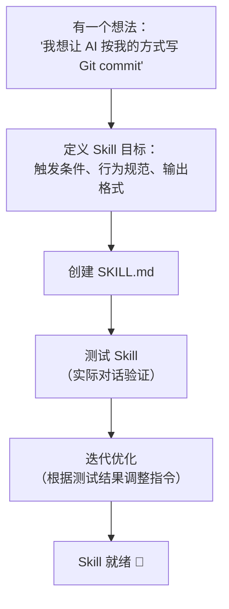

# 创建 Skill：实战指南 🟢

> 创建 Skill 是扩展 OpenClaw 能力最简单的方式。本章通过完整的实战案例，从零创建一个真正可用的 Skill。

## 本章目标

读完本章你将能够：
- 独立创建一个完整的 Skill（包含主文件和支持文件）
- 在 `config.yaml` 中为 Agent 启用 Skill
- 使用 SAG（Skill-as-Agent）辅助 AI 自动生成 Skill
- 分享和复用 Skill

---

## 一、Skill 创建完整流程



---

## 二、实战案例：创建「中文 Git 助手」Skill

### Step 1：定义 Skill 目标

在创建 SKILL.md 之前，先明确：

- **触发条件**：用户要求提交代码、写 commit message 时
- **核心行为**：用中英双语写 commit，遵循特定格式
- **输出格式**：固定模板
- **边界条件**：不影响代码内容，只影响 commit 说明

### Step 2：创建 Skill 目录结构

```bash
mkdir -p ~/.config/openclaw/skills/git-cn
```

或在项目目录下：

```bash
mkdir -p skills/git-cn
```

### Step 3：编写 `SKILL.md`

```markdown
<!-- skills/git-cn/SKILL.md -->

# Git 中文助手 Skill

## 触发时机
当用户要求「提交代码」、「写 commit」、「git commit」时激活此 Skill。

## Commit Message 格式

始终使用以下双语格式：

\`\`\`
<type>(<scope>): <English summary>

<中文详细说明>

- Key change 1（关键改动 1）
- Key change 2（关键改动 2）
\`\`\`

## Type 规范

| Type | 使用场景 |
|------|---------|
| feat | 新功能 |
| fix  | Bug 修复 |
| docs | 文档变更 |
| refactor | 重构（不改变功能） |
| test | 测试相关 |
| chore | 构建、依赖、配置变更 |

## 提交前检查

在执行 git commit 前，先运行以下检查：
1. \`git diff --staged\`：确认暂存内容符合预期
2. \`git status\`：确认没有遗漏文件

## 禁止行为

- 不要在没有检查暂存内容的情况下直接 commit
- 不要一次提交多个不相关的改动
- commit message 第一行不超过 72 个字符
```

### Step 4：在 `config.yaml` 中启用

```yaml
# config.yaml
agents:
  list:
    - id: main
      skills:
        enabled:
          - git-cn    # 启用这个 Skill（目录名即 Skill ID）
```

### Step 5：验证 Skill 是否生效

启动 OpenClaw 后，发送消息：

```
> 帮我提交当前改动，message 说明这是一个登录功能的新增
```

AI 应该：
1. 先运行 `git diff --staged` 查看改动
2. 按格式写出双语 commit message
3. 执行 git commit

---

## 三、进阶技巧

### 技巧 1：使用支持文件模块化 Skill

当 Skill 内容较多时，拆分为多个文件：

```
skills/git-cn/
├── SKILL.md           ← 主文件（引用其他文件）
├── commit-types.md    ← Type 详细说明
└── examples.md        ← 具体示例
```

在 `SKILL.md` 中引用：

```markdown
## 详细类型说明
见：[commit-types.md](commit-types.md)

## 示例
见：[examples.md](examples.md)
```

### 技巧 2：条件式指令

根据上下文有条件地激活不同行为：

```markdown
## 模式切换

### 快速模式（用户说「快速提交」）
- 跳过检查步骤，直接写 commit 并提交
- message 可以简短

### 标准模式（默认）
- 完整的 diff 检查
- 标准双语格式
- 等待用户确认后提交
```

### 技巧 3：引用其他 Skill

Skill 可以依赖其他 Skill 的规范：

```markdown
# 高级 Coding Skill

本 Skill 扩展了 coding-agent Skill 的能力。
如果 coding-agent Skill 未加载，以下是其关键规范的摘要：
...
```

---

## 四、用 SAG 让 AI 帮你写 Skill

如果已启用 `sag`（Skill-as-Agent）Skill，AI 可以辅助创建新 Skill：

```
用户：帮我创建一个 Skill，让 AI 在写代码时始终使用 TypeScript 
     strict 模式，并且所有函数都要有 JSDoc 注释

AI：好的，我来创建这个 Skill...
[AI 自动创建 skills/ts-strict/SKILL.md 文件]
```

---

## 五、Skill 调试技巧

### 查看 Bootstrap 注入的内容

在 `config.yaml` 中开启 verbose 日志：

```yaml
# config.yaml
log:
  verbose: true
```

然后查看日志中的 Bootstrap 信息，确认 Skill 是否被注入。

### 测试 Skill 效果

创建一个专门用于测试的会话：

```bash
openclaw chat --session test-skill-session
```

发送测试消息，观察 AI 是否按 Skill 指令行事。

### Skill 不生效的常见原因

| 原因 | 解决方案 |
|------|---------|
| Skill 目录名与 `enabled` 配置不匹配 | 确认目录名与配置完全一致 |
| Token 预算不足 Skill 被截断 | 精简 Skill 内容，移除冗余说明 |
| Agent 配置了 `enabled` 列表但未包含此 Skill | 将 Skill 添加到 `enabled` 列表 |
| SKILL.md 文件名大小写错误 | 确保文件名为 `SKILL.md`（全大写）|

---

## 六、Skill 分享

创建好的 Skill 可以：

1. **提交到 OpenClaw 仓库**：在 `skills/` 目录下创建 PR，让所有用户受益
2. **发布到 Git 仓库**：他人通过 `git clone` 复用
3. **发布到 npm**：`skills/clawhub/SKILL.md` 中描述了 CrawHub 社区分享机制

---

## 关键源码索引

| 文件 | 作用 |
|------|------|
| `skills/sag/SKILL.md` | SAG：让 AI 帮你创建 Skill |
| `skills/coding-agent/SKILL.md` | 官方编程 Skill（学习参考）|
| `skills/taskflow/SKILL.md` | 任务流 Skill（复杂 Skill 示例）|
| `skills/skill-creator/SKILL.md` | Skill 创建助手（与 SAG 类似）|
| `src/agents/skills.ts` | Skill 发现和加载逻辑 |
| `src/agents/skills/agent-filter.ts` | Agent 级 Skill 过滤 |

---

## 小结

1. **Skill 就是 Markdown**：创建一个 `SKILL.md` 文件，放到 `skills/` 目录下即可。
2. **When-Then 结构**：明确指定触发条件，AI 才知道什么时候用这个 Skill。
3. **SAG 辅助创建**：如果不确定如何写，让 AI 帮你写 Skill。
4. **调试靠 verbose 日志**：确认 Skill 是否真的被注入到 Bootstrap。
5. **Token 预算是实际约束**：Skill 太长会被截断，保持精简。

---

*[← 集成 LLM Provider](02-integrate-llm-provider.md) | [→ 返回目录](../README.md)*
